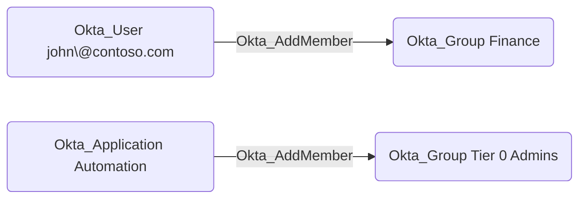

## General Information

The traversable `Okta_AddMember` edges represent custom role permissions that allow a principal (user, group, or application) to add or remove members in scoped Okta groups. These edges are created when a custom role includes the `okta.groups.members.manage` or `okta.groups.manage` permissions.

