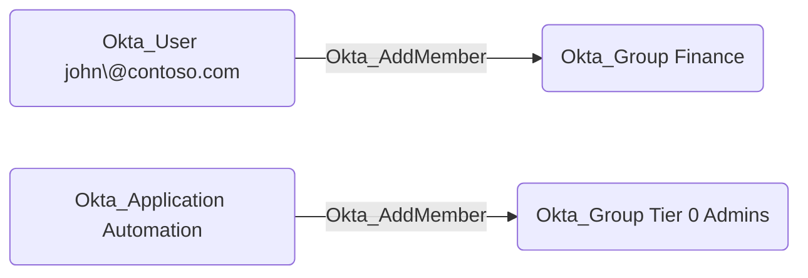

## General Information

The traversable Okta_AddMember edges represent custom role permissions that allow a principal (user, group, or application) to add or remove members in scoped Okta groups. These edges are created when a custom role includes the `okta.groups.members.manage` or `okta.groups.manage` permissions.


```mermaid
graph LR
    u1("Okta_User john\@contoso.com")
    g1("Okta_Group Finance")
    g2("Okta_Group Tier 0 Admins")
    app1("Okta_Application Automation")
    u1 -- Okta_AddMember --> g1
    app1 -- Okta_AddMember --> g2
```

## Abuse Info

An attacker who controls the source principal can add an Okta user they control to the destination group. This can grant any access that is driven by that group, including application assignments, downstream group push or SCIM access, and policy targeting. OpenHound emits this edge for scoped Okta groups that do not have direct Okta admin role assignments, so the usual impact is privilege or access gained through group-driven entitlements rather than direct inheritance of an Okta admin role from the destination group.

For a user source, authenticate as that user. For a group source, authenticate as any compromised member of the source group, because Okta role assignments granted to a group are inherited by the group's members. For an application source, use a valid access token for the service app or client that has the custom admin role assignment.

Using the Admin Console:

1. Sign in to the Okta Admin Console as the source user or as a member of the source group.
2. Open **Directory** > **Groups** and select the destination group from the edge.
3. Open the group's people or members tab and choose the action to assign people to the group.
4. Search for the attacker-controlled Okta user and add that user to the group.
5. Start a new SSO flow, refresh application sessions, or request new OAuth/OIDC tokens as the added user so newly granted group-based access is evaluated.

Using the Okta Groups API:

1. Set the Okta org URL, an API token or bearer token for the source principal, the destination group ID, and the attacker-controlled user ID.

    ```bash
    export OKTA_ORG="https://contoso.okta.com"
    export OKTA_API_TOKEN="REDACTED"
    export TARGET_GROUP_ID="00g..."
    export CONTROLLED_USER_ID="00u..."
    ```

2. Confirm that the target is an Okta-managed group. The Groups API can directly modify memberships for `OKTA_GROUP` groups; imported `APP_GROUP` memberships are managed by the source application or directory.

    ```bash
    curl -sS \
      -H "Authorization: SSWS $OKTA_API_TOKEN" \
      -H "Accept: application/json" \
      "$OKTA_ORG/api/v1/groups/$TARGET_GROUP_ID" \
      | jq '{id, type, name: .profile.name}'
    ```

3. Add the controlled user to the destination group.

    ```bash
    curl -i -sS -X PUT \
      -H "Authorization: SSWS $OKTA_API_TOKEN" \
      -H "Accept: application/json" \
      "$OKTA_ORG/api/v1/groups/$TARGET_GROUP_ID/users/$CONTROLLED_USER_ID"
    ```

    A successful request returns `204 No Content`. If using OAuth instead of an SSWS API token, replace the authorization header with `Authorization: Bearer $OKTA_ACCESS_TOKEN`.

4. Verify the new membership.

    ```bash
    curl -sS \
      -H "Authorization: SSWS $OKTA_API_TOKEN" \
      -H "Accept: application/json" \
      "$OKTA_ORG/api/v1/groups/$TARGET_GROUP_ID/users?limit=200" \
      | jq -r '.[] | select(.id == env.CONTROLLED_USER_ID) | [.id, .profile.login] | @tsv'
    ```

5. Re-authenticate as the controlled user or refresh the user's tokens and sessions. If the group grants an application assignment, launch that app through Okta. If the group is pushed or synced to a downstream application, wait for provisioning or trigger the relevant sync before using the downstream entitlement.

The same relationship can also be abused destructively by removing legitimate users from the destination group, which may revoke application access, admin access, or policy-based access that depends on the group.

## Cleanup after Abuse

Cleanup removes the attacker-controlled user from the destination group, restores any legitimate members that were removed, and lets downstream provisioning revoke access granted by the temporary membership.

Cleanup using Admin Console:

1. Open **Directory** > **Groups** and select the destination group.
2. Open the group's people or members tab.
3. Remove the attacker-controlled user from the group.
4. Add back any legitimate users that were removed during the operation.
5. Trigger or wait for downstream group push/provisioning, then verify connected applications no longer grant the temporary access.

Cleanup using API:

1. Remove the temporary user from the Okta-managed destination group.

    ```bash
    curl -i -sS -X DELETE \
      -H "Authorization: SSWS $OKTA_API_TOKEN" \
      -H "Accept: application/json" \
      "$OKTA_ORG/api/v1/groups/$TARGET_GROUP_ID/users/$CONTROLLED_USER_ID"
    ```

2. Confirm the membership is gone.

    ```bash
    curl -sS \
      -H "Authorization: SSWS $OKTA_API_TOKEN" \
      -H "Accept: application/json" \
      "$OKTA_ORG/api/v1/groups/$TARGET_GROUP_ID/users?limit=200" \
      | jq -r '.[] | select(.id == env.CONTROLLED_USER_ID)'
    ```

## Opsec Considerations

Adding a user to a group creates Okta System Log activity with the `group.user_membership.add` event type. Defenders commonly alert on membership changes to privileged application groups, groups pushed to downstream SaaS applications, and groups used in sign-on or MFA policies.

The API path leaves the caller, client, source IP, request URI, target group, and target user in Okta audit data. The Admin Console path creates the same membership-change telemetry and may additionally stand out through interactive admin-console activity from an unusual user, device, or network.

## References

- [Okta Groups API: Assign a user to a group](https://developer.okta.com/docs/api/openapi/okta-management/management/tag/Group/#tag/Group/operation/assignUserToGroup)
- [Okta custom role permissions](https://developer.okta.com/docs/api/openapi/okta-management/guides/permissions/)
- [Okta System Log event types](https://developer.okta.com/docs/reference/api/event-types/)
