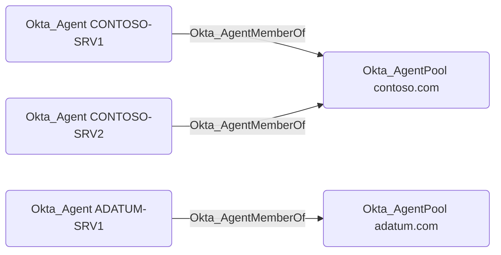

## General Information

`Okta_AgentMemberOf` edges represent membership of an `Okta_Agent` in an `Okta_AgentPool`.

Active Directory Agent Pools and their agents can be visualized in BloodHound as follows:

> [!WARNING]
> Traversable edges between the `Okta_AgentPool` and AD `Domain` nodes are not created in the current version of `OktaHound`.
> This functionality is planned for a future release.
