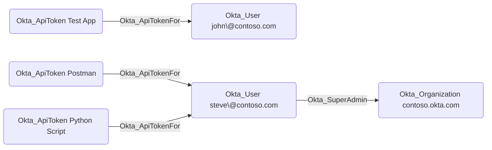

## General Information

The traversable Okta_ApiTokenFor edges represent the API token assignments for users in Okta, represented by the Okta_User nodes:

```mermaid
graph LR
    u1("Okta_User john\@contoso.com")
    u2("Okta_User steve\@contoso.com")
    t1("Okta_ApiToken Test App")
    t2("Okta_ApiToken Postman")
    t3("Okta_ApiToken Python Script")
    org("Okta_Organization contoso.okta.com")
    t1 -- Okta_ApiTokenFor --> u1
    t2 -- Okta_ApiTokenFor --> u2
    t3 -- Okta_ApiTokenFor --> u2
    u2 -- Okta_SuperAdmin --> org
```
