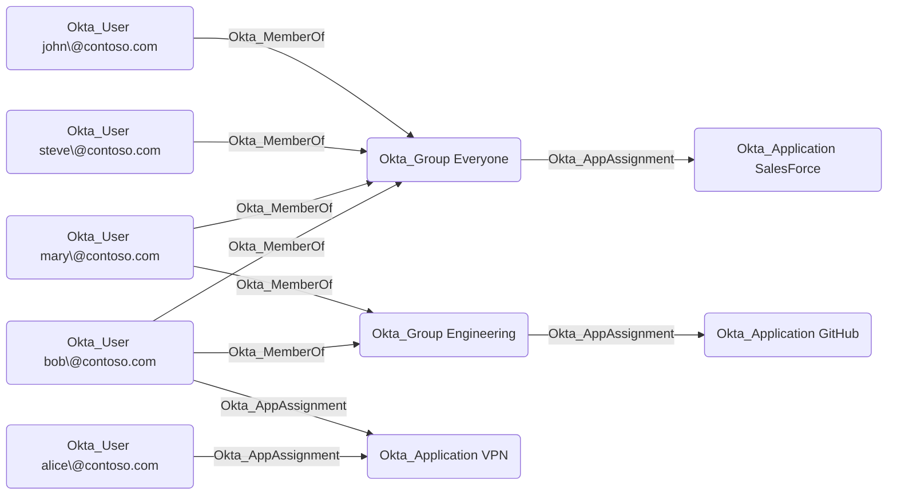

## General Information

Only users that are assigned to applications can access them. Users can be assigned to applications directly or indirectly through group memberships.

The non-traversable `Okta_AppAssignment` edges represent the application assignments for users and groups in Okta:

