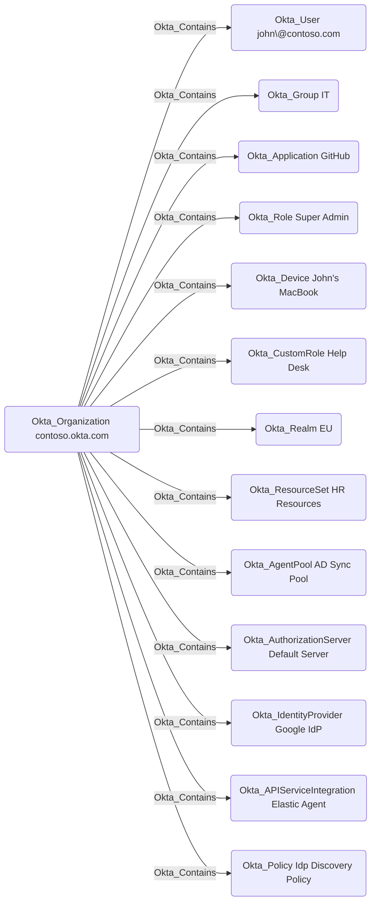

## General Information

The traversable Okta_Contains edges represent containment relationships between the Okta organization and objects collected from that organization. The organization node has Okta_Contains edges to most Okta objects in the graph.



## Abuse Info

This edge is an inventory relationship, not a standalone exploit. An attacker who controls the source organization at an administrative level can usually affect the destination object by using the object-specific Okta API or Admin Console workflow for that object type. In BloodHound terms, `Okta_Contains` helps identify what is inside a compromised org; the concrete abuse is represented by more specific edges such as `Okta_SuperAdmin`, `Okta_OrgAdmin`, `Okta_ResetPassword`, `Okta_AddMember`, `Okta_ManageApp`, `Okta_ReadClientSecret`, `Okta_IdentityProviderFor`, or `Okta_ResourceSetContains`.

To abuse this edge from organization-level control:

1. Obtain Super Administrator, Organization Administrator, or an OAuth service client/API token with sufficient Okta Management scopes in the source organization.
2. Identify the destination object type and choose the object-specific action.
3. For an `Okta_User`, reset credentials, reset authenticators, unlock or activate the account, or change profile attributes that drive group rules and policies.
4. For an `Okta_Group`, add an attacker-controlled user to inherit app assignments, group-push mappings, or admin role assignments.
5. For an `Okta_Application` or `Okta_ApiServiceIntegration`, assign a controlled user, modify sign-on or provisioning settings, rotate credentials, or create a new credential.
6. For an `Okta_IdentityProvider`, modify account linking, signing material, group assignments, or routing rules so controlled external identities become Okta users.
7. For an `Okta_ResourceSet`, add a sensitive object so existing custom-role bindings gain authority over it.
8. For an `Okta_Device`, suspend, deactivate, or delete the device, or use mobile/admin device edges to influence device-based access.

Using the Admin Console:

1. Sign in to the Admin Console as a principal with organization-level authority.
2. Navigate to the destination object area, such as **Directory** > **People**, **Directory** > **Groups**, **Applications** > **Applications**, **Security** > **Identity Providers**, **Security** > **Administrators**, or **Directory** > **Devices**.
3. Perform the smallest object-specific action needed for the path, such as adding a group member, assigning an application, changing an IdP, or adding a resource to a resource set.
4. Verify the derived edge or access path appears. For example, verify a new `Okta_MemberOf`, `Okta_AppAssignment`, `Okta_ManageApp`, or `Okta_ReadClientSecret` path.
5. Use the newly granted access, session, credential, or downstream app entitlement.

Using the Okta API:

1. Set variables for the org and common destination object types. Use only the variables that apply to the object you are abusing.

    ```bash
    export OKTA_ORG="https://contoso.okta.com"
    export OKTA_API_TOKEN="REDACTED"
    export TARGET_USER_ID="00u..."
    export TARGET_GROUP_ID="00g..."
    export TARGET_APP_ID="0oa..."
    export TARGET_IDP_ID="0oa..."
    export TARGET_RESOURCE_SET_ID="iamo..."
    export TARGET_API_SERVICE_ID="0oa..."
    export CONTROLLED_USER_ID="00u..."
    ```

2. Confirm source organization context.

    ```bash
    curl -sS \
      -H "Authorization: SSWS $OKTA_API_TOKEN" \
      -H "Accept: application/json" \
      "$OKTA_ORG/api/v1/org" \
      | jq '{id, companyName, website, status}'
    ```

3. Inspect the destination object before changing it.

    ```bash
    curl -sS -H "Authorization: SSWS $OKTA_API_TOKEN" -H "Accept: application/json" \
      "$OKTA_ORG/api/v1/users/$TARGET_USER_ID" \
      | jq '{id, status, login: .profile.login, email: .profile.email}'

    curl -sS -H "Authorization: SSWS $OKTA_API_TOKEN" -H "Accept: application/json" \
      "$OKTA_ORG/api/v1/groups/$TARGET_GROUP_ID" \
      | jq '{id, type, name: .profile.name}'

    curl -sS -H "Authorization: SSWS $OKTA_API_TOKEN" -H "Accept: application/json" \
      "$OKTA_ORG/api/v1/apps/$TARGET_APP_ID" \
      | jq '{id, label, name, status, signOnMode}'
    ```

4. Abuse the destination object through the concrete action needed for the path. These examples add controlled access through a group and through an application assignment.

    ```bash
    curl -i -sS -X PUT \
      -H "Authorization: SSWS $OKTA_API_TOKEN" \
      -H "Accept: application/json" \
      "$OKTA_ORG/api/v1/groups/$TARGET_GROUP_ID/users/$CONTROLLED_USER_ID"

    curl -sS -X POST \
      -H "Authorization: SSWS $OKTA_API_TOKEN" \
      -H "Accept: application/json" \
      -H "Content-Type: application/json" \
      -d "{\"id\":\"$CONTROLLED_USER_ID\"}" \
      "$OKTA_ORG/api/v1/apps/$TARGET_APP_ID/users" \
      | jq '{id, status, scope, profile}'
    ```

    Adding the group member returns `204 No Content`; assigning the app returns an application user object.

5. Verify the new path.

    ```bash
    curl -sS \
      -H "Authorization: SSWS $OKTA_API_TOKEN" \
      -H "Accept: application/json" \
      "$OKTA_ORG/api/v1/groups/$TARGET_GROUP_ID/users?limit=200" \
      | jq -r '.[] | select(.id == env.CONTROLLED_USER_ID) | [.id, .profile.login] | @tsv'

    curl -sS \
      -H "Authorization: SSWS $OKTA_API_TOKEN" \
      -H "Accept: application/json" \
      "$OKTA_ORG/api/v1/apps/$TARGET_APP_ID/users/$CONTROLLED_USER_ID" \
      | jq '{id, status, scope, profile}'
    ```

6. Continue with the destination object's specific edge documentation for the next action.

## Cleanup after Abuse

Cleanup for `Okta_Contains` means reversing the exact object-specific change made under organization-level control and revoking any sessions, tokens, credentials, or downstream access that change created.

Cleanup using Admin Console:

1. Identify the destination object and the concrete change made to it.
2. Remove temporary users, group memberships, app assignments, role assignments, credentials, IdP changes, policy changes, device changes, or resource-set entries.
3. Restore the destination object's original configuration.
4. Rotate credentials if secrets, keys, API tokens, or app passwords were exposed.
5. Revoke Okta sessions and downstream sessions for principals that received temporary access.
6. Verify the destination object matches its pre-abuse state and the derived attack path no longer resolves.

Cleanup using API:

1. Remove temporary group membership.

    ```bash
    curl -i -sS -X DELETE \
      -H "Authorization: SSWS $OKTA_API_TOKEN" \
      -H "Accept: application/json" \
      "$OKTA_ORG/api/v1/groups/$TARGET_GROUP_ID/users/$CONTROLLED_USER_ID"
    ```

2. Remove temporary application assignment.

    ```bash
    curl -i -sS -X DELETE \
      -H "Authorization: SSWS $OKTA_API_TOKEN" \
      -H "Accept: application/json" \
      "$OKTA_ORG/api/v1/apps/$TARGET_APP_ID/users/$CONTROLLED_USER_ID"
    ```

3. Revoke Okta sessions and OAuth tokens for the controlled user.

    ```bash
    curl -i -sS -X DELETE \
      -H "Authorization: SSWS $OKTA_API_TOKEN" \
      -H "Accept: application/json" \
      "$OKTA_ORG/api/v1/users/$CONTROLLED_USER_ID/sessions?oauthTokens=true"
    ```

4. Verify the temporary paths are gone.

    ```bash
    curl -sS \
      -H "Authorization: SSWS $OKTA_API_TOKEN" \
      -H "Accept: application/json" \
      "$OKTA_ORG/api/v1/groups/$TARGET_GROUP_ID/users?limit=200" \
      | jq -r '.[] | select(.id == env.CONTROLLED_USER_ID)'

    curl -i -sS \
      -H "Authorization: SSWS $OKTA_API_TOKEN" \
      -H "Accept: application/json" \
      "$OKTA_ORG/api/v1/apps/$TARGET_APP_ID/users/$CONTROLLED_USER_ID"
    ```

    The app-user verification should return `404 Not Found` when no direct or inherited assignment remains.

5. Use the destination object's API family for any other cleanup, such as deactivating/deleting a temporary API service secret, removing a resource set resource, deleting a role binding member, restoring an IdP, or reactivating a device.

## Opsec Considerations

`Okta_Contains` itself is not an Okta System Log event. The audit trail comes from the object-specific action performed after using organization control. Common follow-on events include `group.user_membership.add`, `group.user_membership.remove`, `application.user_membership.add`, `application.user_membership.remove`, `user.account.update_profile`, `iam.resourceset.resources.add`, `iam.resourceset.bindings.add`, and app, IdP, device, policy, or credential lifecycle events.

Because organization-level authority can touch many object types, defenders should correlate the administrator or API client session with the exact object-change events and any immediate sign-on, provisioning, token, or downstream app activity.

## References

- [Okta API reference overview](https://developer.okta.com/docs/api/)
- [Okta Users API](https://developer.okta.com/docs/api/openapi/okta-management/management/tag/User/)
- [Okta Group API](https://developer.okta.com/docs/api/openapi/okta-management/management/tag/Group/)
- [Okta Applications API](https://developer.okta.com/docs/api/openapi/okta-management/management/tag/Application/)
- [Okta API Service Integrations API](https://developer.okta.com/docs/api/openapi/okta-management/management/tag/ApiServiceIntegrations/)
- [Okta System Log event types](https://developer.okta.com/docs/reference/api/event-types/)
