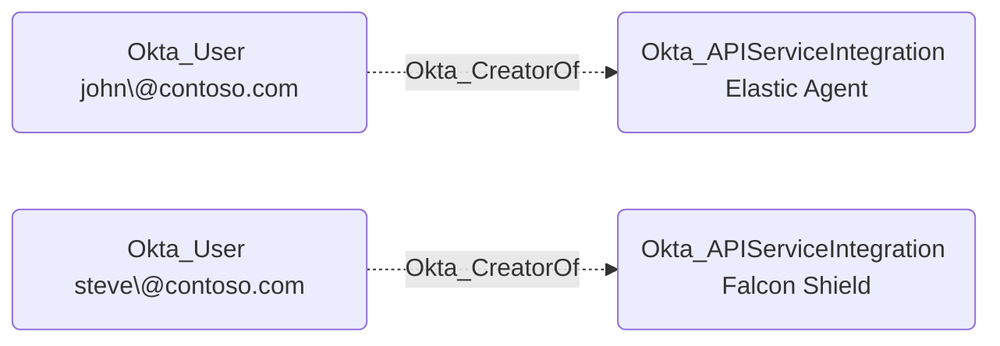

## General Information

The non-traversable `Okta_CreatorOf` edges represent the creator relationships between API Service Integration instances and users in Okta:

```mermaid
graph LR
    u1("Okta_User john\@contoso.com")
    u2("Okta_User steve\@contoso.com")
    is1("Okta_APIServiceIntegration Elastic Agent")
    is2("Okta_APIServiceIntegration Falcon Shield")
    u1 -. Okta_CreatorOf .-> is1
    u2 -. Okta_CreatorOf .-> is2
```
