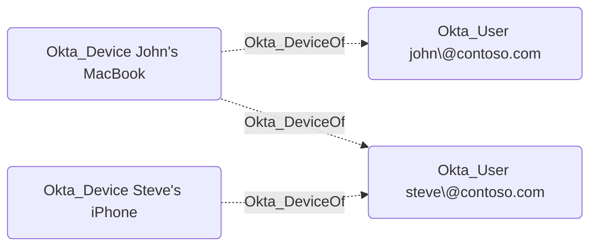

## General Information

The non-traversable Okta_DeviceOf edges represent the ownership relationships between users and devices in Okta:



## Abuse Info

`Okta_DeviceOf` is a device-to-user association. It is not a complete takeover path by itself, but it can satisfy possession, device assurance, Okta Verify FastPass, remembered-device, or browser-session requirements for the destination user. An attacker who controls the source device usually still needs the destination user's password, an active session, a recoverable authenticator, or a separate reset path.

To abuse this edge:

1. Gain physical access, remote control, endpoint malware execution, or MDM-level control over the source device.
2. Identify whether the device has the destination user's Okta Verify enrollment, FastPass, device assurance posture, browser sessions, device-bound certificates, cached app sessions, or refresh tokens.
3. Obtain or create a primary authentication path for the destination user through phishing, password reset, password sync abuse, browser token theft, credential dumping, or another BloodHound path.
4. Start the Okta sign-in from the controlled source device, or reuse an existing browser/native app session on that device.
5. Satisfy the possession requirement with Okta Verify push/FastPass, a remembered device state, device assurance, or an existing session.
6. Access Okta or downstream applications as the destination user.

If the device already has valid browser or native app sessions for the destination user, the attacker may be able to skip password entry for those apps until the sessions expire or are revoked.

Using the Admin Console and endpoint access:

1. From the source device, inspect local browser profiles, Okta Verify, native app sessions, and MDM/device trust state for the destination user.
2. In the Okta Admin Console, open **Directory** > **Devices** and locate the source device.
3. Review the users linked to the device and confirm the destination user appears.
4. Open the destination user and review authenticators, factors, and recent sign-in activity.
5. Use a separate primary-auth path, then complete sign-in from the source device to satisfy device-based controls.
6. Launch the target Okta app or downstream application and verify access.

Using the Okta API:

1. Set variables for the source device, destination user, and any authenticator/factor added during abuse.

    ```bash
    export OKTA_ORG="https://contoso.okta.com"
    export OKTA_API_TOKEN="REDACTED"
    export DEVICE_ID="guo..."
    export TARGET_USER_ID="00u..."
    export ATTACKER_FACTOR_ID="opf..."
    ```

2. Retrieve the source device and linked users.

    ```bash
    curl -sS \
      -H "Authorization: SSWS $OKTA_API_TOKEN" \
      -H "Accept: application/json" \
      "$OKTA_ORG/api/v1/devices/$DEVICE_ID" \
      | jq '{id, status, displayName: .profile.displayName, platform: .profile.platform, registered: .profile.registered, lastUpdated}'

    curl -sS \
      -H "Authorization: SSWS $OKTA_API_TOKEN" \
      -H "Accept: application/json" \
      "$OKTA_ORG/api/v1/devices/$DEVICE_ID/users" \
      | jq -r '.[] | [.user.id, .user.realmId, .managementStatus, .screenLockType] | @tsv'
    ```

3. Review the destination user's authenticators/factors and recent session state before using the device.

    ```bash
    curl -sS \
      -H "Authorization: SSWS $OKTA_API_TOKEN" \
      -H "Accept: application/json" \
      "$OKTA_ORG/api/v1/users/$TARGET_USER_ID/factors" \
      | jq -r '.[] | [.id, .factorType, .provider, .status, .profile.name] | @tsv'
    ```

4. If the source device is being used as the trusted possession for the destination user, authenticate from that device and complete the app launch or token request in the normal browser/native flow. Okta's Management API can verify the device/user link and clean up sessions, but it does not perform the end-user sign-in for you.

5. Verify the device was involved in the destination user's authentication by reviewing the System Log for the destination user, source device, and relevant event types.

    ```bash
    curl -sS \
      -H "Authorization: SSWS $OKTA_API_TOKEN" \
      -H "Accept: application/json" \
      --get "$OKTA_ORG/api/v1/logs" \
      --data-urlencode "filter=actor.id eq \"$TARGET_USER_ID\"" \
      --data-urlencode "limit=20" \
      | jq -r '.[] | [.published, .eventType, .client.userAgent.rawUserAgent, .client.ipAddress] | @tsv'
    ```

## Cleanup after Abuse

Cleanup for `Okta_DeviceOf` removes the device-based access artifacts used for the destination user, revokes sessions and remembered-device state, removes attacker-added factors, and deactivates or deletes the source device record only if the device should no longer be trusted.

Cleanup using Admin Console:

1. Sign the destination user out of Okta and downstream applications on the source device.
2. Open the destination user and remove any attacker-added authenticator or factor.
3. Open **Directory** > **Devices**, select the source device, and review the linked users.
4. Suspend, deactivate, or delete the source device if it is compromised and should no longer satisfy device assurance. Deactivation removes device-user links and is destructive for device factors and client certificates.
5. Remove temporary MDM profiles, device trust certificates, browser profiles, refresh tokens, and local session artifacts from the source device.
6. Verify the destination user has only expected trusted devices, authenticators, and active sessions.

Cleanup using API:

1. Remove an attacker-controlled factor from the destination user if one was enrolled during abuse.

    ```bash
    curl -i -sS -X DELETE \
      -H "Authorization: SSWS $OKTA_API_TOKEN" \
      -H "Accept: application/json" \
      "$OKTA_ORG/api/v1/users/$TARGET_USER_ID/factors/$ATTACKER_FACTOR_ID"
    ```

    A successful deletion returns `204 No Content`.

2. Revoke the destination user's Okta sessions, OAuth tokens, and remembered-device state.

    ```bash
    curl -i -sS -X DELETE \
      -H "Authorization: SSWS $OKTA_API_TOKEN" \
      -H "Accept: application/json" \
      "$OKTA_ORG/api/v1/users/$TARGET_USER_ID/sessions?oauthTokens=true&forgetDevices=true"
    ```

    A successful request returns `204 No Content`.

3. If the source device is compromised, suspend or deactivate it. Suspension is temporary; deactivation removes device-user links and prepares the device for deletion.

    ```bash
    curl -i -sS -X POST \
      -H "Authorization: SSWS $OKTA_API_TOKEN" \
      -H "Accept: application/json" \
      "$OKTA_ORG/api/v1/devices/$DEVICE_ID/lifecycle/suspend"

    curl -i -sS -X POST \
      -H "Authorization: SSWS $OKTA_API_TOKEN" \
      -H "Accept: application/json" \
      "$OKTA_ORG/api/v1/devices/$DEVICE_ID/lifecycle/deactivate"
    ```

4. Delete the device record only after deactivation and only when re-enrollment is acceptable.

    ```bash
    curl -i -sS -X DELETE \
      -H "Authorization: SSWS $OKTA_API_TOKEN" \
      -H "Accept: application/json" \
      "$OKTA_ORG/api/v1/devices/$DEVICE_ID"
    ```

    A successful deletion returns `204 No Content`.

5. Verify the destination user no longer has the attacker factor and the device no longer links to the user.

    ```bash
    curl -sS \
      -H "Authorization: SSWS $OKTA_API_TOKEN" \
      -H "Accept: application/json" \
      "$OKTA_ORG/api/v1/users/$TARGET_USER_ID/factors" \
      | jq -r '.[] | select(.id == env.ATTACKER_FACTOR_ID)'

    curl -i -sS \
      -H "Authorization: SSWS $OKTA_API_TOKEN" \
      -H "Accept: application/json" \
      "$OKTA_ORG/api/v1/devices/$DEVICE_ID/users"
    ```

    If the device was deleted, device verification should return `404 Not Found`. If it was only deactivated, the users list should no longer include the destination user.

## Opsec Considerations

Device-based abuse leaves endpoint, MDM, Okta Verify, device assurance, and Okta System Log traces. Relevant Okta events include `device.user.add`, `device.user.remove`, device lifecycle events, `credential.register`, `credential.revoke`, `user.authentication.auth_via_mfa`, sign-on policy evaluation events, and session or token revocation events.

A trusted device used from a new network, remote access tool, unusual browser profile, or abnormal user agent is suspicious. Defenders should correlate the source device ID, destination user, authenticator method, IP, user agent, and any password/factor reset path that preceded the device-based sign-in.

## References

- [Okta Devices API](https://developer.okta.com/docs/api/openapi/okta-management/management/tag/Device/)
- [Okta device documentation](https://help.okta.com/en-us/content/topics/devices/devices-main-landing.htm)
- [Okta User Factors API](https://developer.okta.com/docs/api/openapi/okta-management/management/tag/UserFactor/)
- [Okta User Sessions API](https://developer.okta.com/docs/api/openapi/okta-management/management/tag/UserSessions/)
- [Okta System Log API](https://developer.okta.com/docs/api/openapi/okta-management/management/tag/SystemLog/)
- [Okta System Log event types](https://developer.okta.com/docs/reference/api/event-types/)
- [Okta Terrify](https://github.com/CCob/okta-terrify)
