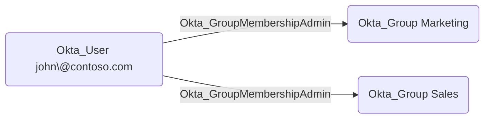

## General Information

The traversable Okta_GroupMembershipAdmin edges represent Group Membership Administrator role assignments. Group Membership Administrators can add and remove members from groups within their assigned scope but cannot modify the groups themselves.

