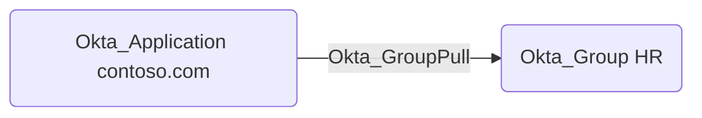

## General Information

The traversable `Okta_GroupPull` edges represent the group synchronization relationships from applications to Okta:

```mermaid
graph LR
    g1("Okta_Group HR")
    app1("Okta_Application contoso.com")
    app1 -- Okta_GroupPull --> g1
```
