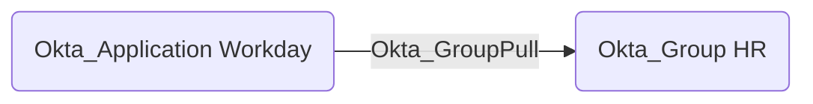

## General Information

The traversable Okta_GroupPull edges represent group synchronization relationships from applications or external directories into Okta:



## Abuse Info

An attacker who controls the source application or external directory can influence the destination Okta group during import. If the destination group receives Okta application assignments, policy targeting, downstream group push, or admin role assignments, controlling the source can become an Okta privilege escalation path.

This edge is directly useful when the source application is authoritative for the destination group, group membership, or group attributes. The attacker changes the source-side group, then lets Okta import that state into the destination group.

Using the Admin Console:

1. Gain administrative control of the source application, external directory, or import connector.
2. Identify the source-side group that maps to the destination Okta group.
3. Add an attacker-controlled source user to the source-side group, or change group attributes that are mapped into Okta.
4. In Okta, open **Applications** > **Applications** and select the source application.
5. Run an import if the connector supports manual imports, or wait for the scheduled import.
6. Review and confirm staged import results if Okta requires approval before applying changes.
7. Confirm the destination Okta group now contains the linked attacker-controlled Okta user or has the desired imported attributes.
8. Start a new Okta session as the affected user and use any assignments, policies, downstream group-push paths, or role assignments granted by the destination group.

Using source and Okta APIs:

1. Set variables for the Okta org, destination group, source application, source group, and attacker-controlled source user. The source API endpoint is connector-specific.

    ```bash
    export OKTA_ORG="https://contoso.okta.com"
    export OKTA_API_TOKEN="REDACTED"
    export SOURCE_API_BASE="https://source.example.com/api"
    export SOURCE_API_TOKEN="REDACTED_SOURCE_TOKEN"
    export SOURCE_APP_ID="0oa..."
    export SOURCE_GROUP_ID="src-group..."
    export SOURCE_USER_ID="src-user..."
    export TARGET_GROUP_ID="00g..."
    export CONTROLLED_OKTA_USER_ID="00u..."
    ```

2. Change the source-side group membership. Replace the endpoint and body with the source application's official group-membership API.

    ```bash
    curl -i -sS -X POST \
      -H "Authorization: Bearer $SOURCE_API_TOKEN" \
      -H "Accept: application/json" \
      -H "Content-Type: application/json" \
      -d "{\"userId\":\"$SOURCE_USER_ID\"}" \
      "$SOURCE_API_BASE/groups/$SOURCE_GROUP_ID/members"
    ```

3. Verify the destination group in Okta before import so you can distinguish the old state from the imported state.

    ```bash
    curl -sS \
      -H "Authorization: SSWS $OKTA_API_TOKEN" \
      -H "Accept: application/json" \
      "$OKTA_ORG/api/v1/groups/$TARGET_GROUP_ID/users?limit=200" \
      | jq -r '.[] | [.id, .profile.login, .status] | @tsv'
    ```

4. Trigger import from the Admin Console if the connector does not expose a documented Management API import trigger. Some integrations expose connector-specific import APIs, but the Okta Management API does not provide one universal import endpoint for every application type.

5. Verify that the destination Okta group contains the linked controlled user after import.

    ```bash
    curl -sS \
      -H "Authorization: SSWS $OKTA_API_TOKEN" \
      -H "Accept: application/json" \
      "$OKTA_ORG/api/v1/groups/$TARGET_GROUP_ID/users?limit=200" \
      | jq -r '.[] | select(.id == env.CONTROLLED_OKTA_USER_ID) | [.id, .profile.login, .status] | @tsv'
    ```

6. Enumerate the destination group's app assignments to understand what the imported membership grants.

    ```bash
    curl -sS \
      -H "Authorization: SSWS $OKTA_API_TOKEN" \
      -H "Accept: application/json" \
      "$OKTA_ORG/api/v1/groups/$TARGET_GROUP_ID/apps?limit=200" \
      | jq -r '.[] | [.id, .label, .name, .status] | @tsv'
    ```

If the destination group is an imported `APP_GROUP`, direct Okta group-membership writes may fail or be overwritten. In that case, modify the authoritative source and let import apply the change.

## Cleanup after Abuse

Cleanup for `Okta_GroupPull` means restoring the source application's group state, re-importing it into Okta, and removing any leftover Okta group membership or app access that the import does not revert automatically.

Cleanup using Admin Console:

1. Restore the source-side group membership and group attributes in the external application or directory.
2. In Okta, open the source application and run an import if the integration supports manual imports.
3. Review staged import results and apply the cleanup changes.
4. Open **Directory** > **Groups** and select the destination Okta group.
5. Verify the attacker-controlled user and any temporary attributes are gone.
6. Revoke sessions for affected Okta users if group claims or assignments were used.

Cleanup using API:

1. Remove the attacker-controlled user from the source-side group. Replace the endpoint with the source application's official API.

    ```bash
    curl -i -sS -X DELETE \
      -H "Authorization: Bearer $SOURCE_API_TOKEN" \
      -H "Accept: application/json" \
      "$SOURCE_API_BASE/groups/$SOURCE_GROUP_ID/members/$SOURCE_USER_ID"
    ```

2. After import runs, verify the destination Okta group no longer contains the controlled Okta user.

    ```bash
    curl -sS \
      -H "Authorization: SSWS $OKTA_API_TOKEN" \
      -H "Accept: application/json" \
      "$OKTA_ORG/api/v1/groups/$TARGET_GROUP_ID/users?limit=200" \
      | jq -r '.[] | select(.id == env.CONTROLLED_OKTA_USER_ID)'
    ```

3. If the integration leaves a stale Okta-managed membership behind, remove it directly.

    ```bash
    curl -i -sS -X DELETE \
      -H "Authorization: SSWS $OKTA_API_TOKEN" \
      -H "Accept: application/json" \
      "$OKTA_ORG/api/v1/groups/$TARGET_GROUP_ID/users/$CONTROLLED_OKTA_USER_ID"
    ```

4. Revoke sessions and OAuth tokens for the affected Okta user.

    ```bash
    curl -i -sS -X DELETE \
      -H "Authorization: SSWS $OKTA_API_TOKEN" \
      -H "Accept: application/json" \
      "$OKTA_ORG/api/v1/users/$CONTROLLED_OKTA_USER_ID/sessions?oauthTokens=true"
    ```

## Opsec Considerations

Abuse creates telemetry in both systems: source-side group membership changes, Okta import activity, Okta group membership changes, and downstream application access from the imported user. Importing a privileged group outside the normal schedule or with unusual membership churn is a strong detection point.

If the import workflow stages changes for approval, the staged diff may expose the attacker-controlled source user, changed attributes, and affected destination group before the change becomes active.

## References

- [Okta Group API](https://developer.okta.com/docs/api/openapi/okta-management/management/tag/Group/)
- [Okta Applications API](https://developer.okta.com/docs/api/openapi/okta-management/management/tag/Application/)
- [Okta Application Groups API](https://developer.okta.com/docs/api/openapi/okta-management/management/tag/ApplicationGroups/)
- [Okta Profile Mappings API](https://developer.okta.com/docs/api/openapi/okta-management/management/tag/ProfileMapping/)
- [Okta SCIM concepts](https://developer.okta.com/docs/concepts/scim/)
- [Okta System Log event types](https://developer.okta.com/docs/reference/api/event-types/)
