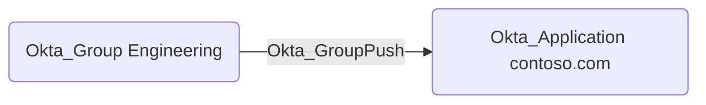

## General Information

The non-traversable `Okta_GroupPush` edges represent the group push assignments to applications.
This indicates group provisioning and membership synchronization from Okta to external applications.

