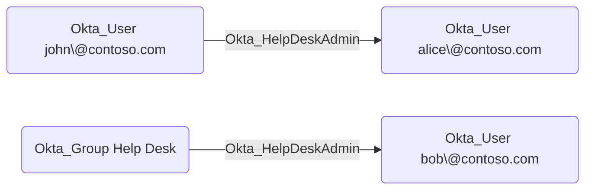

## General Information

The traversable `Okta_HelpDeskAdmin` edges represent Help Desk Administrator role assignments.
Help Desk Administrators can perform password resets, unlock accounts, and reset MFA factors for users within their assigned scope.

