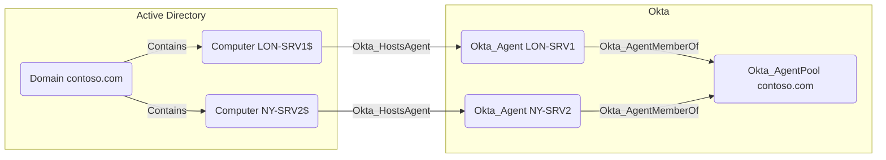

## General Information

Hybrid Okta_HostsAgent edges connect an AD Computer node to the Okta_Agent running on that host.



## Abuse Info

An attacker who controls the source AD computer can compromise the destination Okta Agent running on that host. This does not grant an Okta admin role by itself; the useful primitive is local code execution inside the trust boundary of the agent that handles directory import, delegated authentication, password sync, or group sync for an on-premises integration.

If the agent is an Active Directory agent, the attacker can use the host as a pivot into the AD-backed Okta integration. Practical abuse usually falls into one of these paths:

1. Inspect the agent service, local configuration, logs, process environment, and service-account context on the source computer.
2. Recover or use any exposed AD connector credentials, cached secrets, Kerberos tickets, or local registration material that the agent host makes available.
3. Modify authoritative AD objects that the compromised agent or its pool imports into Okta, such as users, groups, group membership, passwords, or profile attributes.
4. Let the agent import or validate the modified AD state, then follow the resulting `Okta_UserSync`, `Okta_GroupPull`, `Okta_MembershipSync`, or `Okta_PasswordSync` path.
5. Follow `Okta_AgentMemberOf` from the destination agent to its pool and `Okta_AgentPoolFor` from that pool to the backing directory application to identify the Okta users, groups, and apps affected by the compromised host.

Using the Admin Console:

1. Sign in to the Okta Admin Console with an account that can view directory integrations and agents.
2. Open the org agent status view or the affected **Directory** > **Directory Integrations** > **Active Directory** integration and identify the destination agent by name, version, last connection, and operational status.
3. Confirm the source computer from the edge is the server that hosts that agent.
4. Review the integration settings for delegated authentication, imports, password sync, and group sync so you know which Okta objects can be influenced through the agent.
5. From the compromised source computer, make the AD-side change needed for the path, such as adding a controlled AD user to an imported group or resetting the AD password for a delegated-auth user.
6. Run an import from the integration if the Admin Console exposes a manual import action, or wait for the scheduled agent import.
7. Verify the destination Okta user or group changed, refresh the affected user's Okta session, and use the app assignment, group claim, policy target, or delegated-auth sign-in that the imported state grants.

Using the agent host, Active Directory PowerShell, and Okta API verification:

1. Set variables for the Okta org, destination agent, destination pool, and any AD-to-Okta change you plan to verify.

    ```bash
    export OKTA_ORG="https://contoso.okta.com"
    export OKTA_API_TOKEN="REDACTED"
    export AGENT_ID="0ag..."
    export AGENT_POOL_ID="0ap..."
    export TARGET_OKTA_GROUP_ID="00g..."
    export CONTROLLED_OKTA_USER_ID="00u..."
    ```

2. Verify that the destination agent is present in the expected pool.

    ```bash
    curl -sS \
      -H "Authorization: SSWS $OKTA_API_TOKEN" \
      -H "Accept: application/json" \
      "$OKTA_ORG/api/v1/agentPools?poolType=AD&limitPerPoolType=20" \
      | jq --arg agent "$AGENT_ID" '
          .[] as $pool
          | ($pool.agents // [] | if type == "array" then . else [.] end)[]?
          | select(.id == $agent)
          | {
              pool: {
                id: $pool.id,
                name: $pool.name,
                type: $pool.type,
                operationalStatus: $pool.operationalStatus,
                disruptedAgents: $pool.disruptedAgents,
                inactiveAgents: $pool.inactiveAgents
              },
              agent: {
                id: .id,
                name: .name,
                operationalStatus: .operationalStatus,
                lastConnection: .lastConnection,
                active: .active,
                version: .version,
                poolId: .poolId
              }
            }'
    ```

3. On the source AD computer, enumerate the Okta agent service, process, and local install locations.

    ```powershell
    $AgentHost = "LON-SRV1"

    Invoke-Command -ComputerName $AgentHost -ScriptBlock {
      Get-CimInstance Win32_Service |
        Where-Object { $_.DisplayName -like "*Okta*Agent*" -or $_.Name -like "*Okta*" } |
        Select-Object Name, DisplayName, State, StartName, PathName

      Get-Process |
        Where-Object { $_.ProcessName -like "*Okta*" } |
        Select-Object Id, ProcessName, Path

      Get-ChildItem -Path "C:\Program Files", "C:\Program Files (x86)", "C:\ProgramData" -Directory -ErrorAction SilentlyContinue |
        Where-Object { $_.Name -like "*Okta*" } |
        Select-Object FullName
    }
    ```

4. If the path depends on an imported AD group, add a controlled AD user to that source group from a host with the Active Directory PowerShell module.

    ```powershell
    Import-Module ActiveDirectory

    $TargetAdGroupDn = "CN=Finance App Admins,OU=Groups,DC=contoso,DC=com"
    $ControlledAdUserDn = "CN=alice,OU=Users,DC=contoso,DC=com"

    Add-ADGroupMember -Identity $TargetAdGroupDn -Members $ControlledAdUserDn
    ```

5. After the AD agent import runs, verify that the linked Okta user was added to the destination Okta group.

    ```bash
    curl -sS \
      -H "Authorization: SSWS $OKTA_API_TOKEN" \
      -H "Accept: application/json" \
      "$OKTA_ORG/api/v1/groups/$TARGET_OKTA_GROUP_ID/users?limit=200" \
      | jq -r '.[] | select(.id == env.CONTROLLED_OKTA_USER_ID) | [.id, .profile.login, .status] | @tsv'
    ```

6. If the path depends on delegated authentication instead of group import, set the source AD user's password through the authorized AD path and attempt an Okta sign-in as the linked Okta user. The Okta Management API does not safely validate a plaintext password; use an interactive sign-in or controlled authentication test and then inspect Okta System Log activity for the delegated-auth event.

## Cleanup after Abuse

Cleanup for `Okta_HostsAgent` means restoring the specific agent host that was controlled, removing any temporary AD changes made through that host, rotating exposed AD agent credentials, and confirming the destination agent is healthy in its pool again.

Cleanup using Admin Console:

1. Open the org agent status view or the affected Active Directory integration and select the destination agent from the edge.
2. Confirm whether the agent is still active, when it last connected, and whether the pool shows disrupted or inactive agents.
3. On the source computer, remove temporary tooling, restore the Okta Agent service configuration, and restore file permissions on the agent installation and data directories.
4. Rotate the AD service account or directory connector credentials exposed on the host, then update the integration or service configuration as required by the AD agent deployment.
5. Remove any temporary AD user, group, password, or profile changes that were imported through the agent.
6. Restart, re-register, or reinstall the agent only if local registration material or configuration was modified.
7. Run or wait for an import and verify the destination agent and its pool return to a healthy state.

Cleanup using API:

1. Remove any temporary AD group membership created through the compromised host.

    ```powershell
    Import-Module ActiveDirectory

    $TargetAdGroupDn = "CN=Finance App Admins,OU=Groups,DC=contoso,DC=com"
    $ControlledAdUserDn = "CN=alice,OU=Users,DC=contoso,DC=com"

    Remove-ADGroupMember -Identity $TargetAdGroupDn -Members $ControlledAdUserDn -Confirm:$false
    ```

2. Rotate the AD service account used by the agent if that credential or its Kerberos material may have been exposed.

    ```powershell
    Import-Module ActiveDirectory

    $AgentServiceAccount = "OktaService"
    $NewPassword = Read-Host "New AD agent service-account password" -AsSecureString

    Set-ADAccountPassword -Identity $AgentServiceAccount -Reset -NewPassword $NewPassword
    ```

3. Restart the Okta agent service on the source computer after configuration and credential repair.

    ```powershell
    $AgentHost = "LON-SRV1"

    Invoke-Command -ComputerName $AgentHost -ScriptBlock {
      Get-Service |
        Where-Object { $_.DisplayName -like "*Okta*Agent*" -or $_.Name -like "*Okta*" } |
        Restart-Service -Force

      Get-Service |
        Where-Object { $_.DisplayName -like "*Okta*Agent*" -or $_.Name -like "*Okta*" } |
        Select-Object Name, DisplayName, Status
    }
    ```

4. Verify the destination Okta agent is active in the expected pool.

    ```bash
    curl -sS \
      -H "Authorization: SSWS $OKTA_API_TOKEN" \
      -H "Accept: application/json" \
      "$OKTA_ORG/api/v1/agentPools?poolType=AD&limitPerPoolType=20" \
      | jq --arg agent "$AGENT_ID" '
          .[] as $pool
          | ($pool.agents // [] | if type == "array" then . else [.] end)[]?
          | select(.id == $agent)
          | {
              pool: {id: $pool.id, name: $pool.name, operationalStatus: $pool.operationalStatus},
              agent: {id: .id, name: .name, operationalStatus: .operationalStatus, lastConnection: .lastConnection}
            }'
    ```

5. After import runs, verify the temporary Okta group membership is gone.

    ```bash
    curl -sS \
      -H "Authorization: SSWS $OKTA_API_TOKEN" \
      -H "Accept: application/json" \
      "$OKTA_ORG/api/v1/groups/$TARGET_OKTA_GROUP_ID/users?limit=200" \
      | jq -r '.[] | select(.id == env.CONTROLLED_OKTA_USER_ID)'
    ```

6. Revoke sessions and OAuth tokens for any linked Okta user that used the imported access.

    ```bash
    curl -i -sS -X DELETE \
      -H "Authorization: SSWS $OKTA_API_TOKEN" \
      -H "Accept: application/json" \
      "$OKTA_ORG/api/v1/users/$CONTROLLED_OKTA_USER_ID/sessions?oauthTokens=true"
    ```

## Opsec Considerations

Compromising the source computer leaves endpoint, AD, and Okta telemetry. On the agent host, defenders can see remote logons, service stops and starts, new services, PowerShell activity, file access in agent directories, and unusual outbound connections from the agent process. Useful Windows events include Security 4624, 4625, 4648, and 4672; PowerShell 4103 and 4104; and Service Control Manager 7036, 7040, and 7045.

AD-side changes such as adding a user to a synchronized group or resetting a delegated-auth user's password create domain controller audit events such as 4728, 4729, 4732, 4733, 4723, and 4724 depending on group scope and action. Okta-side indicators include agent health changes, import or provisioning failures, `application.provision.user.sync`, `user.authentication.auth_via_AD_agent`, and new sessions or app launches by users whose access appeared immediately after an AD agent import.

## References

- [Okta Agent Pools API: List all agent pools](https://developer.okta.com/docs/api/openapi/okta-management/management/tag/AgentPools/#tag/AgentPools/operation/listAgentPools)
- [Okta view org agents status](https://help.okta.com/oie/en-us/content/topics/dashboard/view-org-agent-status.htm)
- [Okta install multiple Active Directory agents](https://help.okta.com/oie/en-us/content/topics/directory/ad-agent-install-multiple.htm)
- [Okta delegated authentication with Active Directory](https://help.okta.com/en-us/Content/Topics/Directory/Directory_AD_Delegated_Authentication.htm)
- [Okta service account permissions](https://help.okta.com/oie/en-us/content/topics/directory/ad-agent-about-service-account.htm)
- [Okta User Sessions API: Revoke all user sessions](https://developer.okta.com/docs/api/openapi/okta-management/management/tag/UserSessions/#tag/UserSessions/operation/revokeUserSessions)
- [Okta System Log event types](https://developer.okta.com/docs/reference/api/event-types/)
- [Microsoft Add-ADGroupMember](https://learn.microsoft.com/en-us/powershell/module/activedirectory/add-adgroupmember)
- [Microsoft Remove-ADGroupMember](https://learn.microsoft.com/en-us/powershell/module/activedirectory/remove-adgroupmember)
- [Microsoft Set-ADAccountPassword](https://learn.microsoft.com/en-us/powershell/module/activedirectory/set-adaccountpassword)
- [SpecterOps: Discovering Unexpected Okta Attack Paths with BloodHound](https://specterops.io/blog/2026/03/23/discovering-unexpected-okta-attack-paths-with-bloodhound/)
