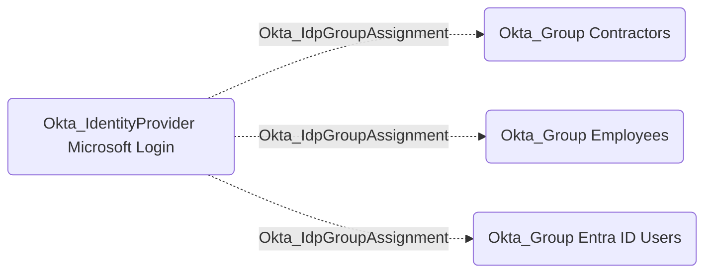

## General Information

The non-traversable `Okta_IdpGroupAssignment` edges represent groups automatically assigned to users based on identity provider attributes or user claims:

```mermaid
graph LR
    idp1("Okta_IdentityProvider Microsoft Login")
    g1("Okta_Group Contractors")
    g2("Okta_Group Employees")
    g3("Okta_Group Entra ID Users")
    idp1 -. Okta_IdpGroupAssignment .-> g1
    idp1 -. Okta_IdpGroupAssignment .-> g2
    idp1 -. Okta_IdpGroupAssignment .-> g3
```
