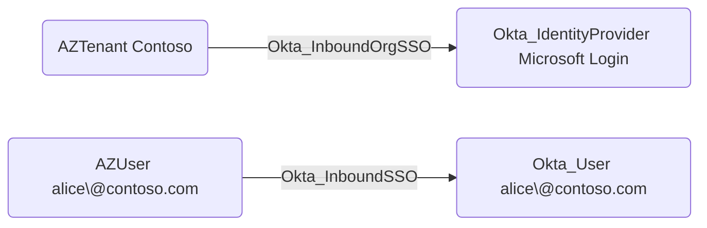

## General Information

The `Okta_InboundOrgSSO` and `Okta_InboundSSO` hybrid edges connect external tenants and users to Okta entities:

```mermaid
graph LR
    t1("AZTenant Contoso")
    idp1("Okta_IdentityProvider Microsoft Login")
    u1("AZUser alice\@contoso.com")
    ou1("Okta_User alice\@contoso.com")
    t1 -- Okta_InboundOrgSSO --> idp1
    u1 -- Okta_InboundSSO --> ou1
```
