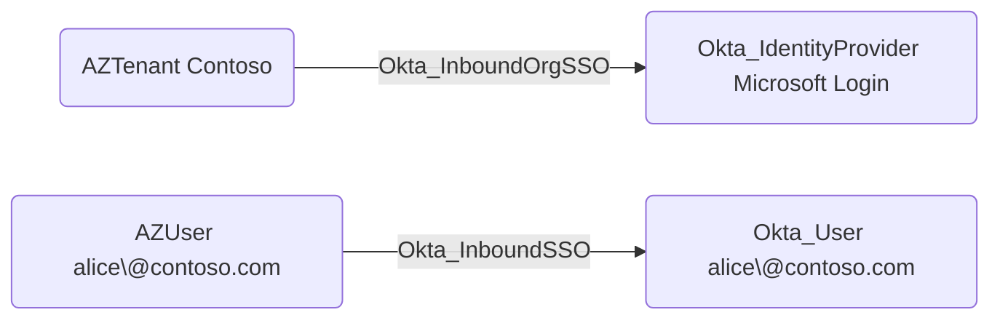

## General Information

The traversable Okta_InboundOrgSSO edges represent an external organization or tenant that can authenticate users into Okta through an Okta identity provider:



OpenHound emits this edge for Microsoft-backed SAML IdPs when the IdP SSO URL identifies the source tenant. The edge is tenant-level: it shows the source tenant is trusted by the destination Okta IdP, while `Okta_InboundSSO`, `Okta_IdentityProviderFor`, and `Okta_IdpGroupAssignment` show the user and group impact.

## Abuse Info

An attacker who controls the source external tenant can abuse the destination Okta IdP trust to authenticate users into Okta, manipulate mapped attributes, or issue assertions for targeted Okta accounts. If the attacker controls tenant signing material or the enterprise application that issues SAML claims, they can potentially mint assertions that Okta accepts for existing linked users.

This edge does not specify the exact user to compromise. Use adjacent `Okta_InboundSSO` edges for specific external-user-to-Okta-user mappings and `Okta_IdpGroupAssignment` for group grants applied during inbound login.

Using the source tenant and Okta Admin Console:

1. Gain administrative control of the source tenant, the enterprise application used for Okta federation, or the signing credentials for the IdP.
2. In Okta, open **Security** > **Identity Providers** and inspect the destination IdP's issuer, SSO URL, account linking, subject mapping, and group assignment settings.
3. In the source tenant, create or modify an external user whose attributes map to a target Okta user, or modify the SAML/OIDC claims emitted by the enterprise application.
4. If the attack requires group-based access, add the external user to the source group emitted in the IdP assertion or mapped to an `Okta_IdpGroupAssignment`.
5. Initiate SSO into Okta through the destination IdP.
6. Use the resulting Okta session or IdP-driven group membership to reach applications and privileges in the Okta org.

Using Microsoft Graph and the Okta API:

1. Set variables for the source tenant, source user, optional source group, destination Okta IdP, and destination Okta user.

    ```bash
    export ENTRA_ACCESS_TOKEN="REDACTED_GRAPH_TOKEN"
    export ENTRA_TENANT_ID="00000000-0000-0000-0000-000000000000"
    export ENTRA_USER_ID="22222222-2222-2222-2222-222222222222"
    export ENTRA_GROUP_ID="33333333-3333-3333-3333-333333333333"
    export OKTA_ORG="https://contoso.okta.com"
    export OKTA_API_TOKEN="REDACTED"
    export IDP_ID="0oa..."
    export DEST_OKTA_USER_ID="00u..."
    ```

2. Retrieve and save the destination Okta IdP configuration.

    ```bash
    curl -sS \
      -H "Authorization: SSWS $OKTA_API_TOKEN" \
      -H "Accept: application/json" \
      "$OKTA_ORG/api/v1/idps/$IDP_ID" \
      | tee /tmp/okta-inbound-org-idp-original.json \
      | jq '{id, type, name, status, sso: .protocol.endpoints.sso.url, accountLink: .policy.accountLink, provisioning: .policy.provisioning, subject: .policy.subject}'
    ```

3. Confirm which Okta users are currently linked to the IdP.

    ```bash
    curl -sS \
      -H "Authorization: SSWS $OKTA_API_TOKEN" \
      -H "Accept: application/json" \
      "$OKTA_ORG/api/v1/idps/$IDP_ID/users?limit=200&expand=user" \
      | jq -r '.[] | [.id, .externalId, .profile.email, .profile.subjectNameId] | @tsv'
    ```

4. Modify a source tenant user attribute that the IdP assertion maps into Okta. Replace the property with the one used by the Okta IdP subject or profile mapping.

    ```bash
    export TEMP_DEPARTMENT="Finance"

    curl -i -sS -X PATCH \
      -H "Authorization: Bearer $ENTRA_ACCESS_TOKEN" \
      -H "Accept: application/json" \
      -H "Content-Type: application/json" \
      -d "{\"department\":\"$TEMP_DEPARTMENT\"}" \
      "https://graph.microsoft.com/v1.0/users/$ENTRA_USER_ID"
    ```

5. Add the source user to a source group that is emitted as a group claim if the Okta path depends on IdP group assignment.

    ```bash
    curl -i -sS -X POST \
      -H "Authorization: Bearer $ENTRA_ACCESS_TOKEN" \
      -H "Accept: application/json" \
      -H "Content-Type: application/json" \
      -d "{\"@odata.id\":\"https://graph.microsoft.com/v1.0/directoryObjects/$ENTRA_USER_ID\"}" \
      "https://graph.microsoft.com/v1.0/groups/$ENTRA_GROUP_ID/members/\$ref"
    ```

    A successful request returns `204 No Content`.

6. Complete the browser SSO flow through the source tenant into Okta.

7. Verify the destination Okta user and any IdP-driven groups.

    ```bash
    curl -sS \
      -H "Authorization: SSWS $OKTA_API_TOKEN" \
      -H "Accept: application/json" \
      "$OKTA_ORG/api/v1/users/$DEST_OKTA_USER_ID" \
      | jq '{id, status, lastLogin, login: .profile.login, email: .profile.email, department: .profile.department}'

    curl -sS \
      -H "Authorization: SSWS $OKTA_API_TOKEN" \
      -H "Accept: application/json" \
      "$OKTA_ORG/api/v1/users/$DEST_OKTA_USER_ID/groups" \
      | jq -r '.[] | [.id, .type, .profile.name] | @tsv'
    ```

## Cleanup after Abuse

Cleanup for `Okta_InboundOrgSSO` means restoring the source tenant's federation users, group claims, and signing material, restoring the destination Okta IdP trust if it was changed, and revoking any Okta sessions or group memberships created through the inbound federation path.

Cleanup using Admin Console:

1. Restore the source tenant's enterprise application configuration, claims, signing certificates, users, and groups.
2. Rotate source tenant signing material if it was exposed.
3. In Okta, restore the destination identity provider configuration, including issuer, endpoints, certificates, account link policy, subject mapping, and group assignments.
4. Remove unintended Okta account links and JIT-provisioned users.
5. Remove IdP-driven Okta group memberships created during the operation.
6. Revoke Okta sessions and downstream app sessions created through the inbound trust.

Cleanup using API:

1. Restore source tenant user attributes.

    ```bash
    export ORIGINAL_DEPARTMENT="Engineering"

    curl -i -sS -X PATCH \
      -H "Authorization: Bearer $ENTRA_ACCESS_TOKEN" \
      -H "Accept: application/json" \
      -H "Content-Type: application/json" \
      -d "{\"department\":\"$ORIGINAL_DEPARTMENT\"}" \
      "https://graph.microsoft.com/v1.0/users/$ENTRA_USER_ID"
    ```

2. Remove the source user from a temporary Entra group claim.

    ```bash
    curl -i -sS -X DELETE \
      -H "Authorization: Bearer $ENTRA_ACCESS_TOKEN" \
      -H "Accept: application/json" \
      "https://graph.microsoft.com/v1.0/groups/$ENTRA_GROUP_ID/members/$ENTRA_USER_ID/\$ref"
    ```

3. Restore the destination Okta IdP configuration if it changed.

    ```bash
    curl -sS -X PUT \
      -H "Authorization: SSWS $OKTA_API_TOKEN" \
      -H "Accept: application/json" \
      -H "Content-Type: application/json" \
      -d @/tmp/okta-inbound-org-idp-original.json \
      "$OKTA_ORG/api/v1/idps/$IDP_ID" \
      | jq '{id, type, name, status, lastUpdated, policy}'
    ```

4. Deactivate the inbound IdP as an emergency containment step if the source tenant remains compromised.

    ```bash
    curl -i -sS -X POST \
      -H "Authorization: SSWS $OKTA_API_TOKEN" \
      -H "Accept: application/json" \
      "$OKTA_ORG/api/v1/idps/$IDP_ID/lifecycle/deactivate"
    ```

    A successful response returns the IdP with `status` set to `INACTIVE`.

5. Remove temporary group membership for the affected Okta user if needed.

    ```bash
    export TEMP_OKTA_GROUP_ID="00g..."

    curl -i -sS -X DELETE \
      -H "Authorization: SSWS $OKTA_API_TOKEN" \
      -H "Accept: application/json" \
      "$OKTA_ORG/api/v1/groups/$TEMP_OKTA_GROUP_ID/users/$DEST_OKTA_USER_ID"
    ```

6. Revoke Okta sessions and OAuth tokens for the affected destination user.

    ```bash
    curl -i -sS -X DELETE \
      -H "Authorization: SSWS $OKTA_API_TOKEN" \
      -H "Accept: application/json" \
      "$OKTA_ORG/api/v1/users/$DEST_OKTA_USER_ID/sessions?oauthTokens=true"
    ```

7. Verify the IdP and user state after cleanup.

    ```bash
    curl -sS \
      -H "Authorization: SSWS $OKTA_API_TOKEN" \
      -H "Accept: application/json" \
      "$OKTA_ORG/api/v1/idps/$IDP_ID" \
      | jq '{id, type, name, status, sso: .protocol.endpoints.sso.url}'

    curl -sS \
      -H "Authorization: SSWS $OKTA_API_TOKEN" \
      -H "Accept: application/json" \
      "$OKTA_ORG/api/v1/users/$DEST_OKTA_USER_ID/groups" \
      | jq -r '.[] | [.id, .type, .profile.name] | @tsv'
    ```

## Opsec Considerations

Inbound federation abuse leaves audit trails in the source tenant and in Okta. Okta can log `user.authentication.auth_via_IDP`, `user.authentication.auth_via_inbound_SAML`, `system.idp.lifecycle.update`, `system.idp.key.create`, `policy.evaluate_sign_on`, and group membership changes. The source tenant records user, group, enterprise application, claim, and certificate changes.

Tenant-level control is noisy. New signing certificates, changed claim rules, high-privilege users authenticating through the IdP, or a spike in JIT-created users should be treated as high-severity signals.

## References

- [Okta Identity Providers API](https://developer.okta.com/docs/api/openapi/okta-management/management/tag/IdentityProvider/)
- [Okta Enterprise Identity Provider guide](https://developer.okta.com/docs/guides/add-an-external-idp/openidconnect/main/)
- [Okta User Sessions API](https://developer.okta.com/docs/api/openapi/okta-management/management/tag/UserSessions/)
- [Okta System Log event types](https://developer.okta.com/docs/reference/api/event-types/)
- [Microsoft Graph: Update user](https://learn.microsoft.com/en-us/graph/api/user-update)
- [Microsoft Graph: Add group members](https://learn.microsoft.com/en-us/graph/api/group-post-members)
- [Microsoft Graph: Remove group member](https://learn.microsoft.com/en-us/graph/api/group-delete-members)
- [Adam Chester: Identity Providers for RedTeamers](https://blog.xpnsec.com/identity-providers-redteamers/)
