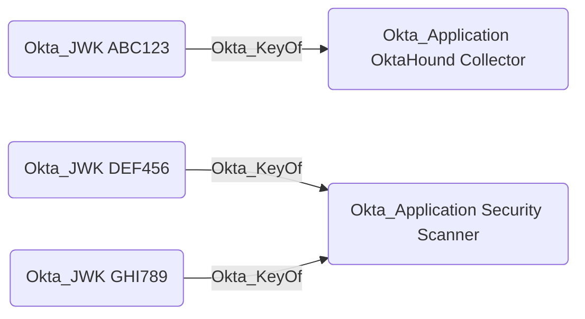

## General Information

The traversable `Okta_KeyOf` edges represent the relationships between applications ([Okta_Application](../Nodes/Okta_Application.md)) and their JWKs:

Possession of the private key corresponding to a JWK allows an attacker to authenticate as the application. The `Okta_KeyOf` edge can be used in BloodHound to understand which applications use JWK-based authentication and trace potential attack paths involving compromised private keys.
