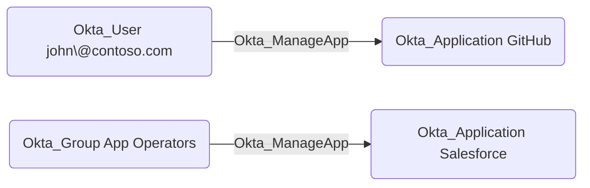

## General Information

The traversable `Okta_ManageApp` edges correspond to the `okta.apps.manage` custom role permissions
that allow a principal (user, group, or application) to fully manage Okta applications and their members.

