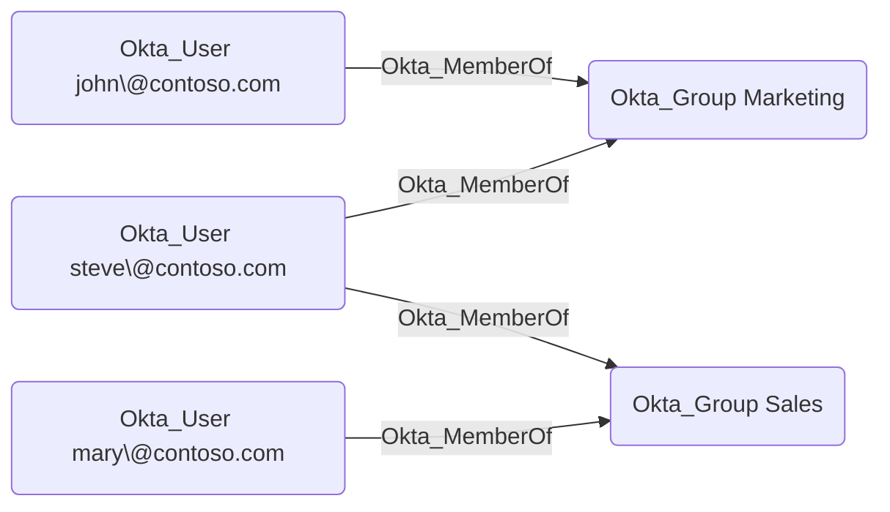

## General Information

The traversable Okta_MemberOf edges represent the membership relationships between users and groups in Okta:

```mermaid
graph LR
    u1("Okta_User john\@contoso.com")
    u2("Okta_User steve\@contoso.com")
    u3("Okta_User mary\@contoso.com")
    g1("Okta_Group Marketing")
    g2("Okta_Group Sales")
    u1 -- Okta_MemberOf --> g1
    u2 -- Okta_MemberOf --> g1
    u2 -- Okta_MemberOf --> g2
    u3 -- Okta_MemberOf --> g2
```
