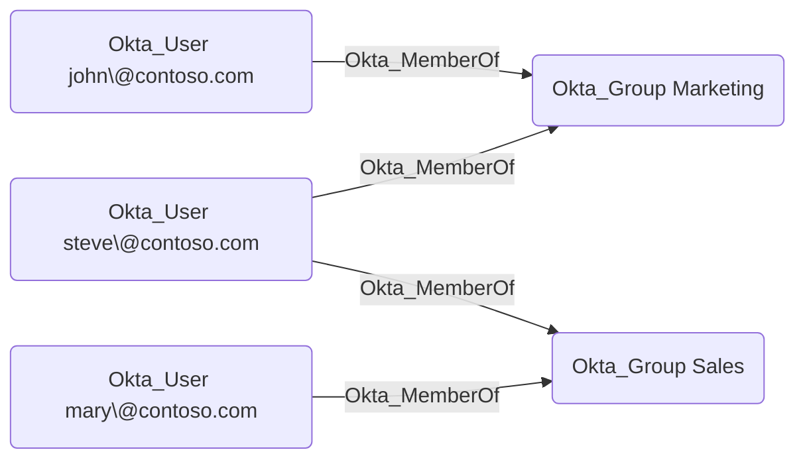

## General Information

The traversable Okta_MemberOf edges represent the membership relationships between users and groups in Okta:



## Abuse Info

An attacker who controls the source user inherits the destination group's Okta entitlements. Depending on how the group is used, this can grant application assignments, sign-on or MFA policy targeting, downstream group push access, imported directory privileges, or admin role assignments that are granted to the group.

This edge is directly abusable when the attacker already controls the source user. It also becomes a privilege escalation primitive when the attacker can create the membership through another edge such as `Okta_AddMember`, `Okta_GroupMembershipAdmin`, `Okta_GroupAdmin`, or `Okta_OrgAdmin`.

Using the Okta dashboard and Admin Console:

1. Authenticate as the source user. If the source user was added to the group during the operation, start a new browser session so Okta evaluates the new membership.
2. Open the Okta end-user dashboard and identify applications that appear because of the destination group.
3. Launch assigned applications and complete any sign-on policy requirements.
4. If the destination group is pushed or synced to another system, wait for provisioning or trigger the relevant sync before using the downstream role or group.
5. If the destination group has an Okta admin role assignment, open the Admin Console and verify the inherited administrative surface.
6. Request new OAuth/OIDC tokens for applications that use group claims, because old tokens may not contain the newly inherited group.

Using the Okta API:

1. Set the Okta org URL, API credential, source user ID, and destination group ID.

    ```bash
    export OKTA_ORG="https://contoso.okta.com"
    export OKTA_API_TOKEN="REDACTED"
    export SOURCE_USER_ID="00u..."
    export TARGET_GROUP_ID="00g..."
    ```

2. Verify that the source user is a member of the destination group.

    ```bash
    curl -sS \
      -H "Authorization: SSWS $OKTA_API_TOKEN" \
      -H "Accept: application/json" \
      "$OKTA_ORG/api/v1/groups/$TARGET_GROUP_ID/users?limit=200" \
      | jq -r '.[] | select(.id == env.SOURCE_USER_ID) | [.id, .profile.login, .status] | @tsv'
    ```

3. Review the destination group. `OKTA_GROUP` memberships can be managed directly in Okta; `APP_GROUP` memberships are mastered by an application or directory.

    ```bash
    curl -sS \
      -H "Authorization: SSWS $OKTA_API_TOKEN" \
      -H "Accept: application/json" \
      "$OKTA_ORG/api/v1/groups/$TARGET_GROUP_ID" \
      | jq '{id, type, name: .profile.name, description: .profile.description}'
    ```

4. Enumerate applications assigned to the group.

    ```bash
    curl -sS \
      -H "Authorization: SSWS $OKTA_API_TOKEN" \
      -H "Accept: application/json" \
      "$OKTA_ORG/api/v1/groups/$TARGET_GROUP_ID/apps?limit=200" \
      | jq -r '.[] | [.id, .label, .name, .status] | @tsv'
    ```

5. If the abuse path required adding the user to the group, add the controlled user with the Groups API.

    ```bash
    curl -i -sS -X PUT \
      -H "Authorization: SSWS $OKTA_API_TOKEN" \
      -H "Accept: application/json" \
      "$OKTA_ORG/api/v1/groups/$TARGET_GROUP_ID/users/$SOURCE_USER_ID"
    ```

    A successful request returns `204 No Content`.

6. Revoke sessions or start a new login for the source user when group claims or app entitlements need to refresh.

    ```bash
    curl -i -sS -X DELETE \
      -H "Authorization: SSWS $OKTA_API_TOKEN" \
      -H "Accept: application/json" \
      "$OKTA_ORG/api/v1/users/$SOURCE_USER_ID/sessions?oauthTokens=true"
    ```

7. Re-authenticate as the source user, launch group-assigned applications, and follow any downstream edges from the destination group.

## Cleanup after Abuse

Cleanup for `Okta_MemberOf` means removing any temporary group membership, invalidating sessions or tokens that inherited group claims, and waiting for downstream provisioning to remove access granted by the group.

Cleanup using Admin Console:

1. Open **Directory** > **Groups** and select the destination group.
2. Remove the source user if that membership was created for the operation.
3. Add back any legitimate users that were removed.
4. Open **Directory** > **People**, select the source user, and revoke sessions if stale group claims should be invalidated.
5. Check applications and downstream systems that receive the group through assignment, group push, SCIM, or directory sync.

Cleanup using API:

1. Remove the temporary membership from the destination group.

    ```bash
    curl -i -sS -X DELETE \
      -H "Authorization: SSWS $OKTA_API_TOKEN" \
      -H "Accept: application/json" \
      "$OKTA_ORG/api/v1/groups/$TARGET_GROUP_ID/users/$SOURCE_USER_ID"
    ```

    A successful request returns `204 No Content`.

2. Revoke the user's Okta sessions and OAuth tokens when token claims need to be refreshed.

    ```bash
    curl -i -sS -X DELETE \
      -H "Authorization: SSWS $OKTA_API_TOKEN" \
      -H "Accept: application/json" \
      "$OKTA_ORG/api/v1/users/$SOURCE_USER_ID/sessions?oauthTokens=true"
    ```

3. Confirm the membership is gone.

    ```bash
    curl -sS \
      -H "Authorization: SSWS $OKTA_API_TOKEN" \
      -H "Accept: application/json" \
      "$OKTA_ORG/api/v1/groups/$TARGET_GROUP_ID/users?limit=200" \
      | jq -r '.[] | select(.id == env.SOURCE_USER_ID)'
    ```

4. Verify that the user's group-assigned app access no longer resolves through the destination group.

    ```bash
    curl -sS \
      -H "Authorization: SSWS $OKTA_API_TOKEN" \
      -H "Accept: application/json" \
      "$OKTA_ORG/api/v1/groups/$TARGET_GROUP_ID/apps?limit=200" \
      | jq -r '.[] | [.id, .label, .status] | @tsv'
    ```

## Opsec Considerations

Adding or removing a user from a group creates `group.user_membership.add` and `group.user_membership.remove` System Log events. The target group name, target user, actor, client, source IP, and request URI are available to defenders.

Using an existing membership produces less administrative telemetry, but application launches, token minting, new group claims, downstream group push events, and first-time access to sensitive SaaS applications still create audit trails. Groups used for admin roles, privileged apps, VPN access, or sign-on policies are common alerting targets.

## References

- [Okta Group API](https://developer.okta.com/docs/api/openapi/okta-management/management/tag/Group/)
- [Okta Application Groups API](https://developer.okta.com/docs/api/openapi/okta-management/management/tag/ApplicationGroups/)
- [Okta User Sessions API](https://developer.okta.com/docs/api/openapi/okta-management/management/tag/UserSessions/)
- [Okta System Log event types](https://developer.okta.com/docs/reference/api/event-types/)
- [SpecterOps: Discovering Unexpected Okta Attack Paths with BloodHound](https://specterops.io/blog/2026/03/23/discovering-unexpected-okta-attack-paths-with-bloodhound/)
