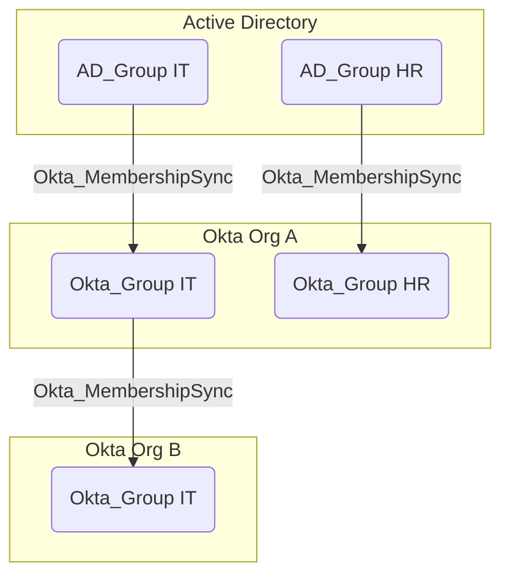
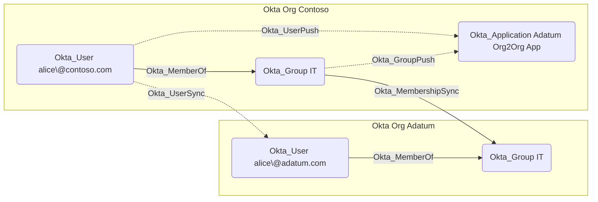

## General Information

The traversable hybrid Okta_MembershipSync edges represent synchronization relationships between source groups and destination Okta groups. OpenHound emits these edges for imported Active Directory groups and for Okta Org2Org group synchronization.





## Abuse Info

An attacker who controls the source group can influence the destination group through membership synchronization. This can grant Okta application assignments, sign-on policy targeting, downstream group push, or indirect role assignments tied to the destination group.

The source can be an Active Directory group imported into Okta, or a source Okta group synced through Org2Org. The attacker adds a controlled source identity to the source group, waits for synchronization, then uses the linked destination identity and the destination group's entitlements.

Using Active Directory as the source:

1. Gain control over the source AD group or an account that can modify its membership.
2. Add an attacker-controlled AD user to the source AD group.
3. Ensure the AD user is linked to, or will import as, an Okta user in the destination org.
4. Trigger the AD import or wait for the scheduled AD agent synchronization.
5. Confirm the linked Okta user is now a member of the destination Okta group.
6. Refresh the Okta session for the linked user and use any app assignments, policies, group-push paths, or admin role assignments granted by the destination group.

Using Active Directory commands and Okta API verification:

1. Add the controlled AD user to the source AD group.

    ```powershell
    Import-Module ActiveDirectory

    $SourceAdGroup = "CN=IT,OU=Groups,DC=contoso,DC=com"
    $ControlledAdUser = "CN=alice,OU=Users,DC=contoso,DC=com"

    Add-ADGroupMember -Identity $SourceAdGroup -Members $ControlledAdUser
    ```

2. After import runs, verify the destination Okta group contains the linked Okta user.

    ```bash
    export OKTA_ORG="https://contoso.okta.com"
    export OKTA_API_TOKEN="REDACTED"
    export TARGET_GROUP_ID="00g..."
    export CONTROLLED_OKTA_USER_ID="00u..."

    curl -sS \
      -H "Authorization: SSWS $OKTA_API_TOKEN" \
      -H "Accept: application/json" \
      "$OKTA_ORG/api/v1/groups/$TARGET_GROUP_ID/users?limit=200" \
      | jq -r '.[] | select(.id == env.CONTROLLED_OKTA_USER_ID) | [.id, .profile.login, .status] | @tsv'
    ```

3. Enumerate app assignments granted by the destination group.

    ```bash
    curl -sS \
      -H "Authorization: SSWS $OKTA_API_TOKEN" \
      -H "Accept: application/json" \
      "$OKTA_ORG/api/v1/groups/$TARGET_GROUP_ID/apps?limit=200" \
      | jq -r '.[] | [.id, .label, .name, .status] | @tsv'
    ```

Using an Okta source group in an Org2Org path:

1. Gain control over membership of the source Okta group.
2. Add the source-org user that links to an attacker-controlled target-org user.
3. Let Org2Org provisioning sync the source group membership into the destination org.
4. Sign in as the target-org linked user and use the destination group's entitlements.

Using Okta APIs for an Org2Org source group:

1. Set variables for the source org, source group, source user, target org, target group, and linked target user.

    ```bash
    export SOURCE_OKTA_ORG="https://source.okta.com"
    export SOURCE_OKTA_API_TOKEN="REDACTED_SOURCE"
    export SOURCE_GROUP_ID="00g..."
    export SOURCE_USER_ID="00u..."
    export TARGET_OKTA_ORG="https://target.okta.com"
    export TARGET_OKTA_API_TOKEN="REDACTED_TARGET"
    export TARGET_GROUP_ID="00g..."
    export TARGET_USER_ID="00u..."
    ```

2. Add the source user to the source group.

    ```bash
    curl -i -sS -X PUT \
      -H "Authorization: SSWS $SOURCE_OKTA_API_TOKEN" \
      -H "Accept: application/json" \
      "$SOURCE_OKTA_ORG/api/v1/groups/$SOURCE_GROUP_ID/users/$SOURCE_USER_ID"
    ```

    A successful request returns `204 No Content`.

3. Verify the source membership.

    ```bash
    curl -sS \
      -H "Authorization: SSWS $SOURCE_OKTA_API_TOKEN" \
      -H "Accept: application/json" \
      "$SOURCE_OKTA_ORG/api/v1/groups/$SOURCE_GROUP_ID/users?limit=200" \
      | jq -r '.[] | select(.id == env.SOURCE_USER_ID) | [.id, .profile.login, .status] | @tsv'
    ```

4. After Org2Org provisioning runs, verify the target membership.

    ```bash
    curl -sS \
      -H "Authorization: SSWS $TARGET_OKTA_API_TOKEN" \
      -H "Accept: application/json" \
      "$TARGET_OKTA_ORG/api/v1/groups/$TARGET_GROUP_ID/users?limit=200" \
      | jq -r '.[] | select(.id == env.TARGET_USER_ID) | [.id, .profile.login, .status] | @tsv'
    ```

## Cleanup after Abuse

Cleanup for `Okta_MembershipSync` means removing the temporary member from the authoritative source group, synchronizing again, and confirming the destination group and any downstream applications no longer grant the temporary access.

Cleanup using Admin Console:

1. Restore the source group's membership in the authoritative system, such as AD or the source Okta org.
2. Trigger the relevant import, push, or synchronization job where available.
3. Open the destination Okta group and verify the attacker-controlled destination user is gone.
4. Restore any legitimate users removed from the source group.
5. Check downstream applications that receive the destination group through assignment or group push.
6. Revoke sessions for the destination user if group claims or app access were used.

Cleanup using API:

1. Remove the controlled AD user from the source AD group when AD is authoritative.

    ```powershell
    Import-Module ActiveDirectory

    $SourceAdGroup = "CN=IT,OU=Groups,DC=contoso,DC=com"
    $ControlledAdUser = "CN=alice,OU=Users,DC=contoso,DC=com"

    Remove-ADGroupMember -Identity $SourceAdGroup -Members $ControlledAdUser -Confirm:$false
    ```

2. Remove the controlled source user from the source Okta group when Org2Org is authoritative.

    ```bash
    curl -i -sS -X DELETE \
      -H "Authorization: SSWS $SOURCE_OKTA_API_TOKEN" \
      -H "Accept: application/json" \
      "$SOURCE_OKTA_ORG/api/v1/groups/$SOURCE_GROUP_ID/users/$SOURCE_USER_ID"
    ```

3. After synchronization runs, verify the target group no longer contains the target user.

    ```bash
    curl -sS \
      -H "Authorization: SSWS $TARGET_OKTA_API_TOKEN" \
      -H "Accept: application/json" \
      "$TARGET_OKTA_ORG/api/v1/groups/$TARGET_GROUP_ID/users?limit=200" \
      | jq -r '.[] | select(.id == env.TARGET_USER_ID)'
    ```

4. If a temporary membership remains in an Okta-managed destination group, remove it directly.

    ```bash
    curl -i -sS -X DELETE \
      -H "Authorization: SSWS $TARGET_OKTA_API_TOKEN" \
      -H "Accept: application/json" \
      "$TARGET_OKTA_ORG/api/v1/groups/$TARGET_GROUP_ID/users/$TARGET_USER_ID"
    ```

5. Revoke sessions and OAuth tokens for the affected destination user.

    ```bash
    curl -i -sS -X DELETE \
      -H "Authorization: SSWS $TARGET_OKTA_API_TOKEN" \
      -H "Accept: application/json" \
      "$TARGET_OKTA_ORG/api/v1/users/$TARGET_USER_ID/sessions?oauthTokens=true"
    ```

## Opsec Considerations

Membership changes are visible in the authoritative source system, Okta import or provisioning logs, and often the destination system. Privileged group membership that appears through a sync connector rather than direct Okta administration is still detectable when defenders correlate source and destination group changes.

High-signal patterns include adding a user to an AD group shortly before Okta import, Org2Org group membership changes outside normal onboarding, and immediate application launch or admin-console activity by the newly synced destination user.

## References

- [Okta Group API](https://developer.okta.com/docs/api/openapi/okta-management/management/tag/Group/)
- [Okta Application Groups API](https://developer.okta.com/docs/api/openapi/okta-management/management/tag/ApplicationGroups/)
- [Okta Group Push Mappings API](https://developer.okta.com/docs/api/openapi/okta-management/management/tag/GroupPushMapping/)
- [Okta SCIM concepts](https://developer.okta.com/docs/concepts/scim/)
- [Okta System Log event types](https://developer.okta.com/docs/reference/api/event-types/)
- [Microsoft Add-ADGroupMember](https://learn.microsoft.com/en-us/powershell/module/activedirectory/add-adgroupmember)
- [Microsoft Remove-ADGroupMember](https://learn.microsoft.com/en-us/powershell/module/activedirectory/remove-adgroupmember)
- [Okta SCIM Attack Tool](https://github.com/authomize/okta_scim_attack_tool)
