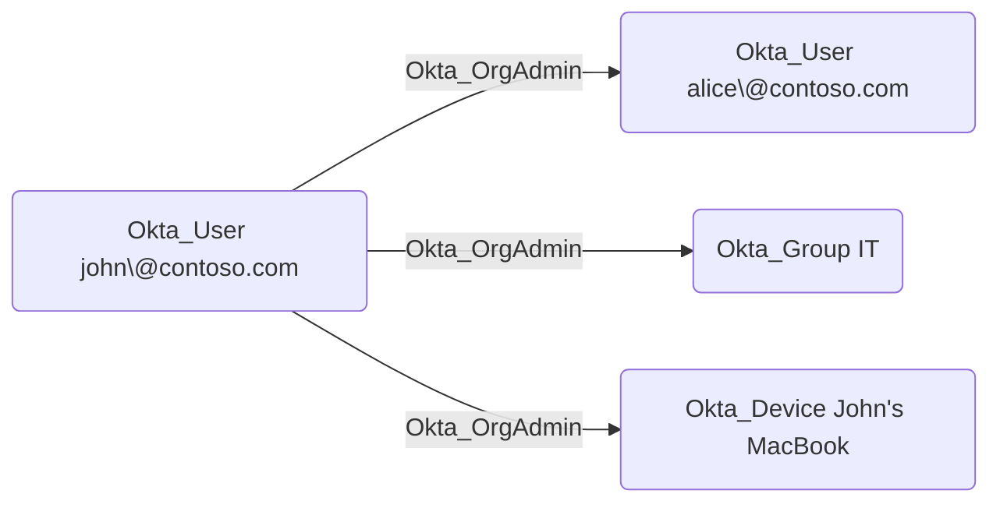

## General Information

The traversable `Okta_OrgAdmin` edges represent Organization Administrator role assignments.
Organization Administrators can manage most organizational settings except for administrative role assignments and some security settings.

