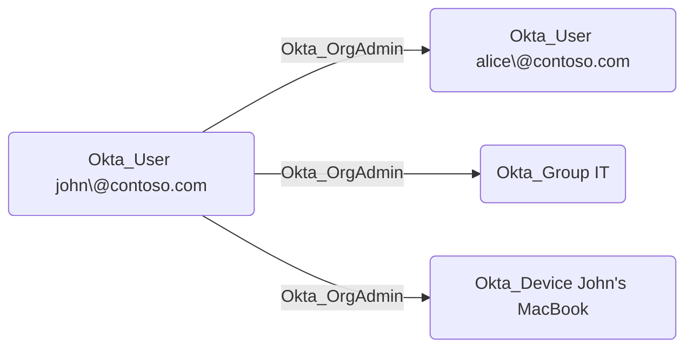

## General Information

The traversable Okta_OrgAdmin edges represent Organization Administrator role assignments. Organization Administrators can manage most organizational settings except for administrative role assignments and some security settings.


```mermaid
graph LR
    u1("Okta_User john\@contoso.com")
    u2("Okta_User alice\@contoso.com")
    g1("Okta_Group IT")
    d1("Okta_Device John's MacBook")
    u1 -- Okta_OrgAdmin --> u2
    u1 -- Okta_OrgAdmin --> g1
    u1 -- Okta_OrgAdmin --> d1
```

## Abuse Info

An attacker who controls the source principal can manage most non-role-assignment user, group, device, and organization settings represented by the destination node. Organization Administrators do not have Super Administrator control and cannot normally add or remove administrators. In current Okta documentation, Org Admins are also restricted from managing applications directly, so when this edge is drawn to an application, treat the path as influence through users, groups, policies, or adjacent app-admin permissions unless the tenant confirms broader app capabilities.

For a user source, sign in as that user. For a group source, compromise any member of the source group. For an application source, authenticate as the service app or client and use its management API access.

Using the Admin Console:

1. Authenticate as the source user, as a member of the source group, or as the source service application.
2. If the destination is a user, open **Directory** > **People**, reset the user's password and authenticators, unlock or activate the account, and sign in as that user.
3. If the destination is a group, open **Directory** > **Groups**, add an attacker-controlled user to the group, and refresh the attacker's Okta session to inherit group-based app assignments, policies, or downstream provisioning.
4. If the destination is a device, open the device record, alter or remove the trust record where permitted, and use the resulting device state change to support a broader sign-on or MFA bypass path.
5. If the destination is an application, identify the users or groups that grant access to that application and use Org Admin-controlled user or group changes to obtain access, or pivot to a separate `Okta_AppAdmin` or `Okta_ManageApp` edge for direct app configuration changes.
6. Verify the result by signing in as the controlled user, launching the application granted through the user or group change, or observing the intended device-trust or policy effect.

Organization Administrators generally cannot assign Super Administrator privileges, but they can often create users, manage groups, reset credentials, manage device state, and make organization-level configuration changes that lead to practical compromise.

Using the Okta API:

1. Set the Okta org URL, a token for the source principal, and the destination IDs used by the path.

    ```bash
    export OKTA_ORG="https://contoso.okta.com"
    export OKTA_API_TOKEN="REDACTED"
    export TARGET_USER_ID="00u..."
    export TARGET_GROUP_ID="00g..."
    export CONTROLLED_USER_ID="00u..."
    ```

2. For a destination user, reset authenticators and start a password reset.

    ```bash
    curl -i -sS -X POST \
      -H "Authorization: SSWS $OKTA_API_TOKEN" \
      -H "Accept: application/json" \
      "$OKTA_ORG/api/v1/users/$TARGET_USER_ID/lifecycle/reset_factors"

    curl -sS -X POST \
      -H "Authorization: SSWS $OKTA_API_TOKEN" \
      -H "Accept: application/json" \
      "$OKTA_ORG/api/v1/users/$TARGET_USER_ID/lifecycle/reset_password?sendEmail=false&revokeSessions=true"
    ```

3. For a destination group, add a controlled user to inherit group-driven access.

    ```bash
    curl -i -sS -X PUT \
      -H "Authorization: SSWS $OKTA_API_TOKEN" \
      -H "Accept: application/json" \
      "$OKTA_ORG/api/v1/groups/$TARGET_GROUP_ID/users/$CONTROLLED_USER_ID"
    ```

4. For a destination device, use the Devices API to inspect the device and perform the minimum device-state change needed by the attack path.
5. Verify the user, group, or device change with a read request and by exercising the resulting access.

    ```bash
    curl -sS \
      -H "Authorization: SSWS $OKTA_API_TOKEN" \
      -H "Accept: application/json" \
      "$OKTA_ORG/api/v1/groups/$TARGET_GROUP_ID/users?limit=200" \
      | jq -r '.[] | select(.id == env.CONTROLLED_USER_ID)'
    ```

## Cleanup after Abuse

Cleanup reverses the specific Org Admin change used for abuse, including temporary users, group-driven app access, authenticators, device state, credentials, and downstream provisioning effects.

Cleanup using Admin Console:

1. Reverse the specific object change used for abuse: user takeover, group membership, temporary user creation, device state, or policy-adjacent setting.
2. Restore original user profiles, group memberships, policy-adjacent settings, and device records.
3. Remove temporary credentials or users created during the operation.
4. Clear sessions for users whose credentials or authenticators were changed.
5. Verify downstream provisioning targets have returned to their original state.

Cleanup using API:

1. Remove temporary group membership.

    ```bash
    curl -i -sS -X DELETE \
      -H "Authorization: SSWS $OKTA_API_TOKEN" \
      -H "Accept: application/json" \
      "$OKTA_ORG/api/v1/groups/$TARGET_GROUP_ID/users/$CONTROLLED_USER_ID"
    ```

2. Remove attacker-controlled factors and revoke sessions for user takeover cleanup.

    ```bash
    curl -i -sS -X DELETE \
      -H "Authorization: SSWS $OKTA_API_TOKEN" \
      -H "Accept: application/json" \
      "$OKTA_ORG/api/v1/users/$TARGET_USER_ID/factors/$FACTOR_ID"

    curl -i -sS -X DELETE \
      -H "Authorization: SSWS $OKTA_API_TOKEN" \
      -H "Accept: application/json" \
      "$OKTA_ORG/api/v1/users/$TARGET_USER_ID/sessions?oauthTokens=true&forgetDevices=true"
    ```

3. Start a legitimate password reset if the user's password was reset during abuse.

    ```bash
    curl -i -sS -X POST \
      -H "Authorization: SSWS $OKTA_API_TOKEN" \
      -H "Accept: application/json" \
      "$OKTA_ORG/api/v1/users/$TARGET_USER_ID/lifecycle/reset_password?sendEmail=true&revokeSessions=true"
    ```

4. Use the relevant device, user, group, or policy endpoint to restore the original object configuration.
5. Verify that the temporary user, membership, authenticator, session, and device changes are gone.

## Opsec Considerations

Org Admin abuse creates normal administrative telemetry across user lifecycle, password reset, authenticator, group membership, device, and policy-adjacent events. Relevant event types include `user.account.reset_password`, `user.mfa.factor.reset_all`, `user.session.clear`, `group.user_membership.add`, `group.user_membership.remove`, `device.user.add`, `device.user.remove`, and `policy.lifecycle.update`.

Broad changes from a newly compromised admin are noisy; targeted reset, membership, or device-state actions are less disruptive but still auditable. When the path affects application access through group membership or provisioning, defenders may also see downstream application or SCIM logs.

## References

- [Okta Organization administrators](https://help.okta.com/oie/en-us/content/topics/security/administrators-org-admin.htm)
- [Okta Roles in Okta](https://developer.okta.com/docs/api/openapi/okta-management/guides/roles/)
- [Okta Groups API](https://developer.okta.com/docs/api/openapi/okta-management/management/tag/Group/)
- [Okta User Lifecycle API](https://developer.okta.com/docs/api/openapi/okta-management/management/tag/UserLifecycle/)
- [Okta User Factors API](https://developer.okta.com/docs/api/openapi/okta-management/management/tag/UserFactor/)
- [Okta Devices API](https://developer.okta.com/docs/api/openapi/okta-management/management/tag/Device/)
- [Okta System Log event types](https://developer.okta.com/docs/reference/api/event-types/)
- [SpecterOps: Discovering Unexpected Okta Attack Paths with BloodHound](https://specterops.io/blog/2026/03/23/discovering-unexpected-okta-attack-paths-with-bloodhound/)
