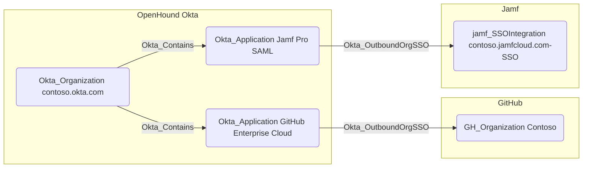

## General Information

The traversable Okta_OutboundOrgSSO edges represent the Single Sign-On (SSO) relationships between Okta applications and supported external organizations or tenants, such as GitHub Enterprise or Jamf Pro, using SAML 2.0 or OIDC protocols.

The respective BloodHound collectors, e.g., OpenHound Github for GitHub organizations and OpenHound Jamf for Jamf Pro tenants, must be used to gather the external node information.
