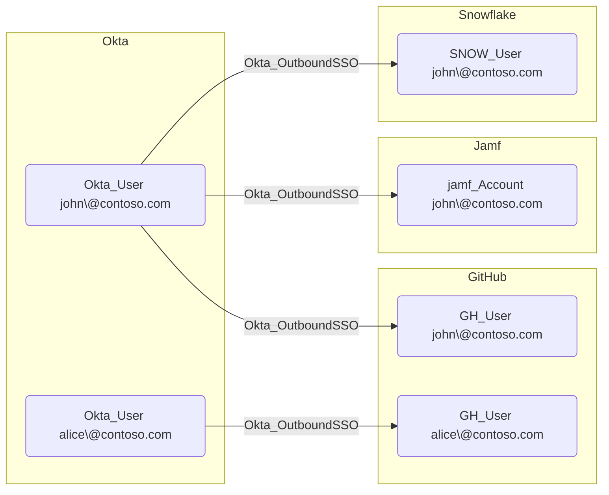

## General Information

The traversable hybrid Okta_OutboundSSO edges represent Single Sign-On relationships between Okta users and their linked accounts in external applications using federated authentication (SAML 2.0 or OIDC).

