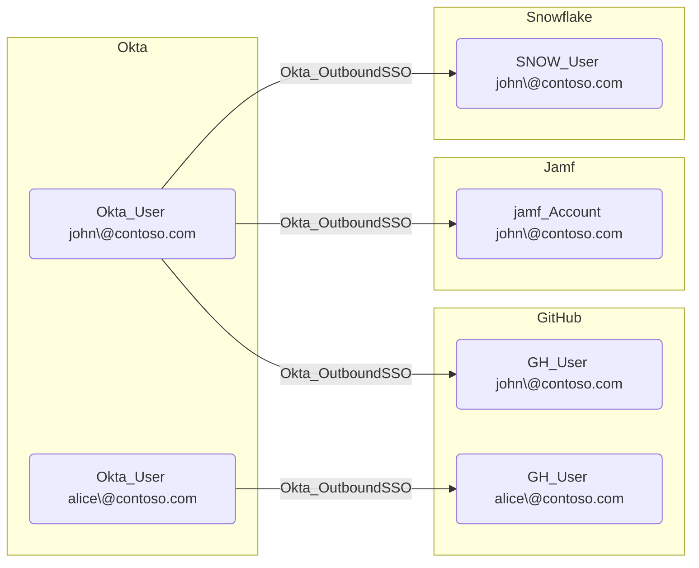

## General Information

The traversable hybrid Okta_OutboundSSO edges represent federated single sign-on from Okta users to their linked accounts in external applications using protocols such as SAML 2.0 or OIDC.


```mermaid
graph LR
    subgraph okta["Okta"]
        u1("Okta_User john\@contoso.com")
        u2("Okta_User alice\@contoso.com")
    end
    subgraph github["GitHub"]
        ghu1("GH_User john\@contoso.com")
        ghu2("GH_User alice\@contoso.com")
    end
    subgraph jamf["Jamf"]
        jamfu1("jamf_Account john\@contoso.com")
    end
    subgraph snowflake["Snowflake"]
        snu1("SNOW_User john\@contoso.com")
    end
    u1 -- Okta_OutboundSSO --> ghu1
    u1 -- Okta_OutboundSSO --> jamfu1
    u2 -- Okta_OutboundSSO --> ghu2
    u1 -- Okta_OutboundSSO --> snu1
```

The edge is user-to-user/account: the source Okta user can obtain a federated session as the destination account when the downstream application trusts Okta.

## Abuse Info

An attacker who controls the source Okta user can authenticate to the destination external account through Okta SSO. The practical impact depends on the downstream application's account linking, JIT provisioning, SAML/OIDC claims, group-to-role mapping, and local authorization model.

If the source user is not already assigned to the app, the attacker needs an adjacent path that adds an app assignment or group membership, such as `Okta_AppAssignment`, `Okta_AddMember`, `Okta_AppAdmin`, or `Okta_ManageApp`. If the downstream app grants roles from Okta groups or claims, modifying the source user's group membership or mapped profile attributes can turn a basic SSO session into privileged access.

Using the Okta dashboard and downstream app:

1. Obtain a valid Okta session for the source user.
2. Confirm the source user is assigned to the federated app, directly or through an Okta group.
3. Launch the app from the Okta dashboard, or initiate SP-initiated SSO from the downstream application.
4. Complete Okta sign-on policy, MFA, device assurance, or network requirements.
5. Let the downstream application consume the SAML assertion or OIDC tokens from Okta.
6. Use the resulting downstream session as the destination account.
7. If the downstream app maps authorization from Okta claims, adjust the relevant Okta group or profile input through adjacent edges and repeat the SSO flow.

Using the Okta API:

1. Set variables for the Okta org, source user, and Okta application that fronts the downstream account.

    ```bash
    export OKTA_ORG="https://contoso.okta.com"
    export OKTA_API_TOKEN="REDACTED"
    export SOURCE_USER_ID="00u..."
    export TARGET_APP_ID="0oa..."
    export TEMP_GROUP_ID="00g..."
    ```

2. Retrieve the source app and save the configuration before any claim or sign-on changes.

    ```bash
    curl -sS \
      -H "Authorization: SSWS $OKTA_API_TOKEN" \
      -H "Accept: application/json" \
      "$OKTA_ORG/api/v1/apps/$TARGET_APP_ID" \
      | tee /tmp/okta-outbound-sso-app-original.json \
      | jq '{id, label, name, status, signOnMode, settings: .settings.signOn}'
    ```

3. Verify the source user's app assignment.

    ```bash
    curl -sS \
      -H "Authorization: SSWS $OKTA_API_TOKEN" \
      -H "Accept: application/json" \
      "$OKTA_ORG/api/v1/apps/$TARGET_APP_ID/users/$SOURCE_USER_ID" \
      | jq '{id, status, scope, syncState, credentials, profile}'
    ```

4. If access depends on an Okta group claim and you have an adjacent group-management path, add the source user to the required group.

    ```bash
    curl -i -sS -X PUT \
      -H "Authorization: SSWS $OKTA_API_TOKEN" \
      -H "Accept: application/json" \
      "$OKTA_ORG/api/v1/groups/$TEMP_GROUP_ID/users/$SOURCE_USER_ID"
    ```

    A successful group add returns `204 No Content`.

5. Revoke the source user's sessions if you need fresh app or group claims, then re-authenticate and launch the app.

    ```bash
    curl -i -sS -X DELETE \
      -H "Authorization: SSWS $OKTA_API_TOKEN" \
      -H "Accept: application/json" \
      "$OKTA_ORG/api/v1/users/$SOURCE_USER_ID/sessions?oauthTokens=true"
    ```

6. Use a browser to complete Okta-initiated or SP-initiated SSO. The Management API verifies assignment and claim inputs; the downstream session is created through the browser SAML/OIDC flow.

7. Verify the downstream session, user, group, and role in the destination application's admin UI or API.

If the app uses JIT provisioning, the first successful SSO may create the destination account. If the app uses local groups or roles after federation, the Okta session may only provide authentication and the downstream API must be used to verify authorization.

## Cleanup after Abuse

Cleanup for `Okta_OutboundSSO` means removing the temporary Okta app assignment, group, profile, or claim path used to mint the downstream session, then revoking downstream sessions and deleting any JIT-created destination account.

Cleanup using Admin Console:

1. Remove temporary Okta group memberships or app assignments used to reach the destination account.
2. Restore SAML/OIDC claim mappings, username formats, app sign-on settings, and profile mappings if they were changed.
3. Revoke the source user's Okta sessions so stale app claims cannot be reused.
4. In the downstream application, sign out sessions and revoke refresh tokens or API tokens created through the SSO session.
5. Delete or disable JIT-created downstream accounts that were only created for the operation.
6. Launch the app again as the temporary principal and confirm access is denied.

Cleanup using API:

1. Restore the source app configuration if SAML/OIDC settings or claims were changed.

    ```bash
    curl -sS -X PUT \
      -H "Authorization: SSWS $OKTA_API_TOKEN" \
      -H "Accept: application/json" \
      -H "Content-Type: application/json" \
      -d @/tmp/okta-outbound-sso-app-original.json \
      "$OKTA_ORG/api/v1/apps/$TARGET_APP_ID" \
      | jq '{id, label, status, signOnMode, settings: .settings.signOn}'
    ```

2. Remove a temporary app assignment.

    ```bash
    curl -i -sS -X DELETE \
      -H "Authorization: SSWS $OKTA_API_TOKEN" \
      -H "Accept: application/json" \
      "$OKTA_ORG/api/v1/apps/$TARGET_APP_ID/users/$SOURCE_USER_ID"
    ```

3. Remove a temporary group membership used for SAML/OIDC claims.

    ```bash
    curl -i -sS -X DELETE \
      -H "Authorization: SSWS $OKTA_API_TOKEN" \
      -H "Accept: application/json" \
      "$OKTA_ORG/api/v1/groups/$TEMP_GROUP_ID/users/$SOURCE_USER_ID"
    ```

4. Revoke Okta sessions and OAuth tokens for the source user.

    ```bash
    curl -i -sS -X DELETE \
      -H "Authorization: SSWS $OKTA_API_TOKEN" \
      -H "Accept: application/json" \
      "$OKTA_ORG/api/v1/users/$SOURCE_USER_ID/sessions?oauthTokens=true"
    ```

5. Verify the app assignment or group path no longer exists.

    ```bash
    curl -i -sS \
      -H "Authorization: SSWS $OKTA_API_TOKEN" \
      -H "Accept: application/json" \
      "$OKTA_ORG/api/v1/apps/$TARGET_APP_ID/users/$SOURCE_USER_ID"

    curl -sS \
      -H "Authorization: SSWS $OKTA_API_TOKEN" \
      -H "Accept: application/json" \
      "$OKTA_ORG/api/v1/groups/$TEMP_GROUP_ID/users?limit=200" \
      | jq -r '.[] | select(.id == env.SOURCE_USER_ID)'
    ```

6. Use the destination application's API to revoke downstream sessions or delete temporary JIT-created accounts.

## Opsec Considerations

Okta records app assignment changes, group membership changes, `policy.evaluate_sign_on`, and app SSO launches such as `user.authentication.sso`. Downstream applications record federated login events, JIT account creation, group or role mapping, and token issuance.

Using an existing assigned user is quieter than changing app assignments or claim mappings, but first-time access to a sensitive application, privileged group claims, and downstream logins from unusual locations are still visible.

## References

- [Okta SAML SSO integration guide](https://developer.okta.com/docs/guides/build-sso-integration/saml2/main/)
- [Okta OIDC app integration guide](https://developer.okta.com/docs/guides/create-an-app-integration/openidconnect/main/)
- [Okta Applications API](https://developer.okta.com/docs/api/openapi/okta-management/management/tag/Application/)
- [Okta Application Users API](https://developer.okta.com/docs/api/openapi/okta-management/management/tag/ApplicationUsers/)
- [Okta Group API](https://developer.okta.com/docs/api/openapi/okta-management/management/tag/Group/)
- [Okta User Sessions API](https://developer.okta.com/docs/api/openapi/okta-management/management/tag/UserSessions/)
- [Okta System Log event types](https://developer.okta.com/docs/reference/api/event-types/)
