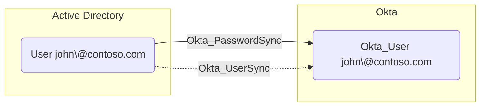
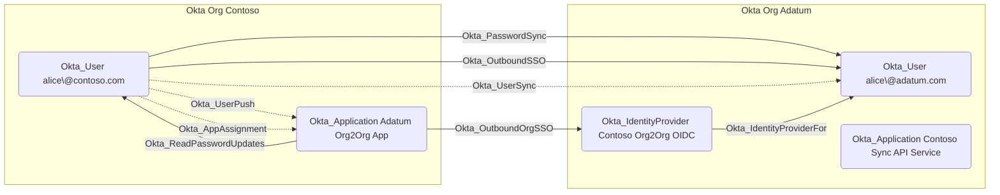

## General Information

The traversable `Okta_PasswordSync` edge represents password synchronization between user accounts. This indicates that credentials are synchronized from a source user to a target user.

In **Active Directory** hybrid setups, this edge is created between `User` (AD) and `Okta_User` when delegated authentication or password push is enabled.
In **Org2Org** setups, this edge is created between `Okta_User` nodes across organizations when password synchronization is configured.

> [!WARNING]
> The Okta API does not indicate if the actual password or a randomly generated value is pushed to the other organization.

### Active Directory Hybrid

### Org2Org

